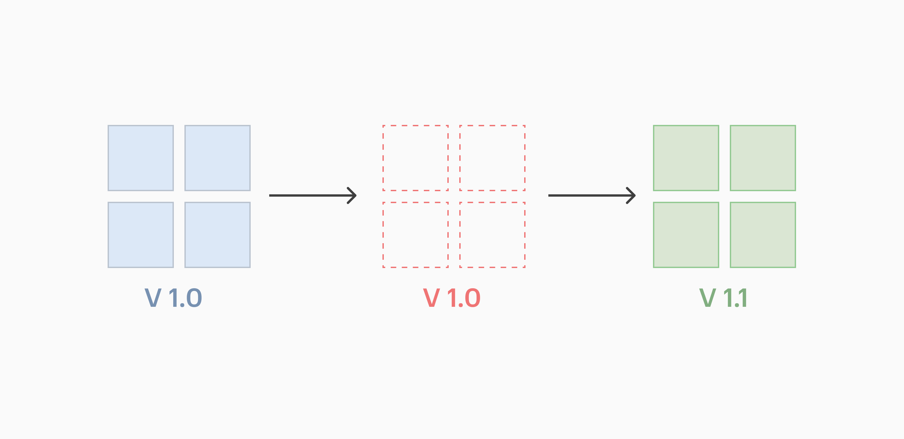

# Домашнее задание к занятию «Обновление приложений»

### Цель задания

Выбрать и настроить стратегию обновления приложения.

### Чеклист готовности к домашнему заданию

1. Кластер K8s.

### Инструменты и дополнительные материалы, которые пригодятся для выполнения задания

1. [Документация Updating a Deployment](https://kubernetes.io/docs/concepts/workloads/controllers/deployment/#updating-a-deployment).
2. [Статья про стратегии обновлений](https://habr.com/ru/companies/flant/articles/471620/).

-----

### Задание 1. Выбрать стратегию обновления приложения и описать ваш выбор

1. Имеется приложение, состоящее из нескольких реплик, которое требуется обновить.
2. Ресурсы, выделенные для приложения, ограничены, и нет возможности их увеличить.
3. Запас по ресурсам в менее загруженный момент времени составляет 20%.
4. Обновление мажорное, новые версии приложения не умеют работать со старыми.
5. Вам нужно объяснить свой выбор стратегии обновления приложения.

### Ответ на Задание 1. Выбрать стратегию обновления приложения и описать ваш выбор

В ванильном кубере вариант с Recreate видится самым верным вариантом. Ресурсов судя по ТЗ мало, неприрывность работы нам из ТЗ не очень интересна. Старые поды умрут, новые поднимутся. Из очевидных минусов - некоторое время на убийство и старт подов. Плюс если что-то пойдет не так, нужно будет откатиться. Стратегия Recreate в реальности будет состоять из двух шагов с половинкой - административный и технический:
* административный - объявление о тех. работах и заглушка;
* технический - удаление текущей версии приложения;
* технический - развертывание новой версии.

Техническая схема деплоя:


Из фантазий можно было бы вписать постепенное развертывание (Rolling) или еще более интересный вариант - канареечное развертывание (Canary) с ограничениями, но судя по выделяемым и ограниченным ресурсам, мы можем встрять по лимитам и такие варианты более опасны и видятся менее предсказуемыми. При таких ограничениях лучше про такое не думать и при наличии в тз отсутствие строки про даунтайм - лучше сделать Recreate.

### Задание 2. Обновить приложение

1. Создать deployment приложения с контейнерами nginx и multitool. Версию nginx взять 1.19. Количество реплик — 5.
2. Обновить версию nginx в приложении до версии 1.20, сократив время обновления до минимума. Приложение должно быть доступно.
3. Попытаться обновить nginx до версии 1.28, приложение должно оставаться доступным.
4. Откатиться после неудачного обновления.

### Ответ на Задание 2. Обновить приложение

1. Создаем и проверяем
* [namespape](namespace.yaml)
* [deployment](deployment.yaml)

```
kubectl apply -f namespace.yaml
kubectl apply -f deployment.yaml
kubectl config set-context --current --namespace=hw04
```

```
vagrant@master:~$  kubectl get all -o wide
NAME                            READY   STATUS    RESTARTS   AGE   IP               NODE    NOMINATED NODE   READINESS GATES
pod/app-depl-6c6cbbf86f-46s97   2/2     Running   0          39s   10.233.71.6      node3   <none>           <none>
pod/app-depl-6c6cbbf86f-j5qtq   2/2     Running   0          39s   10.233.75.6      node2   <none>           <none>
pod/app-depl-6c6cbbf86f-kz6sw   2/2     Running   0          39s   10.233.75.7      node2   <none>           <none>
pod/app-depl-6c6cbbf86f-mgwcp   2/2     Running   0          39s   10.233.102.133   node1   <none>           <none>
pod/app-depl-6c6cbbf86f-qvc5x   2/2     Running   0          39s   10.233.74.70     node4   <none>           <none>

NAME                       READY   UP-TO-DATE   AVAILABLE   AGE   CONTAINERS        IMAGES                               SELECTOR
deployment.apps/app-depl   5/5     5            5           39s   nginx,multitool   nginx:1.19,wbitt/network-multitool   app=app-depl

NAME                                  DESIRED   CURRENT   READY   AGE   CONTAINERS        IMAGES                               SELECTOR
replicaset.apps/app-depl-6c6cbbf86f   5         5         5       39s   nginx,multitool   nginx:1.19,wbitt/network-multitool   app=app-depl,pod-template-hash=6c6cbbf86f
```

2. Применяем обновление - изменяемая часть. Стратегия - rolling update.

```
     containers:
      - name: nginx
        image: nginx:1.20
```

* [deployment2](deployment2.yaml)

```
kubectl apply -f deployment2.yaml
```

В моменте:

```
vagrant@master:~$  kubectl get all -o wide
NAME                            READY   STATUS              RESTARTS   AGE     IP               NODE    NOMINATED NODE   READINESS GATES
pod/app-depl-6c6cbbf86f-mgwcp   2/2     Running             0          3m51s   10.233.102.133   node1   <none>           <none>
pod/app-depl-6c6cbbf86f-qvc5x   2/2     Running             0          3m51s   10.233.74.70     node4   <none>           <none>
pod/app-depl-6db44cc94f-4pgd2   0/2     ContainerCreating   0          3s      <none>           node4   <none>           <none>
pod/app-depl-6db44cc94f-fdvkt   0/2     ContainerCreating   0          3s      <none>           node3   <none>           <none>
pod/app-depl-6db44cc94f-grxzr   0/2     ContainerCreating   0          3s      <none>           node2   <none>           <none>
pod/app-depl-6db44cc94f-gtv8q   0/2     ContainerCreating   0          3s      <none>           node1   <none>           <none>
pod/app-depl-6db44cc94f-tmbzc   0/2     ContainerCreating   0          3s      <none>           node2   <none>           <none>

NAME                       READY   UP-TO-DATE   AVAILABLE   AGE     CONTAINERS        IMAGES                               SELECTOR
deployment.apps/app-depl   2/5     5            2           3m51s   nginx,multitool   nginx:1.20,wbitt/network-multitool   app=app-depl

NAME                                  DESIRED   CURRENT   READY   AGE     CONTAINERS        IMAGES                               SELECTOR
replicaset.apps/app-depl-6c6cbbf86f   2         2         2       3m51s   nginx,multitool   nginx:1.19,wbitt/network-multitool   app=app-depl,pod-template-hash=6c6cbbf86f
replicaset.apps/app-depl-6db44cc94f   5         5         0       3s      nginx,multitool   nginx:1.20,wbitt/network-multitool   app=app-depl,pod-template-hash=6db44cc94f
```

В финале:
```
vagrant@master:~$  kubectl get all -o wide
NAME                            READY   STATUS    RESTARTS   AGE   IP               NODE    NOMINATED NODE   READINESS GATES
pod/app-depl-6db44cc94f-4pgd2   2/2     Running   0          60s   10.233.74.71     node4   <none>           <none>
pod/app-depl-6db44cc94f-fdvkt   2/2     Running   0          60s   10.233.71.7      node3   <none>           <none>
pod/app-depl-6db44cc94f-grxzr   2/2     Running   0          60s   10.233.75.9      node2   <none>           <none>
pod/app-depl-6db44cc94f-gtv8q   2/2     Running   0          60s   10.233.102.134   node1   <none>           <none>
pod/app-depl-6db44cc94f-tmbzc   2/2     Running   0          60s   10.233.75.8      node2   <none>           <none>

NAME                       READY   UP-TO-DATE   AVAILABLE   AGE     CONTAINERS        IMAGES                               SELECTOR
deployment.apps/app-depl   5/5     5            5           4m48s   nginx,multitool   nginx:1.20,wbitt/network-multitool   app=app-depl

NAME                                  DESIRED   CURRENT   READY   AGE     CONTAINERS        IMAGES                               SELECTOR
replicaset.apps/app-depl-6c6cbbf86f   0         0         0       4m48s   nginx,multitool   nginx:1.19,wbitt/network-multitool   app=app-depl,pod-template-hash=6c6cbbf86f
replicaset.apps/app-depl-6db44cc94f   5         5         5       60s     nginx,multitool   nginx:1.20,wbitt/network-multitool   app=app-depl,pod-template-hash=6db44cc94f
```

3. Применяем обновление - изменяемая часть. Стратегия - rolling update.

```
     containers:
      - name: nginx
        image: nginx:1.28
```

* [deployment3](deployment3.yaml)

```
kubectl apply -f deployment3.yaml
```

В моменте:
```
vagrant@master:~$  kubectl get all -o wide
NAME                            READY   STATUS              RESTARTS   AGE     IP               NODE    NOMINATED NODE   READINESS GATES
pod/app-depl-574ffd5c4f-2vr28   0/2     ContainerCreating   0          5s      <none>           node2   <none>           <none>
pod/app-depl-574ffd5c4f-67rh2   1/2     ErrImagePull        0          5s      10.233.71.8      node3   <none>           <none>
pod/app-depl-574ffd5c4f-ddwkv   0/2     ContainerCreating   0          5s      <none>           node2   <none>           <none>
pod/app-depl-574ffd5c4f-ntfhm   0/2     ContainerCreating   0          5s      <none>           node4   <none>           <none>
pod/app-depl-574ffd5c4f-vgsh7   1/2     ImagePullBackOff    0          5s      10.233.102.135   node1   <none>           <none>
pod/app-depl-6db44cc94f-fdvkt   2/2     Running             0          4m14s   10.233.71.7      node3   <none>           <none>
pod/app-depl-6db44cc94f-gtv8q   2/2     Running             0          4m14s   10.233.102.134   node1   <none>           <none>

NAME                       READY   UP-TO-DATE   AVAILABLE   AGE    CONTAINERS        IMAGES                               SELECTOR
deployment.apps/app-depl   2/5     5            2           8m2s   nginx,multitool   nginx:1.28,wbitt/network-multitool   app=app-depl

NAME                                  DESIRED   CURRENT   READY   AGE     CONTAINERS        IMAGES                               SELECTOR
replicaset.apps/app-depl-574ffd5c4f   5         5         0       5s      nginx,multitool   nginx:1.28,wbitt/network-multitool   app=app-depl,pod-template-hash=574ffd5c4f
replicaset.apps/app-depl-6c6cbbf86f   0         0         0       8m2s    nginx,multitool   nginx:1.19,wbitt/network-multitool   app=app-depl,pod-template-hash=6c6cbbf86f
replicaset.apps/app-depl-6db44cc94f   2         2         2       4m14s   nginx,multitool   nginx:1.20,wbitt/network-multitool   app=app-depl,pod-template-hash=6db44cc94f
```

Откат:
```
vagrant@master:~$ kubectl rollout undo deployment app-depl
deployment.apps/app-depl rolled back
```

В финале:
```
vagrant@master:~$  kubectl get all -o wide
NAME                            READY   STATUS    RESTARTS   AGE     IP               NODE    NOMINATED NODE   READINESS GATES
pod/app-depl-6db44cc94f-8v9f8   2/2     Running   0          9s      10.233.74.73     node4   <none>           <none>
pod/app-depl-6db44cc94f-fdvkt   2/2     Running   0          4m53s   10.233.71.7      node3   <none>           <none>
pod/app-depl-6db44cc94f-gtv8q   2/2     Running   0          4m53s   10.233.102.134   node1   <none>           <none>
pod/app-depl-6db44cc94f-ktqkw   2/2     Running   0          9s      10.233.75.12     node2   <none>           <none>
pod/app-depl-6db44cc94f-x4hjz   2/2     Running   0          9s      10.233.75.13     node2   <none>           <none>

NAME                       READY   UP-TO-DATE   AVAILABLE   AGE     CONTAINERS        IMAGES                               SELECTOR
deployment.apps/app-depl   5/5     5            5           8m41s   nginx,multitool   nginx:1.20,wbitt/network-multitool   app=app-depl

NAME                                  DESIRED   CURRENT   READY   AGE     CONTAINERS        IMAGES                               SELECTOR
replicaset.apps/app-depl-574ffd5c4f   0         0         0       44s     nginx,multitool   nginx:1.28,wbitt/network-multitool   app=app-depl,pod-template-hash=574ffd5c4f
replicaset.apps/app-depl-6c6cbbf86f   0         0         0       8m41s   nginx,multitool   nginx:1.19,wbitt/network-multitool   app=app-depl,pod-template-hash=6c6cbbf86f
replicaset.apps/app-depl-6db44cc94f   5         5         5       4m53s   nginx,multitool   nginx:1.20,wbitt/network-multitool   app=app-depl,pod-template-hash=6db44cc94f

```
