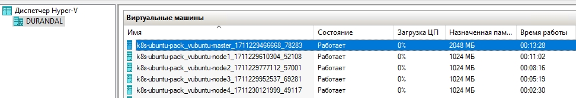

# Домашнее задание к занятию «Установка Kubernetes»

### Цель задания

Установить кластер K8s.

### Чеклист готовности к домашнему заданию

1. Развёрнутые ВМ с ОС Ubuntu 20.04-lts.


### Инструменты и дополнительные материалы, которые пригодятся для выполнения задания

1. [Инструкция по установке kubeadm](https://kubernetes.io/docs/setup/production-environment/tools/kubeadm/create-cluster-kubeadm/).
2. [Документация kubespray](https://kubespray.io/).

-----

### Задание 1. Установить кластер k8s с 1 master node

1. Подготовка работы кластера из 5 нод: 1 мастер и 4 рабочие ноды.
2. В качестве CRI — containerd.
3. Запуск etcd производить на мастере.
4. Способ установки выбрать самостоятельно.

### Ответ к заданию 1. Установить кластер k8s с 1 master node

1. Сначала готовим виртуальные машины. 
   - дано - Hyper-V
   - дано - Vagrant
2. Подбираем образ с Ubuntu 20.04 и поддержкой провайдера hyper-v
3. Переходим в нужную нам директорию
4. Добавляем box (вероятно может потребоваться VPN для скачивания)
```
vagrant box add generic/ubuntu2004
или
vagrant box add gusztavvargadr/ubuntu-server-2004-lts
```
5. Инициализируем
```
vagrant init
```
6. Готовим магию в виде Vagrantfile
```

boxes = [
    {
        :name => "vubuntu-master",
        :mem => "2048",
        :cpu => "2"
    },
    {
        :name => "vubuntu-node1",
        :mem => "1024",
        :cpu => "1"
    },
    {
        :name => "vubuntu-node2",
        :mem => "1024",
        :cpu => "1"
    },
    {
        :name => "vubuntu-node3",
        :mem => "1024",
        :cpu => "1"
    },
    {
        :name => "vubuntu-node4",
        :mem => "1024",
        :cpu => "1"
    }
]

Vagrant.configure(2) do |config|
  config.vm.box = "generic/ubuntu2004"

    config.vm.provider :hyperv do |v, override|
    override.vm.box = "generic/ubuntu2004"
  end

  # Turn off shared folders
  config.vm.synced_folder ".", "/vagrant", id: "vagrant-root", disabled: true

  boxes.each do |opts|
    config.vm.define opts[:name] do |config|
      config.vm.hostname = opts[:name]
	  config.vm.provider "hyperv" do |h|
	  h.memory =  opts[:mem]
	  h.cpus =  opts[:cpu]
     end

    config.vm.provision :shell do |shell|
      shell.inline = <<-SHELL
	apt-get update
	apt-get upgrade -y
	apt-get install  mc curl wget htop -y
	# permit root login
	echo "PermitRootLogin yes" >> /etc/ssh/sshd_config
	sed -in 's/PasswordAuthentication no/PasswordAuthentication yes/g' /etc/ssh/sshd_config
	service ssh restart
	hostnamectl set-hostname vubuntu.local
      SHELL
    end
   end
  end
end

```
7. Проверяем, что все поднялось и соответствует наши ожиданиям (установка софтов опциональна - можно вписать туда своё или убрать)

8. Логинимся на мастер и начинаем установку
9. Клонируем kubespray
```
vagrant@vubuntu:~$  git clone https://github.com/kubernetes-sigs/kubespray
Cloning into 'kubespray'...
remote: Enumerating objects: 73469, done.
remote: Counting objects: 100% (71/71), done.
remote: Compressing objects: 100% (58/58), done.
remote: Total 73469 (delta 22), reused 45 (delta 11), pack-reused 73398
Receiving objects: 100% (73469/73469), 23.20 MiB | 2.88 MiB/s, done.
Resolving deltas: 100% (41383/41383), done.
```
10. При установке зависимостей можем наткнуться на ошибку
```
$ pip3 install -r requirements.txt
ERROR: Could not find a version that satisfies the requirement ansible==9.3.0 (from -r requirements.txt (line 1)) (from versions: 1.0, 1.1, 1.2, 1.2.1, 1.2.2, 1.2.3, 1.3.0, 1.3.1, 1.3.2, 1.3.3, 1.3.4, 1.4, 1.4.1, 1.4.2, 1.4.3, 1.4.4, 1.4.5, 1.5, 1.5.1, 1.5.2, 1.5.3, 1.5.4, 1.5.5, 1.6, 1.6.1, 1.6.2, 1.6.3, 1.6.4, 1.6.5, 1.6.6, 1.6.7, 1.6.8, 1.6.9, 1.6.10, 1.7, 1.7.1, 1.7.2, 1.8, 1.8.1, 1.8.2, 1.8.3, 1.8.4, 1.9.0.1, 1.9.1, 1.9.2, 1.9.3, 1.9.4, 1.9.5, 1.9.6, 2.0.0.0, 2.0.0.1, 2.0.0.2, 2.0.1.0, 2.0.2.0, 2.1.0.0, 2.1.1.0, 2.1.2.0, 2.1.3.0, 2.1.4.0, 2.1.5.0, 2.1.6.0, 2.2.0.0, 2.2.1.0, 2.2.2.0, 2.2.3.0, 2.3.0.0, 2.3.1.0, 2.3.2.0, 2.3.3.0, 2.4.0.0, 2.4.1.0, 2.4.2.0, 2.4.3.0, 2.4.4.0, 2.4.5.0, 2.4.6.0, 2.5.0a1, 2.5.0b1, 2.5.0b2, 2.5.0rc1, 2.5.0rc2, 2.5.0rc3, 2.5.0, 2.5.1, 2.5.2, 2.5.3, 2.5.4, 2.5.5, 2.5.6, 2.5.7, 2.5.8, 2.5.9, 2.5.10, 2.5.11, 2.5.12, 2.5.13, 2.5.14, 2.5.15, 2.6.0a1, 2.6.0a2, 2.6.0rc1, 2.6.0rc2, 2.6.0rc3, 2.6.0rc4, 2.6.0rc5, 2.6.0, 2.6.1, 2.6.2, 2.6.3, 2.6.4, 2.6.5, 2.6.6, 2.6.7, 2.6.8, 2.6.9, 2.6.10, 2.6.11, 2.6.12, 2.6.13, 2.6.14, 2.6.15, 2.6.16, 2.6.17, 2.6.18, 2.6.19, 2.6.20, 2.7.0.dev0, 2.7.0a1, 2.7.0b1, 2.7.0rc1, 2.7.0rc2, 2.7.0rc3, 2.7.0rc4, 2.7.0, 2.7.1, 2.7.2, 2.7.3, 2.7.4, 2.7.5, 2.7.6, 2.7.7, 2.7.8, 2.7.9, 2.7.10, 2.7.11, 2.7.12, 2.7.13, 2.7.14, 2.7.15, 2.7.16, 2.7.17, 2.7.18, 2.8.0a1, 2.8.0b1, 2.8.0rc1, 2.8.0rc2, 2.8.0rc3, 2.8.0, 2.8.1, 2.8.2, 2.8.3, 2.8.4, 2.8.5, 2.8.6, 2.8.7, 2.8.8, 2.8.9, 2.8.10, 2.8.11, 2.8.12, 2.8.13, 2.8.14, 2.8.15, 2.8.16rc1, 2.8.16, 2.8.17rc1, 2.8.17, 2.8.18rc1, 2.8.18, 2.8.19rc1, 2.8.19, 2.8.20rc1, 2.8.20, 2.9.0b1, 2.9.0rc1, 2.9.0rc2, 2.9.0rc3, 2.9.0rc4, 2.9.0rc5, 2.9.0, 2.9.1, 2.9.2, 2.9.3, 2.9.4, 2.9.5, 2.9.6, 2.9.7, 2.9.8, 2.9.9, 2.9.10, 2.9.11, 2.9.12, 2.9.13, 2.9.14rc1, 2.9.14, 2.9.15rc1, 2.9.15, 2.9.16rc1, 2.9.16, 2.9.17rc1, 2.9.17, 2.9.18rc1, 2.9.18, 2.9.19rc1, 2.9.19, 2.9.20rc1, 2.9.20, 2.9.21rc1, 2.9.21, 2.9.22rc1, 2.9.22, 2.9.23rc1, 2.9.23, 2.9.24rc1, 2.9.24, 2.9.25rc1, 2.9.25, 2.9.26rc1, 2.9.26, 2.9.27rc1, 2.9.27, 2.10.0a1, 2.10.0a2, 2.10.0a3, 2.10.0a4, 2.10.0a5, 2.10.0a6, 2.10.0a7, 2.10.0a8, 2.10.0a9, 2.10.0b1, 2.10.0b2, 2.10.0rc1, 2.10.0, 2.10.1, 2.10.2, 2.10.3, 2.10.4, 2.10.5, 2.10.6, 2.10.7, 3.0.0b1, 3.0.0rc1, 3.0.0, 3.1.0, 3.2.0, 3.3.0, 3.4.0, 4.0.0a1, 4.0.0a2, 4.0.0a3, 4.0.0a4, 4.0.0b1, 4.0.0b2, 4.0.0rc1, 4.0.0, 4.1.0, 4.2.0, 4.3.0, 4.4.0, 4.5.0, 4.6.0, 4.7.0, 4.8.0, 4.9.0, 4.10.0, 5.0.0a1, 5.0.0a2, 5.0.0a3, 5.0.0b1, 5.0.0b2, 5.0.0rc1, 5.0.1, 5.1.0, 5.2.0, 5.3.0, 5.4.0, 5.5.0, 5.6.0, 5.7.0, 5.7.1, 5.8.0, 5.9.0, 5.10.0, 6.0.0a1, 6.0.0a2, 6.0.0a3, 6.0.0b1, 6.0.0b2, 6.0.0rc1, 6.0.0, 6.1.0, 6.2.0, 6.3.0, 6.4.0, 6.5.0, 6.6.0, 6.7.0, 9.0.0a1, 9.0.0a2, 9.0.0a3, 9.0.0b1, 9.0.0rc1, 9.0.0)
ERROR: No matching distribution found for ansible==9.3.0 (from -r requirements.txt (line 1))
```
11. Скорее всего у нас старый питончик и нужно обновиться, а также возможно поправить requirements.txt (версия **python >= 3.10**)
```
sudo apt update 

sudo apt install software-properties-common -y 

sudo add-apt-repository ppa:deadsnakes/ppa 

sudo apt install Python3.12

sudo update-alternatives --install /usr/bin/python3 python3 /usr/bin/python3.10 2

sudo apt install python-is-python3

sudo apt install python3-pip
```
12. Устанавливаем
```

vagrant@vubuntu-master:~/kubespray$ pip3 install -r requirements.txt
Defaulting to user installation because normal site-packages is not writeable
Collecting ansible==9.3.0
  Downloading ansible-9.3.0-py3-none-any.whl (46.3 MB)
     ━━━━━━━━━━━━━━━━━━━━━━━━━━━━━━━━━━━━━━━━ 46.3/46.3 MB 19.3 MB/s eta 0:00:00
Collecting cryptography==41.0.4
  Downloading cryptography-41.0.4-cp37-abi3-manylinux_2_28_x86_64.whl (4.4 MB)
     ━━━━━━━━━━━━━━━━━━━━━━━━━━━━━━━━━━━━━━━━ 4.4/4.4 MB 22.6 MB/s eta 0:00:00
Collecting jinja2==3.1.2
  Downloading Jinja2-3.1.2-py3-none-any.whl (133 kB)
     ━━━━━━━━━━━━━━━━━━━━━━━━━━━━━━━━━━━━━━━━ 133.1/133.1 KB 13.9 MB/s eta 0:00:00
Collecting jmespath==1.0.1
  Downloading jmespath-1.0.1-py3-none-any.whl (20 kB)
Collecting MarkupSafe==2.1.3
  Downloading MarkupSafe-2.1.3-cp310-cp310-manylinux_2_17_x86_64.manylinux2014_x86_64.whl (25 kB)
Collecting netaddr==0.9.0
  Downloading netaddr-0.9.0-py3-none-any.whl (2.2 MB)
     ━━━━━━━━━━━━━━━━━━━━━━━━━━━━━━━━━━━━━━━━ 2.2/2.2 MB 18.0 MB/s eta 0:00:00
Collecting pbr==5.11.1
  Downloading pbr-5.11.1-py2.py3-none-any.whl (112 kB)
     ━━━━━━━━━━━━━━━━━━━━━━━━━━━━━━━━━━━━━━━━ 112.7/112.7 KB 12.8 MB/s eta 0:00:00
Collecting ruamel.yaml==0.18.5
  Downloading ruamel.yaml-0.18.5-py3-none-any.whl (116 kB)
     ━━━━━━━━━━━━━━━━━━━━━━━━━━━━━━━━━━━━━━━━ 116.4/116.4 KB 10.1 MB/s eta 0:00:00
Collecting ruamel.yaml.clib==0.2.8
  Downloading ruamel.yaml.clib-0.2.8-cp310-cp310-manylinux_2_17_x86_64.manylinux2014_x86_64.manylinux_2_                      24_x86_64.whl (526 kB)
     ━━━━━━━━━━━━━━━━━━━━━━━━━━━━━━━━━━━━━━━━ 526.7/526.7 KB 19.6 MB/s eta 0:00:00
Collecting ansible-core~=2.16.4
  Downloading ansible_core-2.16.4-py3-none-any.whl (2.3 MB)
     ━━━━━━━━━━━━━━━━━━━━━━━━━━━━━━━━━━━━━━━━ 2.3/2.3 MB 21.9 MB/s eta 0:00:00
Collecting cffi>=1.12
  Downloading cffi-1.16.0-cp310-cp310-manylinux_2_17_x86_64.manylinux2014_x86_64.whl (443 kB)
     ━━━━━━━━━━━━━━━━━━━━━━━━━━━━━━━━━━━━━━━━ 443.9/443.9 KB 19.5 MB/s eta 0:00:00
Collecting resolvelib<1.1.0,>=0.5.3
  Downloading resolvelib-1.0.1-py2.py3-none-any.whl (17 kB)
Collecting packaging
  Downloading packaging-24.0-py3-none-any.whl (53 kB)
     ━━━━━━━━━━━━━━━━━━━━━━━━━━━━━━━━━━━━━━━━ 53.5/53.5 KB 6.4 MB/s eta 0:00:00
Requirement already satisfied: PyYAML>=5.1 in /usr/lib/python3/dist-packages (from ansible-core~=2.16.4-                      >ansible==9.3.0->-r requirements.txt (line 1)) (5.4.1)
Collecting pycparser
  Downloading pycparser-2.21-py2.py3-none-any.whl (118 kB)
     ━━━━━━━━━━━━━━━━━━━━━━━━━━━━━━━━━━━━━━━━ 118.7/118.7 KB 15.4 MB/s eta 0:00:00
Installing collected packages: resolvelib, netaddr, ruamel.yaml.clib, pycparser, pbr, packaging, MarkupS                      afe, jmespath, ruamel.yaml, jinja2, cffi, cryptography, ansible-core, ansible
  WARNING: The script netaddr is installed in '/home/vagrant/.local/bin' which is not on PATH.
  Consider adding this directory to PATH or, if you prefer to suppress this warning, use --no-warn-scrip                      t-location.
  WARNING: The script pbr is installed in '/home/vagrant/.local/bin' which is not on PATH.
  Consider adding this directory to PATH or, if you prefer to suppress this warning, use --no-warn-scrip                      t-location.
  WARNING: The scripts ansible, ansible-config, ansible-connection, ansible-console, ansible-doc, ansibl                      e-galaxy, ansible-inventory, ansible-playbook, ansible-pull and ansible-vault are installed in '/home/va                      grant/.local/bin' which is not on PATH.
  Consider adding this directory to PATH or, if you prefer to suppress this warning, use --no-warn-scrip                      t-location.

  WARNING: The script ansible-community is installed in '/home/vagrant/.local/bin' which is not on PATH.
  Consider adding this directory to PATH or, if you prefer to suppress this warning, use --no-warn-script-location.
Successfully installed MarkupSafe-2.1.3 ansible-9.3.0 ansible-core-2.16.4 cffi-1.16.0 cryptography-41.0.4 jinja2-3.1.2 jmespath-1.0.1 netaddr-0.9.0 packaging-24.0 pbr-5.11.1 pycparser-2.21 resolvelib-1.0.1 ruamel.yaml-0.18.5 ruamel.yaml.clib-0.2.8
```
13. Подготовка исходя из адресов..


```
cp -rfp inventory/sample inventory/mycluster

declare -a IPS=(192.168.1.79 192.168.1.80 192.168.1.82 192.168.1.83 192.168.1.84)
```
```
CONFIG_FILE=inventory/mycluster/hosts.yaml python3 contrib/inventory_builder/inventory.py ${IPS[@]}
```
```
vagrant@vubuntu:~/kubespray$ declare -a IPS=(192.168.1.79 192.168.1.80 192.168.1.82 192.168.1.83 192.168.1.84)
vagrant@vubuntu:~/kubespray$ CONFIG_FILE=inventory/mycluster/hosts.yaml python3 contrib/inventory_builder/inventory.py ${IPS[@]}
DEBUG: Adding group all
DEBUG: Adding group kube_control_plane
DEBUG: Adding group kube_node
DEBUG: Adding group etcd
DEBUG: Adding group k8s_cluster
DEBUG: Adding group calico_rr
DEBUG: adding host node1 to group all
DEBUG: adding host node2 to group all
DEBUG: adding host node3 to group all
DEBUG: adding host node4 to group all
DEBUG: adding host node5 to group all
DEBUG: adding host node1 to group etcd
DEBUG: adding host node2 to group etcd
DEBUG: adding host node3 to group etcd
DEBUG: adding host node1 to group kube_control_plane
DEBUG: adding host node2 to group kube_control_plane
DEBUG: adding host node1 to group kube_node
DEBUG: adding host node2 to group kube_node
DEBUG: adding host node3 to group kube_node
DEBUG: adding host node4 to group kube_node
DEBUG: adding host node5 to group kube_node
```
14. Нормализуем inventory - hosts.yaml / inventory.ini
```

all:
  hosts:
    master:
      ansible_host: 192.168.1.79
      ip: 192.168.1.79
      access_ip: 192.168.1.79
    node1:
      ansible_host: 192.168.1.80
      ip: 192.168.1.80
      access_ip: 192.168.1.80
    node2:
      ansible_host: 192.168.1.82
      ip: 192.168.1.82
      access_ip: 192.168.1.82
    node3:
      ansible_host: 192.168.1.83
      ip: 192.168.1.83
      access_ip: 192.168.1.83
    node4:
      ansible_host: 192.168.1.84
      ip: 192.168.1.84
      access_ip: 192.168.1.84
  children:
    kube_control_plane:
      hosts:
        master:
    kube_node:
      hosts:
        node1:
        node2:
        node3:
        node4:
    etcd:
      hosts:
        master:
    k8s_cluster:
      children:
        kube_control_plane:
        kube_node:
    calico_rr:
      hosts: {}

```
```
[all]
master ansible_host=192.168.1.79
node1 ansible_host=192.168.1.80
node2 ansible_host=192.168.1.82
node3 ansible_host=192.168.1.83
node4 ansible_host=192.168.1.84 

# ## configure a bastion host if your nodes are not directly reachable
# [bastion]
# bastion ansible_host=x.x.x.x ansible_user=some_user

[kube_control_plane]
master

[etcd]
master

[kube_node]
node1
node2
node3
node4

[calico_rr]

[k8s_cluster:children]
kube_control_plane
kube_node
calico_rr

```
15. Создаем и раскидываем ключи
```
ssh-keygen -t rsa
```
```
nano sshkeys.sh
---
#!/bin/bash
for ip in `cat ~/list_of_servers`; do
    ssh-copy-id -i ~/.ssh/id_rsa.pub $ip
done
---
chmod +x
```
Список адресов в list_of_servers

16. Запускаем плейбук
```
Не забываем:
export PATH=$PATH:~/.local/bin

Не забываем (при динамическом выделении памяти, может не хватит):
roles/kubernetes/preinstall/defaults/main.yml:minimal_node_memory_mb: 1024 
```

Запуск:
```
ansible-playbook -i inventory/mycluster/inventory.ini cluster.yml -b -v
```

Вывод:
```
километровая портянка...

Sunday 24 March 2024  08:15:05 +0000 (0:00:00.038)       0:13:46.661 **********

TASK [network_plugin/calico : Check ipip and vxlan mode if simultaneously enabled] *************************************************
ok: [master] => {
    "changed": false,
    "msg": "All assertions passed"
}
Sunday 24 March 2024  08:15:05 +0000 (0:00:00.056)       0:13:46.718 **********

TASK [network_plugin/calico : Get Calico default-pool configuration] ***************************************************************
ok: [master] => {"changed": false, "cmd": ["/usr/local/bin/calicoctl.sh", "get", "ipPool", "default-pool", "-o", "json"], "delta": "0:00:00.045838", "end": "2024-03-24 08:15:06.017998", "failed_when_result": false, "msg": "", "rc": 0, "start": "2024-03-24 08:15:05.972160", "stderr": "", "stderr_lines": [], "stdout": "{\n  \"kind\": \"IPPool\",\n  \"apiVersion\": \"projectcalico.org/v3\",\n  \"metadata\": {\n    \"name\": \"default-pool\",\n    \"uid\": \"e43c7c66-5cc2-4454-a15b-0107ded88f15\",\n    \"resourceVersion\": \"837\",\n    \"creationTimestamp\": \"2024-03-24T08:13:26Z\"\n  },\n  \"spec\": {\n    \"cidr\": \"10.233.64.0/18\",\n    \"vxlanMode\": \"Always\",\n    \"ipipMode\": \"Never\",\n    \"natOutgoing\": true,\n    \"blockSize\": 26,\n    \"nodeSelector\": \"all()\",\n    \"allowedUses\": [\n      \"Workload\",\n      \"Tunnel\"\n    ]\n  }\n}", "stdout_lines": ["{", "  \"kind\": \"IPPool\",", "  \"apiVersion\": \"projectcalico.org/v3\",", "  \"metadata\": {", "    \"name\": \"default-pool\",", "    \"uid\": \"e43c7c66-5cc2-4454-a15b-0107ded88f15\",", "    \"resourceVersion\": \"837\",", "    \"creationTimestamp\": \"2024-03-24T08:13:26Z\"", "  },", "  \"spec\": {", "    \"cidr\": \"10.233.64.0/18\",", "    \"vxlanMode\": \"Always\",", "    \"ipipMode\": \"Never\",", "    \"natOutgoing\": true,", "    \"blockSize\": 26,", "    \"nodeSelector\": \"all()\",", "    \"allowedUses\": [", "      \"Workload\",", "      \"Tunnel\"", "    ]", "  }", "}"]}
Sunday 24 March 2024  08:15:06 +0000 (0:00:00.303)       0:13:47.022 **********

TASK [network_plugin/calico : Set calico_pool_conf] ********************************************************************************
ok: [master] => {"ansible_facts": {"calico_pool_conf": {"apiVersion": "projectcalico.org/v3", "kind": "IPPool", "metadata": {"creationTimestamp": "2024-03-24T08:13:26Z", "name": "default-pool", "resourceVersion": "837", "uid": "e43c7c66-5cc2-4454-a15b-0107ded88f15"}, "spec": {"allowedUses": ["Workload", "Tunnel"], "blockSize": 26, "cidr": "10.233.64.0/18", "ipipMode": "Never", "natOutgoing": true, "nodeSelector": "all()", "vxlanMode": "Always"}}}, "changed": false}
Sunday 24 March 2024  08:15:06 +0000 (0:00:00.069)       0:13:47.091 **********

TASK [network_plugin/calico : Check if inventory match current cluster configuration] **********************************************
ok: [master] => {
    "changed": false,
    "msg": "All assertions passed"
}
Sunday 24 March 2024  08:15:06 +0000 (0:00:00.069)       0:13:47.160 **********
Sunday 24 March 2024  08:15:06 +0000 (0:00:00.043)       0:13:47.204 **********
Sunday 24 March 2024  08:15:06 +0000 (0:00:00.062)       0:13:47.266 **********

PLAY RECAP *************************************************************************************************************************
master                     : ok=697  changed=138  unreachable=0    failed=0    skipped=1170 rescued=0    ignored=6
node1                      : ok=438  changed=82   unreachable=0    failed=0    skipped=697  rescued=0    ignored=1
node2                      : ok=438  changed=82   unreachable=0    failed=0    skipped=693  rescued=0    ignored=1
node3                      : ok=438  changed=82   unreachable=0    failed=0    skipped=693  rescued=0    ignored=1
node4                      : ok=438  changed=82   unreachable=0    failed=0    skipped=693  rescued=0    ignored=1

Sunday 24 March 2024  08:15:06 +0000 (0:00:00.459)       0:13:47.726 **********
===============================================================================
download : Download_container | Download image if required ----------------------------------------------------------------- 32.91s
container-engine/containerd : Download_file | Download item ---------------------------------------------------------------- 28.39s
download : Download_file | Download item ----------------------------------------------------------------------------------- 25.53s
download : Download_container | Download image if required ----------------------------------------------------------------- 25.14s
container-engine/crictl : Download_file | Download item -------------------------------------------------------------------- 22.44s
container-engine/runc : Download_file | Download item ---------------------------------------------------------------------- 20.34s
container-engine/nerdctl : Download_file | Download item ------------------------------------------------------------------- 18.19s
download : Download_file | Download item ----------------------------------------------------------------------------------- 17.98s
kubernetes/kubeadm : Join to cluster --------------------------------------------------------------------------------------- 15.01s
download : Download_file | Download item ----------------------------------------------------------------------------------- 13.55s
download : Download_container | Download image if required ----------------------------------------------------------------- 12.17s
download : Download_container | Download image if required ----------------------------------------------------------------- 11.25s
download : Download_file | Download item ----------------------------------------------------------------------------------- 11.11s
download : Download_container | Download image if required ----------------------------------------------------------------- 10.91s
kubernetes/control-plane : Kubeadm | Initialize first master --------------------------------------------------------------- 10.78s
container-engine/crictl : Extract_file | Unpacking archive ----------------------------------------------------------------- 10.00s
download : Download_file | Download item ------------------------------------------------------------------------------------ 9.67s
container-engine/nerdctl : Extract_file | Unpacking archive ----------------------------------------------------------------- 9.11s
download : Download_container | Download image if required ------------------------------------------------------------------ 8.50s
download : Download_container | Download image if required ------------------------------------------------------------------ 7.93s

```
16. Проверка и дополнение

Можем получить ошибку (особенно, если мы не под рутом)
```
vagrant@master:~$ kubectl version
Client Version: v1.29.2
Kustomize Version: v5.0.4-0.20230601165947-6ce0bf390ce3
The connection to the server localhost:8080 was refused - did you specify the right host or port?
```
Fix:
```
mkdir -p $HOME/.kube
sudo cp -i /etc/kubernetes/admin.conf $HOME/.kube/config
chown -R vagrant:vagrant /home/vagrant/.kube/config
```

```
$ kubectl version
Client Version: v1.29.2
Kustomize Version: v5.0.4-0.20230601165947-6ce0bf390ce3
The connection to the server localhost:8080 was refused - did you specify the right host or port?
```
17. Смотрим ноды
```
 $ kubectl get nodes
NAME     STATUS   ROLES           AGE     VERSION
master   Ready    control-plane   9m21s   v1.29.2
node1    Ready    <none>          8m47s   v1.29.2
node2    Ready    <none>          8m47s   v1.29.2
node3    Ready    <none>          8m46s   v1.29.2
node4    Ready    <none>          8m46s   v1.29.2

```
18. Тестовый деплой
```
$ kubectl create deploy nginx --image=nginx:latest --replicas=2
deployment.apps/nginx created

:~$ kubectl get pod -o wide
NAME                     READY   STATUS    RESTARTS   AGE   IP               NODE    NOMINATED NODE   READINESS GATES
nginx-56fcf95486-lkkgv   1/1     Running   0          98s   10.233.71.1      node3   <none>           <none>
nginx-56fcf95486-pxd52   1/1     Running   0          98s   10.233.102.129   node1   <none>           <none>
```


