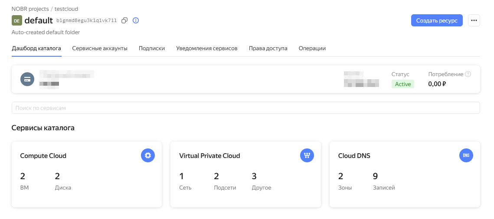
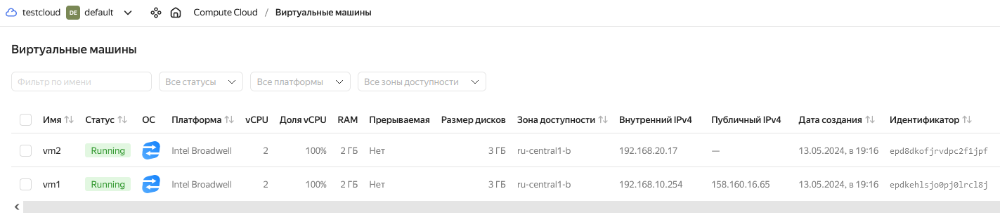
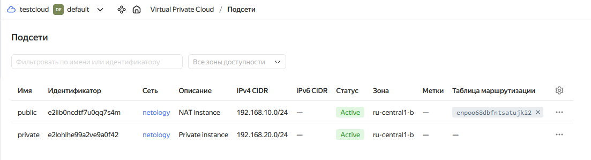

# Домашнее задание к занятию «Организация сети»

### Подготовка к выполнению задания

1. Домашнее задание состоит из обязательной части, которую нужно выполнить на провайдере Yandex Cloud, и дополнительной части в AWS (выполняется по желанию). 
2. Все домашние задания в блоке 15 связаны друг с другом и в конце представляют пример законченной инфраструктуры.  
3. Все задания нужно выполнить с помощью Terraform. Результатом выполненного домашнего задания будет код в репозитории. 
4. Перед началом работы настройте доступ к облачным ресурсам из Terraform, используя материалы прошлых лекций и домашнее задание по теме «Облачные провайдеры и синтаксис Terraform». Заранее выберите регион (в случае AWS) и зону.

---
### Задание 1. Yandex Cloud 

**Что нужно сделать**

1. Создать пустую VPC. Выбрать зону.
2. Публичная подсеть.
 - Создать в VPC subnet с названием public, сетью 192.168.10.0/24.
 - Создать в этой подсети NAT-инстанс, присвоив ему адрес 192.168.10.254. В качестве image_id использовать fd80mrhj8fl2oe87o4e1.
 - Создать в этой публичной подсети виртуалку с публичным IP, подключиться к ней и убедиться, что есть доступ к интернету.
3. Приватная подсеть.
 - Создать в VPC subnet с названием private, сетью 192.168.20.0/24.
 - Создать route table. Добавить статический маршрут, направляющий весь исходящий трафик private сети в NAT-инстанс.
 - Создать в этой приватной подсети виртуалку с внутренним IP, подключиться к ней через виртуалку, созданную ранее, и убедиться, что есть доступ к интернету.

Resource Terraform для Yandex Cloud:

- [VPC subnet](https://registry.terraform.io/providers/yandex-cloud/yandex/latest/docs/resources/vpc_subnet).
- [Route table](https://registry.terraform.io/providers/yandex-cloud/yandex/latest/docs/resources/vpc_route_table).
- [Compute Instance](https://registry.terraform.io/providers/yandex-cloud/yandex/latest/docs/resources/compute_instance).

### Ответ к заданию 1. Yandex Cloud 

1. Для начала нужно вспомнить, где был санкционный терраформ и развернуть тестовый стенд. Поскольку без VPN или хитростей с маршрутом поставить не выйдет, то нужно поискать бинарник на стороне. Внезапно он будет в Яндекса (найдется все :-)

```
wget https://hashicorp-releases.yandexcloud.net/terraform/1.8.3/terraform_1.8.3_linux_amd64.zip
unzip terraform_*_linux_amd64.zip
sudo mv terraform /usr/local/bin/
```

```
vagrant@master:~$ terraform -version
Terraform v1.8.3
on linux_amd64
```

Установим автоподстановки:
```
terraform -install-autocomplete
```

А также нам нужно добавить провайдер - Яндекс, скачать его с санкционного терраформа будет немного проблематично.
```
nano ~/.terraformrc
```
```
provider_installation {
  network_mirror {
    url = "https://terraform-mirror.yandexcloud.net/"
    include = ["registry.terraform.io/*/*"]
  }
  direct {
    exclude = ["registry.terraform.io/*/*"]
  }
}
```

Установим yc (Yandex CLI)
```
curl -sSL https://storage.yandexcloud.net/yandexcloud-yc/install.sh | bash

source "/root/.bashrc"
```

Получим токен и введем его - далее стандартно, выбор директории и т.д.
```
 yc init
```

Создадим сервисный аккаунт
```
yc iam key create --service-account-name sa-terraform --output key.json
```

Проверяем
```
# yc iam service-account list
+----------------------+--------------+
|          ID          |     NAME     |
+----------------------+--------------+
| здесь какой-то ID    | sa-terraform |
+----------------------+--------------+

# yc iam create-token
```

2. Создали файл с описанием инфры - [main.tf](main.tf)
   *Токены из него будут извлечены*

```
# terraform init

Initializing the backend...

Initializing provider plugins...
- Reusing previous version of yandex-cloud/yandex from the dependency lock file
- Using previously-installed yandex-cloud/yandex v0.117.0

Terraform has been successfully initialized!
```

```
# terraform validate
Success! The configuration is valid.
```

```
root@master:/opt/terraform/yandex# terraform plan

Terraform used the selected providers to generate the following execution plan. Resource actions are indicated with the following symbols:
  + create

Terraform will perform the following actions:

  # yandex_compute_instance.default will be created
  + resource "yandex_compute_instance" "default" {
      + created_at                = (known after apply)
      + folder_id                 = (known after apply)
      + fqdn                      = (known after apply)
      + gpu_cluster_id            = (known after apply)
      + hostname                  = (known after apply)
      + id                        = (known after apply)
      + maintenance_grace_period  = (known after apply)
      + maintenance_policy        = (known after apply)
      + metadata                  = {
          + "ssh-keys" = <<-EOT
                ubuntu:ssh-rsa AAAAB3NzaC1yc2EAAAADAQABAAABgQDB6PcSriIrZYGusMl9x9pkQh0FXp0f1Pn/jvM9taXRdcGhQRRkTjlO7WWwK1vUhuDElhhbjIEthox9f0eLwYwNNpVgH8/7vT66RJ16jNCtbn+2u00+sDxPU/uZccNjmIrXnvR5dRcQcua/VnCaX2SjO46WG0c6jQH/6cuxuxVPDdn62KBZmj+B/u8a9R34x8/GSRgBzOFnL3KgMryv4vLCn6xBUPvrWvIfoL1kDrn7b/T+cBjA6OlCsv4v5hk0hh4VzcOQeCmqqWr1CCsCuodGQsJiiLrbC/unr5I+U/cXYLV2MUDuY++oj5rAIKEl6CJDH+R8m77PlURU1/bYZEnnCVZQB57iWs6ZwhU6Fod7UZlwJS+9C17zw/ZvjpNe/K2Vp8UviiriDHPz4mZLYYwibhHtYcaLYh0cnme0okR9GL6V/kKWYS+Z0B0hE3VKbuaIYlF54isIkpz1lpCHqGnPGtToUoyYJrtmU10I9MRFc18z41BFGsQ/AqwsaIRyDA0= root@master
            EOT
        }
      + name                      = "vm1"
      + network_acceleration_type = "standard"
      + platform_id               = "standard-v1"
      + service_account_id        = (known after apply)
      + status                    = (known after apply)
      + zone                      = "ru-central1-b"

      + boot_disk {
          + auto_delete = true
          + device_name = (known after apply)
          + disk_id     = (known after apply)
          + mode        = (known after apply)

          + initialize_params {
              + block_size  = (known after apply)
              + description = (known after apply)
              + image_id    = "fd80mrhj8fl2oe87o4e1"
              + name        = (known after apply)
              + size        = (known after apply)
              + snapshot_id = (known after apply)
              + type        = "network-hdd"
            }
        }

      + network_interface {
          + index              = (known after apply)
          + ip_address         = "192.168.10.254"
          + ipv4               = true
          + ipv6               = (known after apply)
          + ipv6_address       = (known after apply)
          + mac_address        = (known after apply)
          + nat                = true
          + nat_ip_address     = (known after apply)
          + nat_ip_version     = (known after apply)
          + security_group_ids = (known after apply)
          + subnet_id          = (known after apply)
        }

      + resources {
          + core_fraction = 100
          + cores         = 2
          + memory        = 2
        }
    }

  # yandex_compute_instance.netology will be created
  + resource "yandex_compute_instance" "netology" {
      + created_at                = (known after apply)
      + folder_id                 = (known after apply)
      + fqdn                      = (known after apply)
      + gpu_cluster_id            = (known after apply)
      + hostname                  = (known after apply)
      + id                        = (known after apply)
      + maintenance_grace_period  = (known after apply)
      + maintenance_policy        = (known after apply)
      + metadata                  = {
          + "ssh-keys" = <<-EOT
                ubuntu:ssh-rsa AAAAB3NzaC1yc2EAAAADAQABAAABgQDB6PcSriIrZYGusMl9x9pkQh0FXp0f1Pn/jvM9taXRdcGhQRRkTjlO7WWwK1vUhuDElhhbjIEthox9f0eLwYwNNpVgH8/7vT66RJ16jNCtbn+2u00+sDxPU/uZccNjmIrXnvR5dRcQcua/VnCaX2SjO46WG0c6jQH/6cuxuxVPDdn62KBZmj+B/u8a9R34x8/GSRgBzOFnL3KgMryv4vLCn6xBUPvrWvIfoL1kDrn7b/T+cBjA6OlCsv4v5hk0hh4VzcOQeCmqqWr1CCsCuodGQsJiiLrbC/unr5I+U/cXYLV2MUDuY++oj5rAIKEl6CJDH+R8m77PlURU1/bYZEnnCVZQB57iWs6ZwhU6Fod7UZlwJS+9C17zw/ZvjpNe/K2Vp8UviiriDHPz4mZLYYwibhHtYcaLYh0cnme0okR9GL6V/kKWYS+Z0B0hE3VKbuaIYlF54isIkpz1lpCHqGnPGtToUoyYJrtmU10I9MRFc18z41BFGsQ/AqwsaIRyDA0= root@master
            EOT
        }
      + name                      = "vm2"
      + network_acceleration_type = "standard"
      + platform_id               = "standard-v1"
      + service_account_id        = (known after apply)
      + status                    = (known after apply)
      + zone                      = "ru-central1-b"

      + boot_disk {
          + auto_delete = true
          + device_name = (known after apply)
          + disk_id     = (known after apply)
          + mode        = (known after apply)

          + initialize_params {
              + block_size  = (known after apply)
              + description = (known after apply)
              + image_id    = "fd80mrhj8fl2oe87o4e1"
              + name        = (known after apply)
              + size        = (known after apply)
              + snapshot_id = (known after apply)
              + type        = "network-hdd"
            }
        }

      + network_interface {
          + index              = (known after apply)
          + ip_address         = (known after apply)
          + ipv4               = true
          + ipv6               = (known after apply)
          + ipv6_address       = (known after apply)
          + mac_address        = (known after apply)
          + nat                = false
          + nat_ip_address     = (known after apply)
          + nat_ip_version     = (known after apply)
          + security_group_ids = (known after apply)
          + subnet_id          = (known after apply)
        }

      + resources {
          + core_fraction = 100
          + cores         = 2
          + memory        = 2
        }
    }

  # yandex_vpc_network.network will be created
  + resource "yandex_vpc_network" "network" {
      + created_at                = (known after apply)
      + default_security_group_id = (known after apply)
      + folder_id                 = (known after apply)
      + id                        = (known after apply)
      + labels                    = (known after apply)
      + name                      = "netology"
      + subnet_ids                = (known after apply)
    }

  # yandex_vpc_route_table.net-rt will be created
  + resource "yandex_vpc_route_table" "net-rt" {
      + created_at = (known after apply)
      + folder_id  = (known after apply)
      + id         = (known after apply)
      + labels     = (known after apply)
      + network_id = (known after apply)

      + static_route {
          + destination_prefix = "0.0.0.0/0"
          + next_hop_address   = "192.168.10.254"
            # (1 unchanged attribute hidden)
        }
    }

  # yandex_vpc_subnet.private-subnet will be created
  + resource "yandex_vpc_subnet" "private-subnet" {
      + created_at     = (known after apply)
      + description    = "Private instance"
      + folder_id      = (known after apply)
      + id             = (known after apply)
      + labels         = (known after apply)
      + name           = "private"
      + network_id     = (known after apply)
      + v4_cidr_blocks = [
          + "192.168.20.0/24",
        ]
      + v6_cidr_blocks = (known after apply)
      + zone           = "ru-central1-b"
    }

  # yandex_vpc_subnet.public-subnet will be created
  + resource "yandex_vpc_subnet" "public-subnet" {
      + created_at     = (known after apply)
      + description    = "NAT instance"
      + folder_id      = (known after apply)
      + id             = (known after apply)
      + labels         = (known after apply)
      + name           = "public"
      + network_id     = (known after apply)
      + v4_cidr_blocks = [
          + "192.168.10.0/24",
        ]
      + v6_cidr_blocks = (known after apply)
      + zone           = "ru-central1-b"
    }

Plan: 6 to add, 0 to change, 0 to destroy.

```

Добавляем:
```
root@master:/opt/terraform/yandex# terraform apply

Terraform used the selected providers to generate the following execution plan. Resource actions are indicated with the following symbols:
  + create

Terraform will perform the following actions:

  # yandex_compute_instance.default will be created
  + resource "yandex_compute_instance" "default" {
      + created_at                = (known after apply)
      + folder_id                 = (known after apply)
      + fqdn                      = (known after apply)
      + gpu_cluster_id            = (known after apply)
      + hostname                  = (known after apply)
      + id                        = (known after apply)
      + maintenance_grace_period  = (known after apply)
      + maintenance_policy        = (known after apply)
      + metadata                  = {
          + "ssh-keys" = <<-EOT
                ubuntu:ssh-rsa AAAAB3NzaC1yc2EAAAADAQABAAABgQDB6PcSriIrZYGusMl9x9pkQh0FXp0f1Pn/jvM9taXRdcGhQRRkTjlO7WWwK1vUhuDElhhbjIEthox9f0eLwYwNNpVgH8/7vT66RJ16jNCtbn+2u00+sDxPU/uZccNjmIrXnvR5dRcQcua/VnCaX2SjO46WG0c6jQH/6cuxuxVPDdn62KBZmj+B/u8a9R34x8/GSRgBzOFnL3KgMryv4vLCn6xBUPvrWvIfoL1kDrn7b/T+cBjA6OlCsv4v5hk0hh4VzcOQeCmqqWr1CCsCuodGQsJiiLrbC/unr5I+U/cXYLV2MUDuY++oj5rAIKEl6CJDH+R8m77PlURU1/bYZEnnCVZQB57iWs6ZwhU6Fod7UZlwJS+9C17zw/ZvjpNe/K2Vp8UviiriDHPz4mZLYYwibhHtYcaLYh0cnme0okR9GL6V/kKWYS+Z0B0hE3VKbuaIYlF54isIkpz1lpCHqGnPGtToUoyYJrtmU10I9MRFc18z41BFGsQ/AqwsaIRyDA0= root@master
            EOT
        }
      + name                      = "vm1"
      + network_acceleration_type = "standard"
      + platform_id               = "standard-v1"
      + service_account_id        = (known after apply)
      + status                    = (known after apply)
      + zone                      = "ru-central1-b"

      + boot_disk {
          + auto_delete = true
          + device_name = (known after apply)
          + disk_id     = (known after apply)
          + mode        = (known after apply)

          + initialize_params {
              + block_size  = (known after apply)
              + description = (known after apply)
              + image_id    = "fd80mrhj8fl2oe87o4e1"
              + name        = (known after apply)
              + size        = (known after apply)
              + snapshot_id = (known after apply)
              + type        = "network-hdd"
            }
        }

      + network_interface {
          + index              = (known after apply)
          + ip_address         = "192.168.10.254"
          + ipv4               = true
          + ipv6               = (known after apply)
          + ipv6_address       = (known after apply)
          + mac_address        = (known after apply)
          + nat                = true
          + nat_ip_address     = (known after apply)
          + nat_ip_version     = (known after apply)
          + security_group_ids = (known after apply)
          + subnet_id          = (known after apply)
        }

      + resources {
          + core_fraction = 100
          + cores         = 2
          + memory        = 2
        }
    }

  # yandex_compute_instance.netology will be created
  + resource "yandex_compute_instance" "netology" {
      + created_at                = (known after apply)
      + folder_id                 = (known after apply)
      + fqdn                      = (known after apply)
      + gpu_cluster_id            = (known after apply)
      + hostname                  = (known after apply)
      + id                        = (known after apply)
      + maintenance_grace_period  = (known after apply)
      + maintenance_policy        = (known after apply)
      + metadata                  = {
          + "ssh-keys" = <<-EOT
                ubuntu:ssh-rsa AAAAB3NzaC1yc2EAAAADAQABAAABgQDB6PcSriIrZYGusMl9x9pkQh0FXp0f1Pn/jvM9taXRdcGhQRRkTjlO7WWwK1vUhuDElhhbjIEthox9f0eLwYwNNpVgH8/7vT66RJ16jNCtbn+2u00+sDxPU/uZccNjmIrXnvR5dRcQcua/VnCaX2SjO46WG0c6jQH/6cuxuxVPDdn62KBZmj+B/u8a9R34x8/GSRgBzOFnL3KgMryv4vLCn6xBUPvrWvIfoL1kDrn7b/T+cBjA6OlCsv4v5hk0hh4VzcOQeCmqqWr1CCsCuodGQsJiiLrbC/unr5I+U/cXYLV2MUDuY++oj5rAIKEl6CJDH+R8m77PlURU1/bYZEnnCVZQB57iWs6ZwhU6Fod7UZlwJS+9C17zw/ZvjpNe/K2Vp8UviiriDHPz4mZLYYwibhHtYcaLYh0cnme0okR9GL6V/kKWYS+Z0B0hE3VKbuaIYlF54isIkpz1lpCHqGnPGtToUoyYJrtmU10I9MRFc18z41BFGsQ/AqwsaIRyDA0= root@master
            EOT
        }
      + name                      = "vm2"
      + network_acceleration_type = "standard"
      + platform_id               = "standard-v1"
      + service_account_id        = (known after apply)
      + status                    = (known after apply)
      + zone                      = "ru-central1-b"

      + boot_disk {
          + auto_delete = true
          + device_name = (known after apply)
          + disk_id     = (known after apply)
          + mode        = (known after apply)

          + initialize_params {
              + block_size  = (known after apply)
              + description = (known after apply)
              + image_id    = "fd80mrhj8fl2oe87o4e1"
              + name        = (known after apply)
              + size        = (known after apply)
              + snapshot_id = (known after apply)
              + type        = "network-hdd"
            }
        }

      + network_interface {
          + index              = (known after apply)
          + ip_address         = (known after apply)
          + ipv4               = true
          + ipv6               = (known after apply)
          + ipv6_address       = (known after apply)
          + mac_address        = (known after apply)
          + nat                = false
          + nat_ip_address     = (known after apply)
          + nat_ip_version     = (known after apply)
          + security_group_ids = (known after apply)
          + subnet_id          = (known after apply)
        }

      + resources {
          + core_fraction = 100
          + cores         = 2
          + memory        = 2
        }
    }

  # yandex_vpc_network.network will be created
  + resource "yandex_vpc_network" "network" {
      + created_at                = (known after apply)
      + default_security_group_id = (known after apply)
      + folder_id                 = (known after apply)
      + id                        = (known after apply)
      + labels                    = (known after apply)
      + name                      = "netology"
      + subnet_ids                = (known after apply)
    }

  # yandex_vpc_route_table.net-rt will be created
  + resource "yandex_vpc_route_table" "net-rt" {
      + created_at = (known after apply)
      + folder_id  = (known after apply)
      + id         = (known after apply)
      + labels     = (known after apply)
      + network_id = (known after apply)

      + static_route {
          + destination_prefix = "0.0.0.0/0"
          + next_hop_address   = "192.168.10.254"
            # (1 unchanged attribute hidden)
        }
    }

  # yandex_vpc_subnet.private-subnet will be created
  + resource "yandex_vpc_subnet" "private-subnet" {
      + created_at     = (known after apply)
      + description    = "Private instance"
      + folder_id      = (known after apply)
      + id             = (known after apply)
      + labels         = (known after apply)
      + name           = "private"
      + network_id     = (known after apply)
      + v4_cidr_blocks = [
          + "192.168.20.0/24",
        ]
      + v6_cidr_blocks = (known after apply)
      + zone           = "ru-central1-b"
    }

  # yandex_vpc_subnet.public-subnet will be created
  + resource "yandex_vpc_subnet" "public-subnet" {
      + created_at     = (known after apply)
      + description    = "NAT instance"
      + folder_id      = (known after apply)
      + id             = (known after apply)
      + labels         = (known after apply)
      + name           = "public"
      + network_id     = (known after apply)
      + v4_cidr_blocks = [
          + "192.168.10.0/24",
        ]
      + v6_cidr_blocks = (known after apply)
      + zone           = "ru-central1-b"
    }

Plan: 6 to add, 0 to change, 0 to destroy.

Do you want to perform these actions?
  Terraform will perform the actions described above.
  Only 'yes' will be accepted to approve.

  Enter a value: yes

yandex_vpc_network.network: Creating...
yandex_vpc_network.network: Creation complete after 3s [id=enp7e5clfvrtu0bkbhuc]
yandex_vpc_subnet.private-subnet: Creating...
yandex_vpc_subnet.public-subnet: Creating...
yandex_vpc_subnet.private-subnet: Creation complete after 0s [id=e2lohlhe99a2ve9a0f42]
yandex_compute_instance.netology: Creating...
yandex_vpc_subnet.public-subnet: Creation complete after 1s [id=e2lib0ncdtf7u0qq7s4m]
yandex_compute_instance.default: Creating...
yandex_compute_instance.netology: Still creating... [10s elapsed]
yandex_compute_instance.default: Still creating... [10s elapsed]
yandex_compute_instance.netology: Still creating... [20s elapsed]
yandex_compute_instance.default: Still creating... [20s elapsed]
yandex_compute_instance.netology: Still creating... [30s elapsed]
yandex_compute_instance.default: Still creating... [30s elapsed]
yandex_compute_instance.netology: Still creating... [40s elapsed]
yandex_compute_instance.default: Still creating... [40s elapsed]
yandex_compute_instance.netology: Still creating... [50s elapsed]
yandex_compute_instance.default: Still creating... [50s elapsed]
yandex_compute_instance.netology: Still creating... [1m0s elapsed]
yandex_compute_instance.default: Still creating... [1m0s elapsed]
yandex_compute_instance.netology: Creation complete after 1m1s [id=epd8dkofjrvdpc2f1jpf]
yandex_compute_instance.default: Still creating... [1m10s elapsed]
yandex_compute_instance.default: Creation complete after 1m16s [id=epdkehlsjo0pj0lrcl8j]
yandex_vpc_route_table.net-rt: Creating...
yandex_vpc_route_table.net-rt: Creation complete after 1s [id=enpoo68dbfntsatujki2]

Apply complete! Resources: 6 added, 0 changed, 0 destroyed.
```







3. Проверяем работу

Соединение с машиной с публичным адресом
```
# ssh ubuntu@158.160.16.65
Welcome to Ubuntu 18.04.1 LTS (GNU/Linux 4.15.0-29-generic x86_64)

 * Documentation:  https://help.ubuntu.com
 * Management:     https://landscape.canonical.com
 * Support:        https://ubuntu.com/advantage

New release '20.04.6 LTS' available.
Run 'do-release-upgrade' to upgrade to it.
```

Проверка интернетов
```
ubuntu@epdkehlsjo0pj0lrcl8j:~$ ip a | grep eth
2: eth0: <BROADCAST,MULTICAST,UP,LOWER_UP> mtu 1500 qdisc mq state UP group default qlen 1000
    link/ether d0:0d:14:74:6b:c9 brd ff:ff:ff:ff:ff:ff
    inet 192.168.10.254/24 brd 192.168.10.255 scope global eth0

ubuntu@epdkehlsjo0pj0lrcl8j:~$ ping ya.ru
PING ya.ru (5.255.255.242) 56(84) bytes of data.
64 bytes from ya.ru (5.255.255.242): icmp_seq=1 ttl=56 time=4.12 ms
64 bytes from ya.ru (5.255.255.242): icmp_seq=2 ttl=56 time=3.55 ms
64 bytes from ya.ru (5.255.255.242): icmp_seq=3 ttl=56 time=3.54 ms
64 bytes from ya.ru (5.255.255.242): icmp_seq=4 ttl=56 time=3.47 ms
64 bytes from ya.ru (5.255.255.242): icmp_seq=5 ttl=56 time=3.54 ms
```

Соединение с машиной за NAT
```
ubuntu@epdkehlsjo0pj0lrcl8j:~$ ssh ubuntu@192.168.20.17
Welcome to Ubuntu 18.04.1 LTS (GNU/Linux 4.15.0-29-generic x86_64)

 * Documentation:  https://help.ubuntu.com
 * Management:     https://landscape.canonical.com
 * Support:        https://ubuntu.com/advantage
```

Проверка интернетов
```
ubuntu@epd8dkofjrvdpc2f1jpf:~$ ip a | grep eth
2: eth0: <BROADCAST,MULTICAST,UP,LOWER_UP> mtu 1500 qdisc mq state UP group default qlen 1000
    link/ether d0:0d:86:d3:0f:9e brd ff:ff:ff:ff:ff:ff
    inet 192.168.20.17/24 brd 192.168.20.255 scope global eth0

ubuntu@epd8dkofjrvdpc2f1jpf:~$ ping ya.ru
PING ya.ru (5.255.255.242) 56(84) bytes of data.
64 bytes from ya.ru (5.255.255.242): icmp_seq=1 ttl=52 time=4.89 ms
64 bytes from ya.ru (5.255.255.242): icmp_seq=2 ttl=52 time=4.11 ms
64 bytes from ya.ru (5.255.255.242): icmp_seq=3 ttl=52 time=4.17 ms
64 bytes from ya.ru (5.255.255.242): icmp_seq=4 ttl=52 time=4.13 ms
64 bytes from ya.ru (5.255.255.242): icmp_seq=5 ttl=52 time=4.12 ms
64 bytes from ya.ru (5.255.255.242): icmp_seq=6 ttl=52 time=4.03 ms
64 bytes from ya.ru (5.255.255.242): icmp_seq=7 ttl=52 time=4.00 ms

```

Убираем за собой:
```
terraform destroy -auto-approve
```

```
yandex_vpc_route_table.net-rt: Destroying... [id=enpoo68dbfntsatujki2]
yandex_vpc_route_table.net-rt: Destruction complete after 0s
yandex_compute_instance.default: Destroying... [id=epdkehlsjo0pj0lrcl8j]
yandex_compute_instance.default: Still destroying... [id=epdkehlsjo0pj0lrcl8j, 10s elapsed]
yandex_compute_instance.default: Still destroying... [id=epdkehlsjo0pj0lrcl8j, 20s elapsed]
yandex_compute_instance.default: Still destroying... [id=epdkehlsjo0pj0lrcl8j, 30s elapsed]
yandex_compute_instance.default: Still destroying... [id=epdkehlsjo0pj0lrcl8j, 40s elapsed]
yandex_compute_instance.default: Still destroying... [id=epdkehlsjo0pj0lrcl8j, 50s elapsed]
yandex_compute_instance.default: Destruction complete after 56s
yandex_vpc_subnet.public-subnet: Destroying... [id=e2lib0ncdtf7u0qq7s4m]
yandex_vpc_subnet.public-subnet: Destruction complete after 2s
yandex_vpc_network.network: Destroying... [id=enp7e5clfvrtu0bkbhuc]
yandex_vpc_network.network: Destruction complete after 1s

Destroy complete! Resources: 4 destroyed.
```