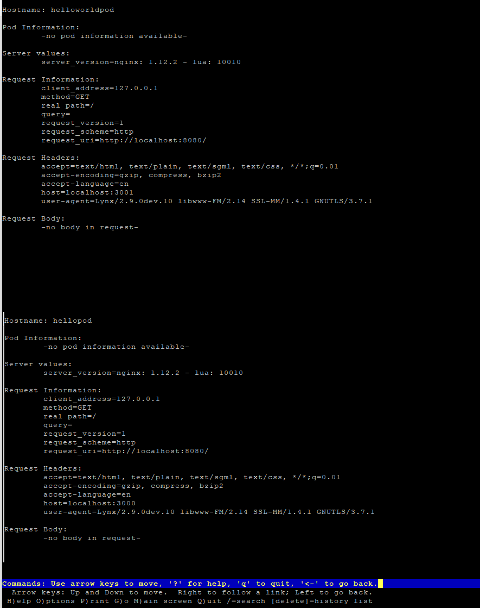
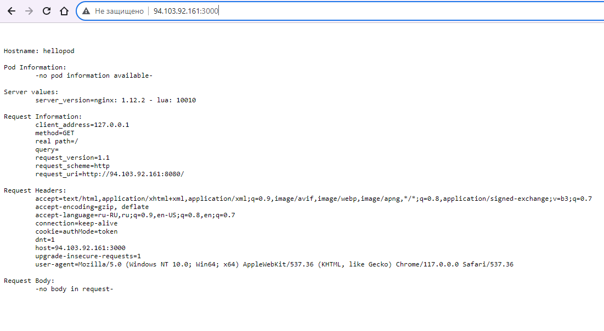
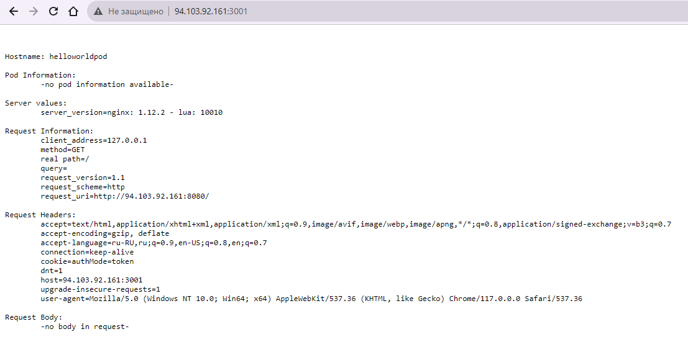
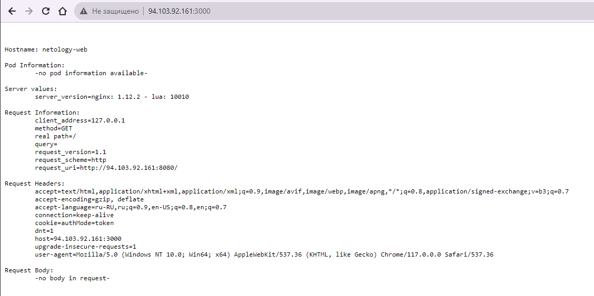

# Домашнее задание к занятию «Базовые объекты K8S»

### Цель задания

В тестовой среде для работы с Kubernetes, установленной в предыдущем ДЗ, необходимо развернуть Pod с приложением и подключиться к нему со своего локального компьютера. 

------

### Задание 1. Создать Pod с именем hello-world

1. Создать манифест (yaml-конфигурацию) Pod.
2. Использовать image - gcr.io/kubernetes-e2e-test-images/echoserver:2.2.
3. Подключиться локально к Pod с помощью `kubectl port-forward` и вывести значение (curl или в браузере).

#### Ответ к заданию 1

Манифест [01-hello-world-pod.yml](01-hello-world-pod.yml) / [02-hello-world-pod.yml](02-hello-world-pod.yml)

Добавляем
```
kubectl apply -f 01-hello-world-pod.yml
kubectl apply -f 02-hello-world-pod.yml
```

Проверяем:
```
# kubectl get pods
NAME                         READY   STATUS    RESTARTS      AGE
hello-node-f9f86cb6b-xkm9p   1/1     Running   2 (35h ago)   35h
hellopod                     1/1     Running   0             3m51s
helloworldpod                1/1     Running   0             88s
```

Пробрасываем порт:
```
microk8s kubectl port-forward pods/hellopod 3000:8080 --address 0.0.0.0
microk8s kubectl port-forward pods/helloworldpod 3001:8080 --address 0.0.0.0
```

Проверяем:

```
# curl localhost:3000


Hostname: hellopod

Pod Information:
        -no pod information available-

Server values:
        server_version=nginx: 1.12.2 - lua: 10010

Request Information:
        client_address=127.0.0.1
        method=GET
        real path=/
        query=
        request_version=1.1
        request_scheme=http
        request_uri=http://localhost:8080/

Request Headers:
        accept=*/*
        host=localhost:3000
        user-agent=curl/7.81.0

Request Body:
        -no body in request-
```

```
# curl localhost:3001

Hostname: helloworldpod

Pod Information:
        -no pod information available-

Server values:
        server_version=nginx: 1.12.2 - lua: 10010

Request Information:
        client_address=127.0.0.1
        method=GET
        real path=/
        query=
        request_version=1.1
        request_scheme=http
        request_uri=http://localhost:8080/

Request Headers:
        accept=*/*
        host=localhost:3001
        user-agent=curl/7.81.0

Request Body:
        -no body in request-
```

Проверяем в браузере (на скрине совмещенная информация):
```
lynx localhost:3000 и потом lynx localhost:3001
```

Скриншоты:







------

### Задание 2. Создать Service и подключить его к Pod

1. Создать Pod с именем netology-web.
2. Использовать image — gcr.io/kubernetes-e2e-test-images/echoserver:2.2.
3. Создать Service с именем netology-svc и подключить к netology-web.
4. Подключиться локально к Service с помощью `kubectl port-forward` и вывести значение (curl или в браузере).


#### Ответ к заданию 2

Манифест - [03-netology-web-svc.yml](03-netology-web-svc.yml) 

Добавляем

```
kubectl apply -f 03-netology-web-svc.yml
```

Проверяем:

```
# kubectl get pods
NAME                         READY   STATUS    RESTARTS      AGE
hello-node-f9f86cb6b-xkm9p   1/1     Running   2 (40h ago)   41h
hellopod                     1/1     Running   0             5h41m
helloworldpod                1/1     Running   0             5h38m
netology-web                 1/1     Running   0             70s

# kubectl get service
NAME           TYPE        CLUSTER-IP       EXTERNAL-IP   PORT(S)    AGE
kubernetes     ClusterIP   10.152.183.1     <none>        443/TCP    2d4h
netology-svc   ClusterIP   10.152.183.218   <none>        8888/TCP   76s
```

Проброс порта к сервису:

```
microk8s kubectl port-forward services/netology-svc 3000:8888 --address 0.0.0.0
```

Проверяем:

```
# curl localhost:3000


Hostname: netology-web

Pod Information:
        -no pod information available-

Server values:
        server_version=nginx: 1.12.2 - lua: 10010

Request Information:
        client_address=127.0.0.1
        method=GET
        real path=/
        query=
        request_version=1.1
        request_scheme=http
        request_uri=http://localhost:8080/

Request Headers:
        accept=*/*
        host=localhost:3000
        user-agent=curl/7.81.0

Request Body:
        -no body in request-
```



------

