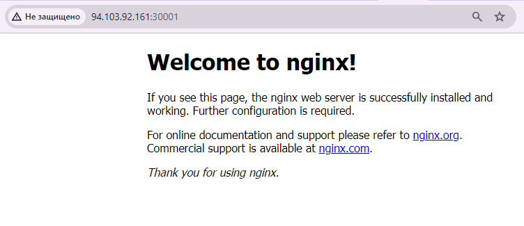
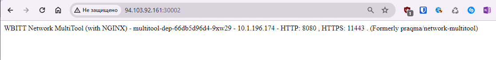

# Домашнее задание к занятию «Сетевое взаимодействие в K8S. Часть 1»

### Цель задания

В тестовой среде Kubernetes необходимо обеспечить доступ к приложению, установленному в предыдущем ДЗ и состоящему из двух контейнеров, по разным портам в разные контейнеры как внутри кластера, так и снаружи.

------

### Задание 1. Создать Deployment и обеспечить доступ к контейнерам приложения по разным портам из другого Pod внутри кластера

1. Создать Deployment приложения, состоящего из двух контейнеров (nginx и multitool), с количеством реплик 3 шт.
2. Создать Service, который обеспечит доступ внутри кластера до контейнеров приложения из п.1 по порту 9001 — nginx 80, по 9002 — multitool 8080.
3. Создать отдельный Pod с приложением multitool и убедиться с помощью `curl`, что из пода есть доступ до приложения из п.1 по разным портам в разные контейнеры.
4. Продемонстрировать доступ с помощью `curl` по доменному имени сервиса.
5. Предоставить манифесты Deployment и Service в решении, а также скриншоты или вывод команды п.4.

#### Ответ на задание 1

1. Deployment приложения, состоящего из двух контейнеров (nginx и multitool), с количеством реплик 3 шт.

```
# kubectl create ns hw08
```

```
apiVersion: apps/v1
kind: Deployment
metadata:
  labels:
    app: multitool-dep
  name: multitool-dep
  namespace: hw08
spec:
  replicas: 3
  selector:
    matchLabels:
      app: multitool
  template:
    metadata:
      labels:
        app: multitool
    spec:
      containers:
      - name: nginx
        image: nginx:latest
        ports:
        - containerPort: 80
      - name: multitool
        image: wbitt/network-multitool:latest
        ports:
        - containerPort: 8080
        env:
        - name: HTTP_PORT
          value: "8080"
        - name: HTTPS_PORT
          value: "11443"
```

```
# kubectl apply -f deployment-08.yml --namespace=hw08
```

```
# kubectl get pods --all-namespaces | grep hw08

hw08          multitool-dep-66db5d96d4-dlsnp               2/2     Running   0             44s
hw08          multitool-dep-66db5d96d4-ftdzf               2/2     Running   0             44s
hw08          multitool-dep-66db5d96d4-9xw29               2/2     Running   0             44s
```

2. Service, который обеспечит доступ внутри кластера до контейнеров приложения из п.1 по порту 9001 — nginx 80, по 9002 — multitool 8080

```
---
apiVersion: v1
kind: Service
metadata:
  name: multitool-svc
spec:
  selector:
    app: multitool
  ports:
  - name: nginx80
    port: 9001
    targetPort: 80
  - name: multitool8080
    port: 9002
    targetPort: 8080
```

```
# kubectl apply -f service-08.yml --namespace=hw08
```

```
# kubectl get service --all-namespaces | grep hw08
hw08          multitool-svc               ClusterIP   10.152.183.164   <none>        9001/TCP,9002/TCP        14s
```

3. Отдельный Pod с приложением multitool и убедиться с помощью curl, что из пода есть доступ до приложения из п.1 по разным портам

```
---
apiVersion: v1
kind: Pod
metadata:
  name: multitool-pod
spec:
  containers:
  - name: multitool
    image: wbitt/network-multitool
    ports:
    - containerPort: 8080
    env:
      - name: HTTP_PORT
        value: "8080"
      - name: HTTPS_PORT
        value: "11443"
```

```
# kubectl apply -f pod-08.yml --namespace=hw08
pod/multitool-pod created
```

```
# kubectl get pods --all-namespaces | grep hw08
hw08          multitool-dep-66db5d96d4-dlsnp               2/2     Running   0             20m
hw08          multitool-dep-66db5d96d4-ftdzf               2/2     Running   0             20m
hw08          multitool-dep-66db5d96d4-9xw29               2/2     Running   0             20m
hw08          multitool-pod                                1/1     Running   0             19s
```

```
#  kubectl get pods -o wide --all-namespaces | grep hw08
hw08          multitool-dep-66db5d96d4-dlsnp               2/2     Running   0             21m     10.1.196.176    kub.nobr.ru   <none>
          <none>
hw08          multitool-dep-66db5d96d4-ftdzf               2/2     Running   0             21m     10.1.196.175    kub.nobr.ru   <none>
          <none>
hw08          multitool-dep-66db5d96d4-9xw29               2/2     Running   0             21m     10.1.196.174    kub.nobr.ru   <none>
          <none>
hw08          multitool-pod                                1/1     Running   0             53s     10.1.196.177    kub.nobr.ru   <none>
          <none>
```

```
# kubectl --namespace=hw08 exec multitool-pod -- curl -s 10.1.196.176:8080
WBITT Network MultiTool (with NGINX) - multitool-dep-66db5d96d4-dlsnp - 10.1.196.176 - HTTP: 8080 , HTTPS: 11443 . (Formerly praqma/network-multitool)

# kubectl --namespace=hw08 exec multitool-pod -- curl -s 10.1.196.175:8080
WBITT Network MultiTool (with NGINX) - multitool-dep-66db5d96d4-ftdzf - 10.1.196.175 - HTTP: 8080 , HTTPS: 11443 . (Formerly praqma/network-multitool)

# kubectl --namespace=hw08 exec multitool-pod -- curl -s 10.1.196.174:8080
WBITT Network MultiTool (with NGINX) - multitool-dep-66db5d96d4-9xw29 - 10.1.196.174 - HTTP: 8080 , HTTPS: 11443 . (Formerly praqma/network-multitool)
```

```
# kubectl --namespace=hw08 exec multitool-pod -- curl -s 10.1.196.176:80
<!DOCTYPE html>
<html>
<head>
<title>Welcome to nginx!</title>
<style>
html { color-scheme: light dark; }
body { width: 35em; margin: 0 auto;
font-family: Tahoma, Verdana, Arial, sans-serif; }
</style>
</head>
<body>
<h1>Welcome to nginx!</h1>
<p>If you see this page, the nginx web server is successfully installed and
working. Further configuration is required.</p>

<p>For online documentation and support please refer to
<a href="http://nginx.org/">nginx.org</a>.<br/>
Commercial support is available at
<a href="http://nginx.com/">nginx.com</a>.</p>

<p><em>Thank you for using nginx.</em></p>
</body>
</html>
```

4. Продемонстрировать доступ с помощью curl по доменному имени сервиса.

```
# kubectl --namespace=hw08 exec multitool-pod -- curl -s multitool-svc.hw08.svc.cluster.local:9001

<!DOCTYPE html>
<html>
<head>
<title>Welcome to nginx!</title>
<style>
html { color-scheme: light dark; }
body { width: 35em; margin: 0 auto;
font-family: Tahoma, Verdana, Arial, sans-serif; }
</style>
</head>
<body>
<h1>Welcome to nginx!</h1>
<p>If you see this page, the nginx web server is successfully installed and
working. Further configuration is required.</p>

<p>For online documentation and support please refer to
<a href="http://nginx.org/">nginx.org</a>.<br/>
Commercial support is available at
<a href="http://nginx.com/">nginx.com</a>.</p>

<p><em>Thank you for using nginx.</em></p>
</body>
</html>
```

```
# kubectl --namespace=hw08 exec multitool-pod -- curl -s multitool-svc.hw08.svc.cluster.local:9002
WBITT Network MultiTool (with NGINX) - multitool-dep-66db5d96d4-dlsnp - 10.1.196.176 - HTTP: 8080 , HTTPS: 11443 . (Formerly praqma/network-multitool)

# kubectl --namespace=hw08 exec multitool-pod -- curl -s multitool-svc.hw08.svc.cluster.local:9002
WBITT Network MultiTool (with NGINX) - multitool-dep-66db5d96d4-dlsnp - 10.1.196.176 - HTTP: 8080 , HTTPS: 11443 . (Formerly praqma/network-multitool)

# kubectl --namespace=hw08 exec multitool-pod -- curl -s multitool-svc.hw08.svc.cluster.local:9002
WBITT Network MultiTool (with NGINX) - multitool-dep-66db5d96d4-ftdzf - 10.1.196.175 - HTTP: 8080 , HTTPS: 11443 . (Formerly praqma/network-multitool)

# kubectl --namespace=hw08 exec multitool-pod -- curl -s multitool-svc.hw08.svc.cluster.local:9002
WBITT Network MultiTool (with NGINX) - multitool-dep-66db5d96d4-ftdzf - 10.1.196.175 - HTTP: 8080 , HTTPS: 11443 . (Formerly praqma/network-multitool)

# kubectl --namespace=hw08 exec multitool-pod -- curl -s multitool-svc.hw08.svc.cluster.local:9002
WBITT Network MultiTool (with NGINX) - multitool-dep-66db5d96d4-9xw29 - 10.1.196.174 - HTTP: 8080 , HTTPS: 11443 . (Formerly praqma/network-multitool)
```

5. манифесты Deployment и Service в решении

[deployment-08.yml](deployment-08.yml)
[service-08.yml](service-08.yml)
[pod-08.yml](pod-08.yml)

------

### Задание 2. Создать Service и обеспечить доступ к приложениям снаружи кластера

1. Создать отдельный Service приложения из Задания 1 с возможностью доступа снаружи кластера к nginx, используя тип NodePort.
2. Продемонстрировать доступ с помощью браузера или `curl` с локального компьютера.
3. Предоставить манифест и Service в решении, а также скриншоты или вывод команды п.2.

#### Ответ на задание 2

[service-08-2.yml](service-08-2.yml)

```
---
apiVersion: v1
kind: Service
metadata:
  name: multitool-svc-nodeport
spec:
  selector:
    app: multitool
  ports:
  - name: nginx80nodeport
    nodePort: 30001
    port: 80
  - name: multitool8080nodeport
    nodePort: 30002
    port: 8080
  type: NodePort
```

```
# kubectl apply -f service-08-2.yml --namespace=hw08
```

```
# kubectl get service --all-namespaces | grep hw08
hw08          multitool-svc               ClusterIP   10.152.183.164   <none>        9001/TCP,9002/TCP             31m
hw08          multitool-svc-nodeport      NodePort    10.152.183.118   <none>        80:30001/TCP,8080:30002/TCP   29s
```

```
# kubectl  --namespace=hw08 describe service multitool-svc-nodeport
Name:                     multitool-svc-nodeport
Namespace:                hw08
Labels:                   <none>
Annotations:              <none>
Selector:                 app=multitool
Type:                     NodePort
IP Family Policy:         SingleStack
IP Families:              IPv4
IP:                       10.152.183.118
IPs:                      10.152.183.118
Port:                     nginx80nodeport  80/TCP
TargetPort:               80/TCP
NodePort:                 nginx80nodeport  30001/TCP
Endpoints:                10.1.196.174:80,10.1.196.175:80,10.1.196.176:80
Port:                     multitool8080nodeport  8080/TCP
TargetPort:               8080/TCP
NodePort:                 multitool8080nodeport  30002/TCP
Endpoints:                10.1.196.174:8080,10.1.196.175:8080,10.1.196.176:8080
Session Affinity:         None
External Traffic Policy:  Cluster
Events:                   <none>
```

```
# kubectl get service --all-namespaces | grep hw08
hw08          multitool-svc               ClusterIP   10.152.183.164   <none>        9001/TCP,9002/TCP             32m
hw08          multitool-svc-nodeport      NodePort    10.152.183.118   <none>        80:30001/TCP,8080:30002/TCP   88s
```



```
sku@Angurva:~$ curl http://94.103.92.161:30001/
<!DOCTYPE html>
<html>
<head>
<title>Welcome to nginx!</title>
<style>
html { color-scheme: light dark; }
body { width: 35em; margin: 0 auto;
font-family: Tahoma, Verdana, Arial, sans-serif; }
</style>
</head>
<body>
<h1>Welcome to nginx!</h1>
<p>If you see this page, the nginx web server is successfully installed and
working. Further configuration is required.</p>

<p>For online documentation and support please refer to
<a href="http://nginx.org/">nginx.org</a>.<br/>
Commercial support is available at
<a href="http://nginx.com/">nginx.com</a>.</p>

<p><em>Thank you for using nginx.</em></p>
</body>
</html>
```



```
sku@Angurva:~$ curl http://94.103.92.161:30002/
WBITT Network MultiTool (with NGINX) - multitool-dep-66db5d96d4-dlsnp - 10.1.196.176 - HTTP: 8080 , HTTPS: 11443 . (Formerly praqma/network-multitool)
```
------
