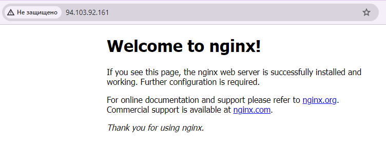

# Домашнее задание к занятию «Сетевое взаимодействие в K8S. Часть 2»

### Цель задания

В тестовой среде Kubernetes необходимо обеспечить доступ к двум приложениям снаружи кластера по разным путям.

------

### Задание 1. Создать Deployment приложений backend и frontend

1. Создать Deployment приложения _frontend_ из образа nginx с количеством реплик 3 шт.
2. Создать Deployment приложения _backend_ из образа multitool. 
3. Добавить Service, которые обеспечат доступ к обоим приложениям внутри кластера. 
4. Продемонстрировать, что приложения видят друг друга с помощью Service.
5. Предоставить манифесты Deployment и Service в решении, а также скриншоты или вывод команды п.4.


#### Ответ на задание 1

1. Создать Deployment приложения _frontend_ из образа nginx с количеством реплик 3 шт.

```
apiVersion: apps/v1
kind: Deployment
metadata:
  labels:
    app: nginx-dep
  name: frontend
  namespace: hw09
spec:
  replicas: 3
  selector:
    matchLabels:
      app: nginx
  template:
    metadata:
      labels:
        app: nginx
    spec:
      containers:
      - name: nginx
        image: nginx:latest
        ports:
        - containerPort: 80

---
apiVersion: v1
kind: Service
metadata:
  name: frontend-svc
spec:
  selector:
    app: nginx
  ports:
  - name: nginx80
    port: 80
    targetPort: 80
```

```
# kubectl apply -f deployment-09.yml --namespace=hw09
deployment.apps/frontend created
service/frontend-svc created
```

```
# kubectl get pods --all-namespaces | grep hw09
hw09          frontend-57d84f57dc-6hlmz                    1/1     Running   0             38s
hw09          frontend-57d84f57dc-h4trh                    1/1     Running   0             38s
hw09          frontend-57d84f57dc-86g84                    1/1     Running   0             38s
```

```
# kubectl get service --all-namespaces | grep hw09
hw09          frontend-svc                ClusterIP   10.152.183.42    <none>        80/TCP                        45s
```
2. Создать Deployment приложения _backend_ из образа multitool. 

```
apiVersion: apps/v1
kind: Deployment
metadata:
  labels:
    app: multitool-dep
  name: backend
  namespace: hw09
spec:
  replicas: 1
  selector:
    matchLabels:
      app: multitool
  template:
    metadata:
      labels:
        app: multitool
    spec:
      containers:
      - name: multitool
        image: wbitt/network-multitool:latest
        ports:
        - containerPort: 80
        env:
        - name: HTTP_PORT
          value: "80"

---
apiVersion: v1
kind: Service
metadata:
  name: backend-svc
spec:
  selector:
    app: multitool
  ports:
  - name: multitool80
    port: 80
    targetPort: 80
```

```
# kubectl apply -f deployment-09-2.yml --namespace=hw09
deployment.apps/backend created
service/backend-svc created
```

```
# kubectl get pods --all-namespaces | grep hw09
hw09          frontend-57d84f57dc-6hlmz                    1/1     Running   0             3m54s
hw09          frontend-57d84f57dc-h4trh                    1/1     Running   0             3m54s
hw09          frontend-57d84f57dc-86g84                    1/1     Running   0             3m54s
hw09          backend-6547bf5d68-kvkvr                     1/1     Running   0             18s
```

```
# kubectl get service --all-namespaces | grep hw09
hw09          frontend-svc                ClusterIP   10.152.183.42    <none>        80/TCP                        4m32s
hw09          backend-svc                 ClusterIP   10.152.183.136   <none>        80/TCP                        38s
```

3. Добавить Service, которые обеспечат доступ к обоим приложениям внутри кластера. 

```
#  kubectl config set-context --current --namespace=hw09
```

```
# kubectl get service
NAME           TYPE        CLUSTER-IP       EXTERNAL-IP   PORT(S)   AGE
kubernetes     ClusterIP   10.152.183.1     <none>        443/TCP   15d
frontend-svc   ClusterIP   10.152.183.42    <none>        80/TCP    22m
backend-svc    ClusterIP   10.152.183.136   <none>        80/TCP    18m
```

4. Продемонстрировать, что приложения видят друг друга с помощью Service.

```
# kubectl exec services/frontend-svc -- curl -s backend-svc
WBITT Network MultiTool (with NGINX) - backend-6547bf5d68-kvkvr - 10.1.196.181 - HTTP: 80 , HTTPS: 443 . (Formerly praqma/network-multitool)
```

```
# kubectl exec services/backend-svc -- curl -s frontend-svc
<!DOCTYPE html>
<html>
<head>
<title>Welcome to nginx!</title>
<style>
html { color-scheme: light dark; }
body { width: 35em; margin: 0 auto;
font-family: Tahoma, Verdana, Arial, sans-serif; }
</style>
</head>
<body>
<h1>Welcome to nginx!</h1>
<p>If you see this page, the nginx web server is successfully installed and
working. Further configuration is required.</p>

<p>For online documentation and support please refer to
<a href="http://nginx.org/">nginx.org</a>.<br/>
Commercial support is available at
<a href="http://nginx.com/">nginx.com</a>.</p>

<p><em>Thank you for using nginx.</em></p>
</body>
</html>
```

5. Предоставить манифесты Deployment и Service в решении, а также скриншоты или вывод команды п.4.


[deployment-09.yml](deployment-09.yml)

[deployment-09-2.yml](deployment-09-2.yml)


------

### Задание 2. Создать Ingress и обеспечить доступ к приложениям снаружи кластера

1. Включить Ingress-controller в MicroK8S.
2. Создать Ingress, обеспечивающий доступ снаружи по IP-адресу кластера MicroK8S так, чтобы при запросе только по адресу открывался _frontend_ а при добавлении /api - _backend_.
3. Продемонстрировать доступ с помощью браузера или `curl` с локального компьютера.
4. Предоставить манифесты и скриншоты или вывод команды п.2.

#### Ответ на задание 2

1. Включить Ingress-controller в MicroK8S.

```
# microk8s enable ingress
Infer repository core for addon ingress
Enabling Ingress
ingressclass.networking.k8s.io/public created
ingressclass.networking.k8s.io/nginx created
namespace/ingress created
serviceaccount/nginx-ingress-microk8s-serviceaccount created
clusterrole.rbac.authorization.k8s.io/nginx-ingress-microk8s-clusterrole created
role.rbac.authorization.k8s.io/nginx-ingress-microk8s-role created
clusterrolebinding.rbac.authorization.k8s.io/nginx-ingress-microk8s created
rolebinding.rbac.authorization.k8s.io/nginx-ingress-microk8s created
configmap/nginx-load-balancer-microk8s-conf created
configmap/nginx-ingress-tcp-microk8s-conf created
configmap/nginx-ingress-udp-microk8s-conf created
daemonset.apps/nginx-ingress-microk8s-controller created
Ingress is enabled
```

2. Создать Ingress, обеспечивающий доступ снаружи по IP-адресу кластера MicroK8S так, чтобы при запросе только по адресу открывался _frontend_ а при добавлении /api - _backend_.

```
---
apiVersion: networking.k8s.io/v1
kind: Ingress
metadata:
  name: ingress
spec:
  rules:
  - http:
      paths:
      - path: /
        pathType: Prefix
        backend:
          service:
            name: frontend-svc
            port:
              number: 80
      - path: /api
        pathType: Prefix
        backend:
          service:
            name: backend-svc
            port:
              number: 80
```

```
# kubectl apply -f ingress.yml
ingress.networking.k8s.io/ingress created
```

```
# kubectl get ingress
NAME      CLASS    HOSTS   ADDRESS     PORTS   AGE
ingress   public   *       127.0.0.1   80      41s
```

3. Продемонстрировать доступ с помощью браузера или `curl` с локального компьютера.

Проверка основного адреса:

```
sku@Angurva:~$ curl http://94.103.92.161
<!DOCTYPE html>
<html>
<head>
<title>Welcome to nginx!</title>
<style>
html { color-scheme: light dark; }
body { width: 35em; margin: 0 auto;
font-family: Tahoma, Verdana, Arial, sans-serif; }
</style>
</head>
<body>
<h1>Welcome to nginx!</h1>
<p>If you see this page, the nginx web server is successfully installed and
working. Further configuration is required.</p>

<p>For online documentation and support please refer to
<a href="http://nginx.org/">nginx.org</a>.<br/>
Commercial support is available at
<a href="http://nginx.com/">nginx.com</a>.</p>

<p><em>Thank you for using nginx.</em></p>
</body>
</html>
```

Проверка /api

```
sku@Angurva:~$ curl http://94.103.92.161/api
<html>
<head><title>404 Not Found</title></head>
<body>
<center><h1>404 Not Found</h1></center>
<hr><center>nginx/1.24.0</center>
</body>
</html>
```

Добавляем 

```
annotations:
    nginx.ingress.kubernetes.io/rewrite-target: /
```

Проверяем повторно:

```
sku@Angurva:~$ curl http://94.103.92.161/api
WBITT Network MultiTool (with NGINX) - backend-6547bf5d68-kvkvr - 10.1.196.181 - HTTP: 80 , HTTPS: 443 . (Formerly praqma/network-multitool)
```

4. Предоставить манифесты и скриншоты или вывод команды п.2.

[ingress.yml](ingress.yml)




------
