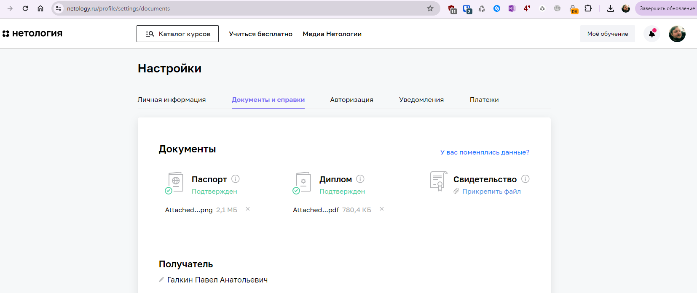

**1. Получилось ли у вас загрузить в личный кабинет документы, подтверждающие личность, и диплом о высшем или среднем специальном образовании?**

а) Да

~~б) Нет, но сделаю это в ближайшее время. Инструкция по загрузке документов в личный кабинет.
в) Не загрузил диплом, у меня его нет~~

**2. Нужна ли вам справка об обучении после сдачи дипломной работы? Справка выдаётся всем студентам, в том числе тем, у кого нет диплома о высшем или среднем специальном образовании.**

а) Да
Постараемся написать.

~~б) Нет~~

**3. Выполнен ли вами необходимый минимум заданий на каждом модуле профессии для допуска к дипломной работе?**

а) Да
Ура! Ждем дипломного координатора :-)

~~б) Нет
В этом случае у вас нет допуска к дипломной работе. Если вы хотите сдать домашние работы на закрытых модулях, свяжитесь с координатором вашей профессии.~~