# Дипломный практикум в Yandex.Cloud по курсу "DevOps-инженер" в Нетологии

- [Дипломный практикум в Yandex.Cloud по курсу "DevOps-инженер" в Нетологии](#дипломный-практикум-в-yandexcloud-по-курсу-devops-инженер-в-нетологии)
  - [Цели:](#цели)
  - [Этапы выполнения:](#этапы-выполнения)
    - [Планирование и проработка этапов выполнения](#планирование-и-проработка-этапов-выполнения)
    - [Подготовка - Gitlab](#подготовка---gitlab)
    - [Создание облачной инфраструктуры](#создание-облачной-инфраструктуры)
    - [Создание Kubernetes кластера](#создание-kubernetes-кластера)
    - [Создание тестового приложения](#создание-тестового-приложения)
    - [Подготовка cистемы мониторинга и деплой приложения](#подготовка-cистемы-мониторинга-и-деплой-приложения)
    - [Установка и настройка CI/CD](#установка-и-настройка-cicd)
    - [Итоги выполнения работы](#итоги-выполнения-работы)

---
## Цели:

1. Подготовить облачную инфраструктуру на базе облачного провайдера Яндекс.Облако.
2. Запустить и сконфигурировать Kubernetes кластер.
3. Установить и настроить систему мониторинга.
4. Настроить и автоматизировать сборку тестового приложения с использованием Docker-контейнеров.
5. Настроить CI для автоматической сборки и тестирования.
6. Настроить CD для автоматического развёртывания приложения.

[Оригинальный текст задания](readme.md)

---

## Этапы выполнения:

### Планирование и проработка этапов выполнения

По целям в изначальном задании, у нас должна появиться инфраструктура в Яндекс.Облаке, а внутри этой самой инфраструктуры несколько элементов:
* виртуальные сети
* в облаке должно быть яндекс.регистри для сборок
* в облаке должен быть бакет для терраформа 
* виртуальные машины с kubernetes-кластером или managed кластер
* внутри кластера у нас должен быть мониторинг
* внутри кластера у нас должно быть приложение
* домены и сертификаты для них

С самого начала помимо динамической и изменяемой структуры в виде облака и всякого другого, у нас должен появится некий статичный элемент в виде хранилища кода и центра для деплоя. Этим краеугольным камнем станет Gitlab-сервер. Держать мы его будет отдельно, чтобы избежать дополнительных расходов.

Общими мазками выглядит приблизительно так:
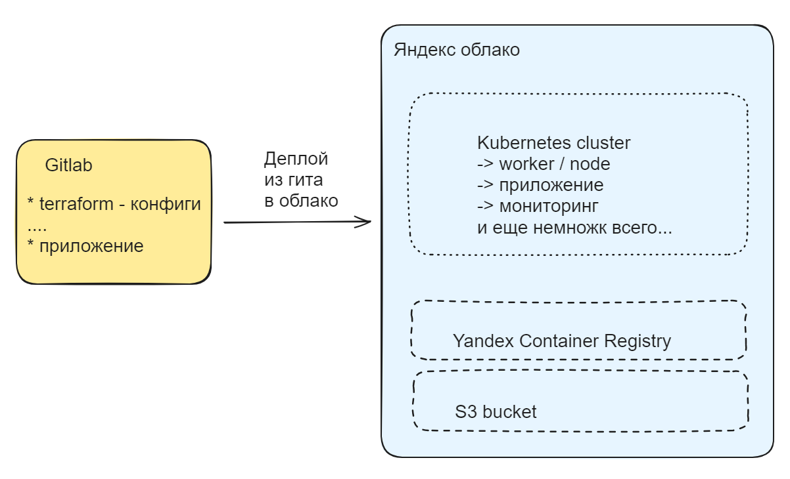

Слева Gitlab - мощнейщий велосипед для почти всего. В нем мы будем держать данные по инфраструктуре и приложению. Будем стараться избежать монорепозитория. Отдельно будем хранить данные с манифестами терраформа по созданию сети, k8s кластера и отдельно по приложению, которое планируется деплоить в кластер.

Справа Яндекс.облако - динамически изменяемая среда в зависимости от того, что у нас будет, что у нас будет лежать в репозитории Gitlab. Таким образом мы по сути прикоснемся и используем методологию Gitops, исходя из которой у нас декларативно описана структура в виде кода и мы автоматически разворачивыем её.

### Подготовка - Gitlab

Подготовим виртуальную машину, а также домен для нашего проекта - lab.galkin.work. Используем операционную систему Ubuntu в конфигурации 4 vCPU / 8 Gb RAM. Это немного меньше, чем рекомендованные настройки, но с учетом того, что у нас она почти пустая, нам хватит.

В принципе не так важно, где именно мы разместим машину, главное - доступность и возможность дополнительных настроек. Gitlab мы выбрали за возможность использования CI/CD и раннеров прямо на борту. Также крайне и крайне желательно на старте иметь возможность дать Gitlab нормальные сертификаты, в противном случае можно довольно знатно пройтись по граблям. 

<details>
  <summary>Подготовка операционной системы: softs, docker, helm, terraform, yc</summary>

  * **Сменим хостнейм**
  ```  hostnamectl set-hostname lab.galkin.work ```

  * **Немного украсим внешний вид**
  ``` cat /dev/null > .bash_profile; nano .bash_profile ```

  ``` 
  PS1="\[\033[1;36m\]\t \[\e[39m\][\[\e[31m\]\u\[\e[39m\]@\[\e[35m\]\h\[\e[39m\]:\[\e[1;34m\]\w\[\e[m\] \[\e[39m\]] \[\e[0;31m\]\$ \[\e[m\]\[\e[0;37m\]"
  export HISTTIMEFORMAT="%d/%m/%y %T "
 ```
  
  * **Обновим систему**
  ```  apt update && apt upgrade --yes --force-yes ```

  * **Установим софты**
   ``` apt install  mc curl wget htop vnstat monit ncdu nano git rsync host whois dnsutils sysstat iotop pwgen siege sshfs nmap p7zip-full screen nmap python3 python3-pip nmon expect pv etckeeper mtr auditd acct jq --yes  ```

  * **Установим docker**
   ``` sudo apt install apt-transport-https ca-certificates curl software-properties-common --yes && curl -fsSL https://download.docker.com/linux/ubuntu/gpg | sudo apt-key add - &&  sudo add-apt-repository "deb [arch=amd64] https://download.docker.com/linux/ubuntu focal stable" &&  sudo apt-cache policy docker-ce &&  sudo apt install docker-ce docker-ce-cli containerd.io docker-buildx-plugin docker-compose-plugin docker-compose --yes && sudo systemctl status docker &&  docker ps ```

  * **Установим helm**
  ```
  snap install helm --classic
  ```  

  * **Установим kubectl**
  ```
  snap install kubectl --classic
  ```  

  * **Установим terraform**
  ```
  wget https://hashicorp-releases.yandexcloud.net/terraform/1.8.3/terraform_1.8.3_linux_amd64.zip
  unzip terraform_*_linux_amd64.zip
  sudo mv terraform /usr/local/bin/
  ```

  * **Установим автоподстановки**
```
terraform -install-autocomplete
```

А также нам нужно добавить провайдер - Яндекс, скачать его с санкционного терраформа будет немного проблематично.
```
nano ~/.terraformrc
```
```
provider_installation {
  network_mirror {
    url = "https://terraform-mirror.yandexcloud.net/"
    include = ["registry.terraform.io/*/*"]
  }
  direct {
    exclude = ["registry.terraform.io/*/*"]
  }
}
```

  * **Установим yc**
  ```
  curl -sSL https://storage.yandexcloud.net/yandexcloud-yc/install.sh | bash

  source "/root/.bashrc"  
  ```

  * **Сгенерируем ключи**
  ```
  ssh-keygen -t rsa
  ssh-keygen -t ed25519
  ```  
</details>

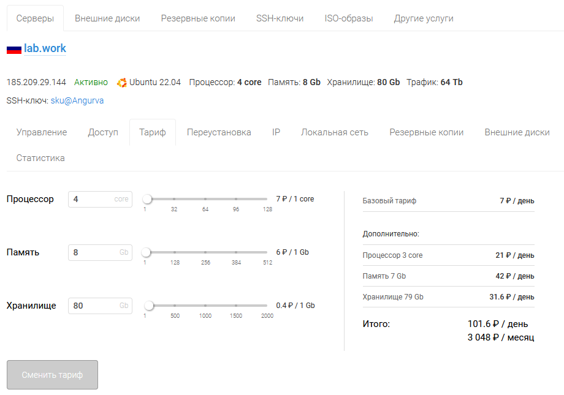


<details>
  <summary>Запускаем Gitlab</summary>

* **Подготовим docker-compose для Gitlab**

docker-compose.yml

```
version: '3.7'

services:
  web:
    image: 'gitlab/gitlab-ce:16.9.8-ce.0'
    restart: always
    hostname: 'lab.galkin.work'
    environment:
      GITLAB_OMNIBUS_CONFIG: |
        external_url 'https://lab.galkin.work'
        gitlab_rails['gitlab_shell_ssh_port'] = 2224
    ports:
      - '80:80'
      - '443:443'
      - '2224:22'
    volumes:
      - './config:/etc/gitlab'
      - './logs:/var/log/gitlab'
      - './data:/var/opt/gitlab'
    shm_size: '256m'
  ```

```
docker-compose up -d
```

* **Зададим пароль пользователя**

```
docker exec -it gitlab /bin/bash
gitlab-rake "gitlab:password:reset"
```

Например такие:
```
root
ну-вы-поняли (по запросу)
```

* **После входа заведем сразу runner - тип shell**

```
# Download the binary for your system
sudo curl -L --output /usr/local/bin/gitlab-runner https://gitlab-runner-downloads.s3.amazonaws.com/latest/binaries/gitlab-runner-linux-amd64

# Give it permission to execute
sudo chmod +x /usr/local/bin/gitlab-runner

# Create a GitLab Runner user
sudo useradd --comment 'GitLab Runner' --create-home gitlab-runner --shell /bin/bash

# Install and run as a service
sudo gitlab-runner install --user=gitlab-runner --working-directory=/home/gitlab-runner
sudo gitlab-runner start
```
```
gitlab-runner register --url https://lab.galkin.work --token glrt-B9bR4BpxzWPyDy5f2HfR
```

</details>

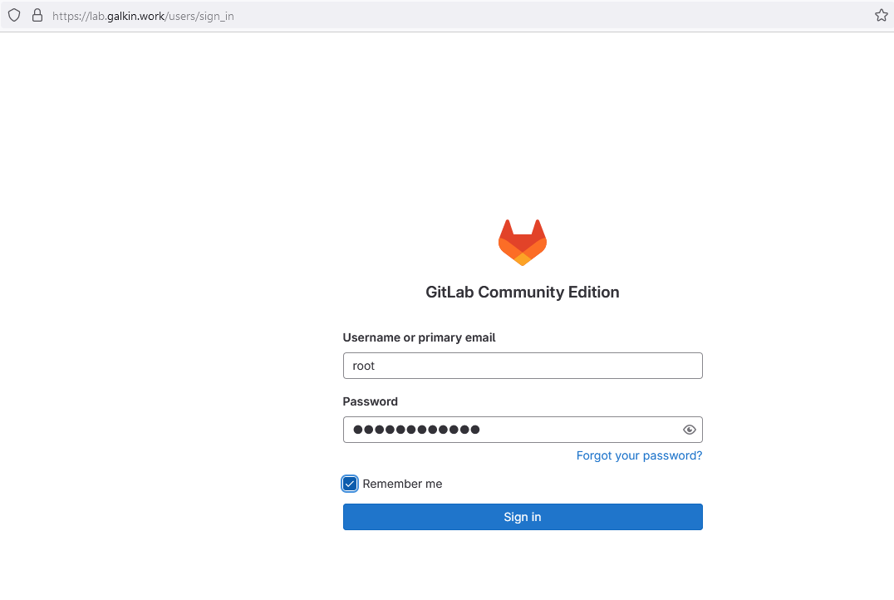

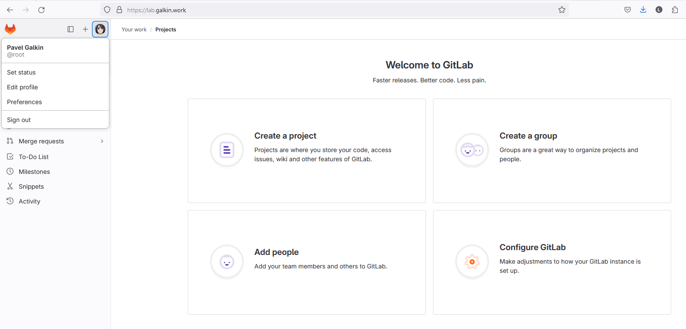

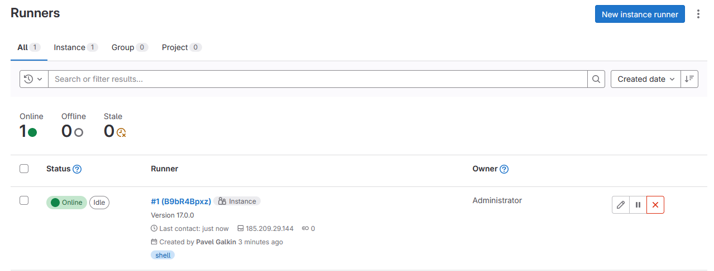


Создадим в Gitlab несколько проектов. Как мы декларировали ранее, мы постараемся уйти от монорепозитория:
- **infra** - инфраструктура проекта
- **app** - для нашего приложения
- **monitor** - мониторинг

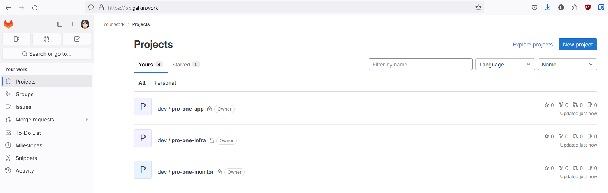

### Создание облачной инфраструктуры

<details>
  <summary>yc - инициализация</summary>

  ```
  yc init

  получаем токен и проводим первоначальную настройку
  ```
</details>

<details>
  <summary>yc - сервис-аккаунт и токен</summary>

  Создаем сервисный аккаунт и получаем токеннс 

  ```
  yc iam service-account create sa-key
  yc iam key create --service-account-name sa-key --output key.json

  yc iam create-token
  ```

  ```
  root@lab:~# yc iam service-account create sa-key
  done (1s)
  id: aje74mb2ucv975of1ud3
  folder_id: b1gsk3plrk6l86to7geb
  created_at: "2024-05-21T14:08:11.770461101Z"
  ```

  ```
  root@lab:~# yc iam key create --service-account-name sa-key --output key.json
  id: ajeqjbr8719fopi06o79
  service_account_id: aje74mb2ucv975of1ud3
  created_at: "2024-05-21T14:08:39.873190357Z"
  key_algorithm: RSA_2048
  ```

  ```
  root@lab:/opt/dev-one# yc iam create-token
  t1.9euelZqelMaPk5KQyJmbnpCeksuUj-3rnpWalI2Tzs7LiZGck5zOz5TIzM_l8_cPO01N-e8TdWxf_N3z909pSk357xN1bF_8zef1656VmpLHmYqWkZTJjpSdkZqTm5KM7_zF656VmpLHmYqWkZTJjpSdkZqTm5KM.[CENSORED]
  ```
</details>

<details>
  <summary>Уточняем ID облака и каталога для указания в манифесте</summary>

  ```
  root@lab:/opt/dev-one# yc resource-manager cloud list
  +----------------------+-------------+----------------------+
  |          ID          |    NAME     |   ORGANIZATION ID    |
  +----------------------+-------------+----------------------+
  | b1gjruksal1mu1cb4lmv | thesis      | bpf0m4gb7drjlcg56asf |
  +----------------------+-------------+----------------------+

  root@lab:/opt/dev-one# yc resource-manager folder list
  +----------------------+-------+--------+--------+
  |          ID          | NAME  | LABELS | STATUS |
  +----------------------+-------+--------+--------+
  | b1gsk3plrk6l86to7geb | cloud |        | ACTIVE |
  +----------------------+-------+--------+--------+
  ```

  Добавим переменные окружения
  ```
  export YC_TOKEN=$(yc iam create-token)
  export YC_CLOUD_ID=$(yc config get cloud-id)
  export YC_FOLDER_ID=$(yc config get folder-id)
  ```

  Добавим в переменные окружения идентификатор ключа и секретный ключ

  ```
  yc iam access-key create --service-account-name sa-key > key.json

  cat key.json | grep key_id | awk '{print $2}'
  cat key.json | grep secret | awk '{print $2}'

  export ACCESS_KEY="<идентификатор_ключа>"
  export SECRET_KEY="<секретный_ключ>"
  ```
</details>

<details>
  <summary>Манифест для создания бакета</summary>

  ```
terraform {
  required_providers {
    yandex = {
      source = "yandex-cloud/yandex"
    }
  }
  required_version = ">= 0.13"
}

provider "yandex" {
  token     = "t1.9euelZrOnZuTj8aZk5qVnIqLjZWQnO3rnpWalI2Tzs7LiZGck5zOz5TIzM_l8_dwdkxN-e8MZzg-_....."
  cloud_id  = "b1gjruksal1mu1cb4lmv"
  folder_id = "b1gsk3plrk6l86to7geb"
  zone      = "ru-central1-b"
}

resource "yandex_iam_service_account" "sa" {
  name = "sa-key-terra"
}

// Назначение роли сервисному аккаунту
resource "yandex_resourcemanager_folder_iam_member" "sa-admin" {
  folder_id = "b1gsk3plrk6l86to7geb"
  role      = "storage.admin"
  member    = "serviceAccount:${yandex_iam_service_account.sa.id}"
}

// Создание статического ключа доступа
resource "yandex_iam_service_account_static_access_key" "sa-static-key" {
  service_account_id = yandex_iam_service_account.sa.id
  description        = "static access key for object storage"
}

// Создание бакета с использованием ключа
resource "yandex_storage_bucket" "test" {
  access_key = yandex_iam_service_account_static_access_key.sa-static-key.access_key
  secret_key = yandex_iam_service_account_static_access_key.sa-static-key.secret_key
  bucket     = "s3-dev-one"
}
  ```

  [Документация по созданию бакета](https://yandex.cloud/ru/docs/storage/operations/buckets/create)
</details>

<details>

  <summary>Стартуем создание бакета</summary>


```
nano backend.tf 

terraform init
terraform plan
terraform apply
```
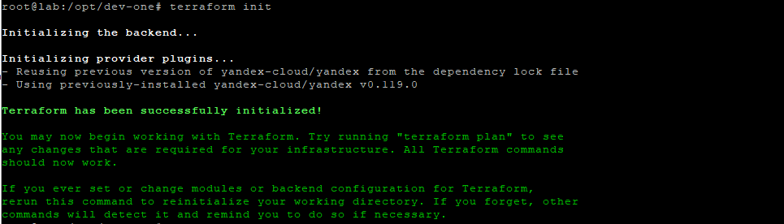

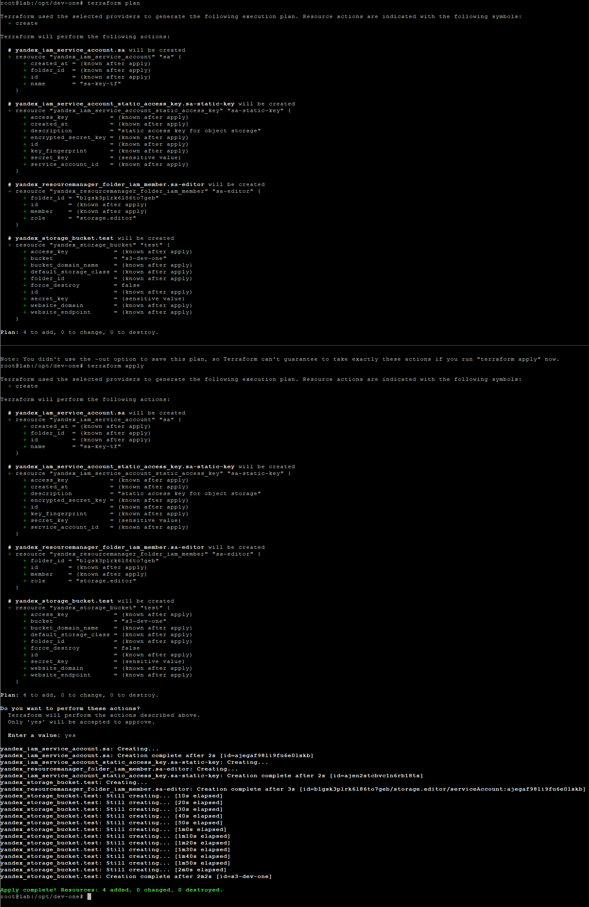

</details>

<details>
  <summary>Добавляем backend для terraform</summary>

```
nano backend-s3.tf 
```

```
terraform {
  backend "s3" {
    endpoints = {
      s3 = "https://storage.yandexcloud.net"
    }
    bucket = "s3-dev-one"
    region = "ru-central1"
    key    = "state/terraform.tfstate"

    skip_region_validation      = true
    skip_credentials_validation = true
    skip_requesting_account_id  = true # необходимая опция при описании бэкенда для Terraform версии 1.6.1 и старше.
    skip_s3_checksum            = true # необходимая опция при описании бэкенда для Terraform версии 1.6.3 и старше.

  }
}
```

```
terraform init -upgrade -reconfigure -backend-config="access_key=$ACCESS_KEY" -backend-config="secret_key=$SECRET_KEY"
```

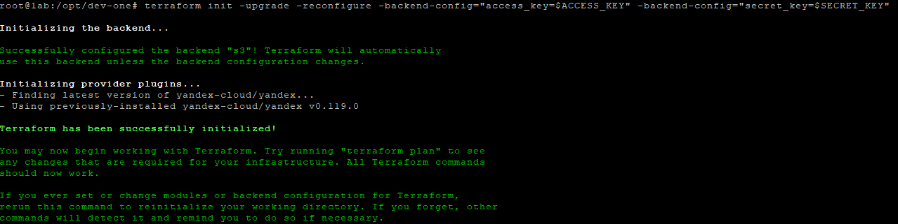

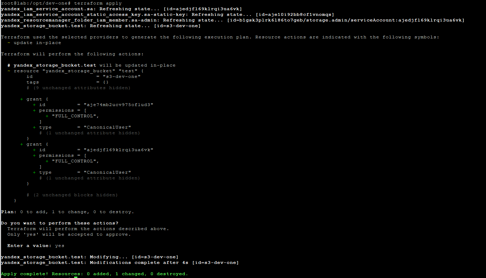

NB: В случае проблем стоит проверить роли сервисного аккаунта

[Загрузка состояний Terraform в Yandex Object Storage](https://yandex.cloud/ru/docs/tutorials/infrastructure-management/terraform-state-storage)
</details>


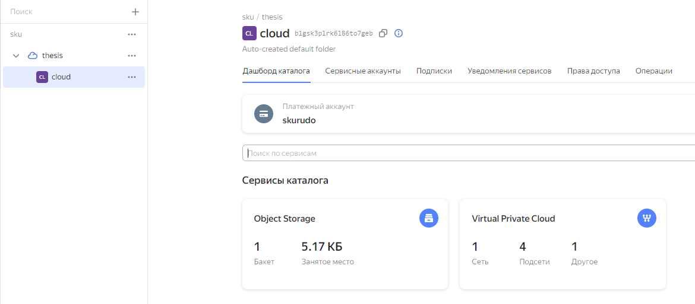

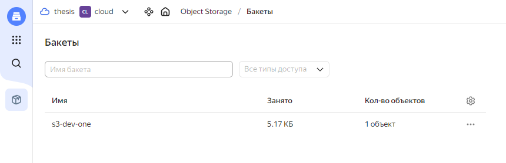

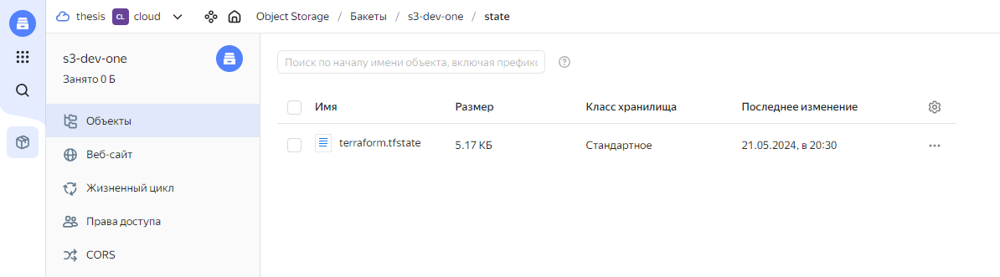


### Создание Kubernetes кластера

<details>
  <summary>Example</summary>

  ```
  long console output here
  ```
</details>

### Создание тестового приложения

<details>
  <summary>Example</summary>

  ```
  long console output here
  ```
</details>

### Подготовка cистемы мониторинга и деплой приложения

<details>
  <summary>Example</summary>

  ```
  long console output here
  ```
</details>

### Установка и настройка CI/CD

<details>
  <summary>Example</summary>

  ```
  long console output here
  ```
</details>

### Итоги выполнения работы