# Дипломный практикум в Yandex.Cloud по курсу "DevOps-инженер" в Нетологии

- [Дипломный практикум в Yandex.Cloud по курсу "DevOps-инженер" в Нетологии](#дипломный-практикум-в-yandexcloud-по-курсу-devops-инженер-в-нетологии)
  - [Цели:](#цели)
  - [Этапы выполнения:](#этапы-выполнения)
    - [Планирование и проработка этапов выполнения](#планирование-и-проработка-этапов-выполнения)
    - [Подготовка - Gitlab](#подготовка---gitlab)
    - [Создание облачной инфраструктуры](#создание-облачной-инфраструктуры)
    - [Создание Kubernetes кластера](#создание-kubernetes-кластера)
    - [Создание тестового приложения](#создание-тестового-приложения)

---
## Цели:

1. Подготовить облачную инфраструктуру на базе облачного провайдера Яндекс.Облако.
2. Запустить и сконфигурировать Kubernetes кластер.
3. Установить и настроить систему мониторинга.
4. Настроить и автоматизировать сборку тестового приложения с использованием Docker-контейнеров.
5. Настроить CI для автоматической сборки и тестирования.
6. Настроить CD для автоматического развёртывания приложения.

[Оригинальный текст задания](readme.md)

---

## Этапы выполнения:

### Планирование и проработка этапов выполнения

По целям в изначальном задании, у нас должна появиться инфраструктура в Яндекс.Облаке, а внутри этой самой инфраструктуры несколько элементов:
* виртуальные сети
* в облаке должно быть яндекс.регистри для сборок
* в облаке должен быть бакет для терраформа 
* виртуальные машины с kubernetes-кластером или managed кластер
* внутри кластера у нас должен быть мониторинг
* внутри кластера у нас должно быть приложение
* домены и сертификаты для них

С самого начала помимо динамической и изменяемой структуры в виде облака и всякого другого, у нас должен появится некий статичный элемент в виде хранилища кода и центра для деплоя. Этим краеугольным камнем станет Gitlab-сервер. Держать мы его будет отдельно, чтобы избежать дополнительных расходов.

Общими мазками выглядит приблизительно так:


Слева Gitlab - мощнейщий велосипед для почти всего. В нем мы будем держать данные по инфраструктуре и приложению. Будем стараться избежать монорепозитория. Отдельно будем хранить данные с манифестами терраформа по созданию сети, k8s кластера и отдельно по приложению, которое планируется деплоить в кластер.

Справа Яндекс.облако - динамически изменяемая среда в зависимости от того, что у нас будет, что у нас будет лежать в репозитории Gitlab. Таким образом мы по сути прикоснемся и используем методологию Gitops, исходя из которой у нас декларативно описана структура в виде кода и мы автоматически разворачивыем её.

### Подготовка - Gitlab

Подготовим виртуальную машину, а также домен для нашего проекта - lab.galkin.work. Используем операционную систему Ubuntu в конфигурации 4 vCPU / 8 Gb RAM. Это немного меньше, чем рекомендованные настройки, но с учетом того, что у нас она почти пустая, нам хватит.

В принципе не так важно, где именно мы разместим машину, главное - доступность и возможность дополнительных настроек. Gitlab мы выбрали за возможность использования CI/CD и раннеров прямо на борту. Также крайне и крайне желательно на старте иметь возможность дать Gitlab нормальные сертификаты, в противном случае можно довольно знатно пройтись по граблям. 

<details>
  <summary>Подготовка операционной системы: softs, docker, helm, terraform, yc</summary>


  * **Сменим хостнейм**
  ```  hostnamectl set-hostname lab.galkin.work ```

  * **Немного украсим внешний вид**
  ``` cat /dev/null > .bash_profile; nano .bash_profile ```

  ``` 
  PS1="\[\033[1;36m\]\t \[\e[39m\][\[\e[31m\]\u\[\e[39m\]@\[\e[35m\]\h\[\e[39m\]:\[\e[1;34m\]\w\[\e[m\] \[\e[39m\]] \[\e[0;31m\]\$ \[\e[m\]\[\e[0;37m\]"
  export HISTTIMEFORMAT="%d/%m/%y %T "
 ```
  
  * **Обновим систему**
  ```  apt update && apt upgrade --yes --force-yes ```

  * **Установим софты**
   ``` apt install  mc curl wget htop vnstat monit ncdu nano git rsync host whois dnsutils sysstat iotop pwgen siege sshfs nmap p7zip-full screen nmap python3 python3-pip nmon expect pv etckeeper mtr auditd acct jq --yes  ```

  * **Установим docker**
   ``` sudo apt install apt-transport-https ca-certificates curl software-properties-common --yes && curl -fsSL https://download.docker.com/linux/ubuntu/gpg | sudo apt-key add - &&  sudo add-apt-repository "deb [arch=amd64] https://download.docker.com/linux/ubuntu focal stable" &&  sudo apt-cache policy docker-ce &&  sudo apt install docker-ce docker-ce-cli containerd.io docker-buildx-plugin docker-compose-plugin docker-compose --yes && sudo systemctl status docker &&  docker ps ```

  * **Установим helm**
  ```
  snap install helm --classic
  ```  

  * **Установим kubectl**
  ```
  snap install kubectl --classic
  ```  

  * **Установим terraform**
  ```
  wget https://hashicorp-releases.yandexcloud.net/terraform/1.8.3/terraform_1.8.3_linux_amd64.zip
  unzip terraform_*_linux_amd64.zip
  sudo mv terraform /usr/local/bin/
  ```

  * **Установим автоподстановки**
```
terraform -install-autocomplete
```

А также нам нужно добавить провайдер - Яндекс, скачать его с санкционного терраформа будет немного проблематично.
```
nano ~/.terraformrc
```
```
provider_installation {
  network_mirror {
    url = "https://terraform-mirror.yandexcloud.net/"
    include = ["registry.terraform.io/*/*"]
  }
  direct {
    exclude = ["registry.terraform.io/*/*"]
  }
}
```

  * **Установим yc**
  ```
  curl -sSL https://storage.yandexcloud.net/yandexcloud-yc/install.sh | bash

  source "/root/.bashrc"  
  ```

  * **Сгенерируем ключи**
  ```
  ssh-keygen -t rsa
  ssh-keygen -t ed25519
  ```  
</details>


<details>
  <summary>На случай проблем с докером</summary>

  ```
   nano /etc/docker/daemon.json  
  ```

  ```
  {
  "registry-mirrors": [      
          "https://dockerhub.timeweb.cloud",
          "https://huecker.io"
  ]
  }
  ```

  При наличии домена и VPS в зазеркалье можно нехитрым образом сделать свой миррор, что более предпочтительно

  * [_env](src/docker-mirror/_env) - переименовать в .env и указать свой домен (А запись нужно указать заранее, иначе сертификат сразу можно не получить!)
  * [config.yml](src/docker-mirror/config.yml) - конфигурационный файл для registry
  * [docker-compose.yml](src/docker-mirror/docker-compose.yml) - запускаем как обычно
  * [traefik.yml](src/docker-mirror/traefik.yml) - доп. конфиг для Traefik
  
</details>

<details>
  <summary>Запускаем Gitlab</summary>

* **Подготовим docker-compose для Gitlab**

docker-compose.yml

```
version: '3.7'

services:
  web:
    image: 'gitlab/gitlab-ce:16.9.8-ce.0'
    restart: always
    hostname: 'lab.galkin.work'
    environment:
      GITLAB_OMNIBUS_CONFIG: |
        external_url 'https://lab.galkin.work'
        gitlab_rails['gitlab_shell_ssh_port'] = 2224
    ports:
      - '80:80'
      - '443:443'
      - '2224:22'
    volumes:
      - './config:/etc/gitlab'
      - './logs:/var/log/gitlab'
      - './data:/var/opt/gitlab'
    shm_size: '256m'
  ```

```
docker-compose up -d
```

* **Зададим пароль пользователя**

```
docker exec -it gitlab /bin/bash
gitlab-rake "gitlab:password:reset"
```

Например такие:
```
root
ну-вы-поняли (по запросу)
```

* **После входа заведем сразу runner - тип shell**

```
# Download the binary for your system
sudo curl -L --output /usr/local/bin/gitlab-runner https://gitlab-runner-downloads.s3.amazonaws.com/latest/binaries/gitlab-runner-linux-amd64

# Give it permission to execute
sudo chmod +x /usr/local/bin/gitlab-runner

# Create a GitLab Runner user
sudo useradd --comment 'GitLab Runner' --create-home gitlab-runner --shell /bin/bash

# Install and run as a service
sudo gitlab-runner install --user=gitlab-runner --working-directory=/home/gitlab-runner
sudo gitlab-runner start
```
```
gitlab-runner register --url https://lab.galkin.work --token glrt-B9bR4BpxzWPyDy5f2HfR
```


Создадим в Gitlab несколько проектов. Как мы декларировали ранее, мы постараемся уйти от монорепозитория:
- **infra** - инфраструктура проекта
- **app** - для нашего приложения
- **monitor** - мониторинг


</details>

### Создание облачной инфраструктуры

Создание облачной инфраструкты проходит на базе Яндекс.Облако с использованием terraform. Работы проводились с рабочей машины с сервером Gitlab. 

<details>
    <summary>yc - сервис-аккаунт и токен</summary>

  ```
  yc init

  получаем токен и проводим первоначальную настройку
  ```
  
  Создаем сервисный аккаунт и получаем токен 

  ```
  yc iam service-account create sa-key
  yc iam key create --service-account-name sa-key --output key.json

  yc iam create-token
  ```

  ```
root@lab:~/v03# yc iam service-account create sa-key
done (1s)
id: ajeatu7jd5l3o85qrb1u
folder_id: b1gsk3plrk6l86to7geb
created_at: "2024-06-03T13:02:01.891878178Z"
name: sa-key
  ```

  ```
  root@lab:~# yc iam key create --service-account-name sa-key --output key.json
  id: ajeqjbr8719fopi06o79
  service_account_id: aje74mb2ucv975of1ud3
  created_at: "2024-05-21T14:08:39.873190357Z"
  key_algorithm: RSA_2048
  ```

  ```
  root@lab:/opt/dev-one# yc iam create-token
  t1.9euelZqelMaPk5KQyJmbnpCeksuUj-3rnpWalI2Tzs7LiZGck5zOz5TIzM_l8_cPO01N-e8TdWxf_N3z909pSk357xN1bF_8zef1656VmpLHmYqWkZTJjpSdkZqTm5KM7_zF656VmpLHmYqWkZTJjpSdkZqTm5KM.[CENSORED]
  ```
</details>

<details>
  <summary>Уточняем ID облака и каталога для указания в манифесте</summary>

  ```
  root@lab:/opt/dev-one# yc resource-manager cloud list
  +----------------------+-------------+----------------------+
  |          ID          |    NAME     |   ORGANIZATION ID    |
  +----------------------+-------------+----------------------+
  | b1gjruksal1mu1cb4lmv | thesis      | bpf0m4gb7drjlcg56asf |
  +----------------------+-------------+----------------------+

  root@lab:/opt/dev-one# yc resource-manager folder list
  +----------------------+-------+--------+--------+
  |          ID          | NAME  | LABELS | STATUS |
  +----------------------+-------+--------+--------+
  | b1gsk3plrk6l86to7geb | cloud |        | ACTIVE |
  +----------------------+-------+--------+--------+
  ```

  Добавим переменные окружения
  ```
  export YC_TOKEN=$(yc iam create-token)
  export YC_CLOUD_ID=$(yc config get cloud-id)
  export YC_FOLDER_ID=$(yc config get folder-id)
  ```

  Добавим в переменные окружения идентификатор ключа и секретный ключ

  ```
  yc iam access-key create --service-account-name sa-key > key.json

  cat key.json | grep key_id | awk '{print $2}'
  cat key.json | grep secret | awk '{print $2}'

  export ACCESS_KEY="<идентификатор_ключа>"
  export SECRET_KEY="<секретный_ключ>"
  ```
</details>

<details>
  <summary>Создаем манифесты и делаем s3 backend</summary>

Данные c исходниками в каталоге с [исходниками](src/pro-one-infra-init/) или на [gitlab](https://lab.galkin.work/admin/projects/dev/infra) (пока он еще жив)

* [private.auto.tfvars](src/pro-one-infra-init/private.auto.tfvars) - переменные
* [provider.tf](src/pro-one-infra-init/provider.tf) - провайдер
* [s3-backet.tf_](src/pro-one-infra-init/s3-backet.tf_) - описание бекенда s3
* [s3.tf](src/pro-one-infra-init/s3.tf) - статические ключи для бакета
* [sa-storage-admin.tf](src/pro-one-infra-init/sa-storage-admin.tf) - сервис-аккаунт
* [variables.tf](src/pro-one-infra-init/variables.tf) - описание переменных
* [s3_destroy.sh](src/pro-one-infra-init/s3_destroy.sh) - sh файл с terraform destroy
* [s3_install.sh](src/pro-one-infra-init/s3_install.sh) - sh файл с terraform init и apply
* [s3_install-state.sh](src/pro-one-infra-init/s3_install-state.sh) - добавление бекенда для хранения terraform state


**История в картинках:**
  * Сначала было ничего
  

  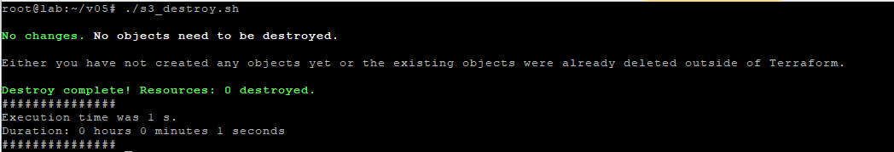

  * Запустили создание и появился бакет
  
  
  

  

  * Проверили, что бакет удаляется и появляется
   
  
  

   

   

  

  * Добавили бекенд для хранилища и появилось состояние
   

  


Иными словами стейт мы благополучно храним в s3. Но фикус в том, что этот самый s3 нам сначала нужно создать, а потом положить туда стейт, указать бэкенд и смигрировать. Т.е. на мой взгляд было бы логичнее хранить стейт не там же, где мы проводим массовые манипуляции, а переложить его в более "статичное" и не подверженное изменениям место, например Gitlab. 

А также замечу, что, к счастью, мы не можем грохнуть s3 со стейтом, т.к. облако Яндекс (не знаю, как там с AWS или другими, не удалось попробовать) не дает удалить бакет, в котором что-то есть. Инами словами потери стейта не происходит (что хорошо), но и полной автоматизации процесса нет (что допустимо, по всей видимости).

*Хотя было довольно забавно ради спортивного интереса удалить remote state из бакета и посмотреть на поведение terraform (никогда так не делайте, особенно в проде и особенно при работе в команде) :)*

</details>

<details>
  <summary>Создание VPC с подсетями в разных зонах доступности</summary>

Забегая вперед замечу, что создать прям во всех зонах доступности не вышло из-за квотирования. На аккаунте мне доступны только A и B зоны. Зона С скоро будет закрыта - https://cloud.yandex.ru/blog/posts/2023/08/new-availability-zone - потому пришлось создать три штуки, но в двух зонах.

Вместо этого можно использовать зону D, т.е. у нас получаются машины в зонах A, B и D. Единственный нюанс, мы не сможем использовать виртуальные машины с  Intel Broadwell, но выбирать Intel Cascade Lake (standard-v2 / Intel® Xeon® Gold 6230) или Intel Ice Lake (standard-v3 / Intel® Xeon® Gold 6338).


Данные c исходниками в каталоге с [исходниками](src/pro-one-infra-init-test-vps/), [исходниками-2-с-зоной-D](src/pro-one-infra-init-test-vps2/) или на [gitlab](https://lab.galkin.work/admin/projects/dev/infra) (пока он еще жив)

*Вариант 1*
* [private.auto.tfvars](src/pro-one-infra-init-test-vps/private.auto.tfvars) - переменные
* [provider.tf](src/pro-one-infra-init-test-vps/provider.tf) - провайдер
* [s3-backet.tf_](src/pro-one-infra-init-test-vps/s3-backet.tf) - описание бекенда s3
* [s3.tf](src/pro-one-infra-init-test-vps/s3.tf) - статические ключи для бакета
* [sa-storage-admin.tf](src/pro-one-infra-init-test-vps/sa-storage-admin.tf) - сервис-аккаунт
* [variables.tf](src/pro-one-infra-init-test-vps/variables.tf) - описание переменных
* [vpc-s3_destroy.shh](src/pro-one-infra-init-test-vps/vpc-s3_destroy.sh) - sh файл с terraform destroy
* [vpc-s3_install.sh](src/pro-one-infra-init-test-vps/vpc-s3_install.sh) - sh файл с terraform init и apply
* [s3_install-state.sh](src/pro-one-infra-init-test-vps/s3_install-state.sh) - добавление бекенда для хранения terraform state

Кроме того добавляем некоторые дополнительные файлы:
* [networks.tf](src/pro-one-infra-init-test-vps/networks.tf) - список сетей 
* [output.tf](src/pro-one-infra-init-test-vps/output.tf) - вывод полученного
* [secret.txt](src/pro-one-infra-init-test-vps/secret.txt) - мета-данные для передачи в виртуальные машины
* [vpc.tf](src/pro-one-infra-init-test-vps/vpc.tf) - манифест для создания виртуальных машин

А также переименовали sh скрипты в vpc-s3_destroy.sh и vpc-s3_install.sh, но по сути там ничего не поменялось.

*Вариант 2*

* [private.auto.tfvars](src/pro-one-infra-init-test-vps2/private.auto.tfvars) - переменные
* [provider.tf](src/pro-one-infra-init-test-vps2/provider.tf) - провайдер
* [s3-backet.tf_](src/pro-one-infra-init-test-vps2/s3-backet.tf) - описание бекенда s3
* [s3.tf](src/pro-one-infra-init-test-vps2/s3.tf) - статические ключи для бакета
* [sa-storage-admin.tf](src/pro-one-infra-init-test-vps2/sa-storage-admin.tf) - сервис-аккаунт
* [variables.tf](src/pro-one-infra-init-test-vps2/variables.tf) - описание переменных
* [vpc-s3_destroy.shh](src/pro-one-infra-init-test-vps2/vpc-s3_destroy.sh) - sh файл с terraform destroy
* [vpc-s3_install.sh](src/pro-one-infra-init-test-vps2/vpc-s3_install.sh) - sh файл с terraform init и apply
* [s3_install-state.sh](src/pro-one-infra-init-test-vps2/s3_install-state.sh) - добавление бекенда для хранения terraform state

Кроме того добавляем некоторые дополнительные файлы:
* [networks.tf](src/pro-one-infra-init-test-vps2/networks.tf) - список сетей - сеть в зоне ru-central1-d
* [output.tf](src/pro-one-infra-init-test-vps2/output.tf) - вывод полученного
* [secret.txt](src/pro-one-infra-init-test-vps2/secret.txt) - мета-данные для передачи в виртуальные машины
* [vpc.tf](src/pro-one-infra-init-test-vps2/vpc.tf) - манифест для создания виртуальных машин - изменение в выборе платформы на одной из машин


**История в картинках:**

  * В начале снова ничего, кроме s3 и стейта
  

  * Запустили создание - вариант 1
  

  * Запустили создание - вариант 2
  

  * Создалось - вариант 1:
  

  

  * Создалось - вариант 2:
  

  

  * Видео создания (вариант 1):
  [https://youtu.be/8m-nbBQoqDI](https://youtu.be/8m-nbBQoqDI)

  * Видео удаления:
  [https://youtu.be/iJznXWd4vlY](https://youtu.be/iJznXWd4vlY)

  * Удаление:
  
  
  * И ничего кроме s3 со стейтом не осталось
  

  Виртуальные машины многократно создавались и пересоздавались для проверки работы манифестов и отсутствия при этом критичных ошибок.

  Материалы по теме:
  * [Метаданные виртуальной машины](https://yandex.cloud/ru/docs/compute/concepts/vm-metadata)
  * [Как создать виртуальную машину с доступом по паролю](https://yandex.cloud/ru/docs/troubleshooting/compute/how-to/create-password-protected-vm)
  * [Включить доступ по OS Login](https://yandex.cloud/ru/docs/organization/operations/os-login-access)
  * [Добавить SSH-ключ](https://yandex.cloud/ru/docs/organization/operations/add-ssh#tf_1)
  * [Платформы](https://yandex.cloud/ru/docs/compute/concepts/vm-platforms#standard-platforms)
  * [TF Yandex - yandex_compute_instance](https://terraform-provider.yandexcloud.net/Resources/compute_instance)
  * [Virtual Private Cloud (VPC) Terraform module for Yandex.Cloud](https://github.com/terraform-yc-modules/terraform-yc-vpc)
</details>


<details>
  <summary>Summary</summary>

В скромной части работы, конечно, не совсем полная автоматизация, хотя по заданию было свести все к минимуму, но пока моих знаний и умений недостаточно. В идеальной картинке мира было бы здорово когда-нибудь добиться более автоматизированной истории, скорее всего, при помощи модулей от Яндекса:

  * Автоматическое создание дополнительных служебных учеток средствами terraform. На мой взгляд использование одной для всего, безусловно, удобнее, но идеально, когда для каждого "ресурса" у нас свои креды и они строго ограничены в рамках своих прав. С точки зрения отладки это то еще приключение, но с точки зрения безопасности - более надежное решение.
  * Для хранения секретов также идеально было бы использовать Vault от HashiCorp в связке с Terraform, а если секреты лежат в файлах, то аккуратнее подходить к gitignore (здесь эта рекомендация сознательно не соблюдалась, чтобы было понятно, что происходит)
  * Не хватает автоматизации миграции state terraform при хранении его в облачной инфраструктуре. По заданию мы храним его в s3, но это хранилище создает и потенциально пытается убить тот же terraform. Да, у него не получается, но это как-то не очень здорово выглядит. Т.е. тут более идеальной наверное историей было бы мигрирование state в локальный при убийстве всех ресурсов (в том числе очистка бакета) и переходе обратно. Но скорее всего все это оверкил, и state было бы логичнее хранить в Gitlab.
</details>

<details>
  <summary>Материалы по теме</summary>

  * [Документация по созданию бакета](https://yandex.cloud/ru/docs/storage/operations/buckets/create)
  * [Документация по созданию приватного бакета от Hashicorp](https://registry.terraform.io/providers/yandex-cloud/yandex/latest/docs/resources/storage_bucket)
  * [Документация по s3 от HashiCorp](https://www.terraform.io/docs/language/settings/backends/s3.html)
  * [Деплоим Yandex Cloud с помощью Terraform и GitLab](https://www.youtube.com/watch?v=U58zSIvgyDI)
  * [Загрузка состояний Terraform в Yandex Object Storage](https://yandex.cloud/ru/docs/tutorials/infrastructure-management/terraform-state-storage)
  * [Terraform: от незнания к best practices](https://habr.com/ru/companies/nixys/articles/721404/)
</details>


### Создание Kubernetes кластера

Создание кластера Kubernetes проходит на базе Яндекс.Облако с использованием terraform. Работы проводились с рабочей машины с сервером Gitlab. Для разворачивания кластера был выбран вариант с Managed service Kubernetes. По условиям задачи нужно получить региональный кластер

<details>
  <summary>Первый блин</summary>

  На моменте тестирования отвалился ресурс terraform-mirror.yandexcloud.net с ошибкой

  ```
  upstream connect error or disconnect/reset before headers. reset reason: connection failure, transport failure reason: delayed connect error: 110 request-id: 3b5a2521-d490-4728-8081-1dba89e6eadc trace-id: -
  ```

  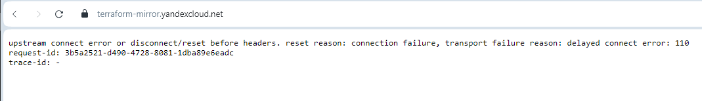

  Пришлось переключиться на OpenTofu. Здесь и далее будет представлен именно он. Отличий в синтаксисе манифестов, командах и так далее нет, поэтому вполне можно использовать и его, как анти-санкционную замену terraform.

  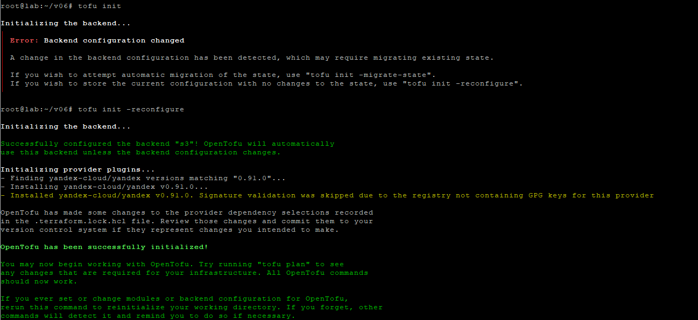
</details>

<details>
  <summary>Манифесты и конфигурация</summary>

* [private.auto.tfvars](src/pro-one-infra-k8s/private.auto.tfvars) - переменные
* [provider.tf](src/pro-one-infra-k8s/provider.tf) - провайдер
* [s3-backet.tf_](src/pro-one-infra-k8s/s3-backet.tf) - описание бекенда s3
* [s3.tf](src/pro-one-infra-k8s/s3.tf) - статические ключи для бакета
* [sa-storage-admin.tf](src/pro-one-infra-k8s/sa-storage-admin.tf) - сервис-аккаунт, изменения для k-admin для k8s
* [variables.tf](src/pro-one-infra-k8s/variables.tf) - описание переменных
* [k8s-s3_destroy.shh](src/pro-one-infra-k8s/vpc-s3_destroy.sh) - sh файл с terraform destroy
* [k8s-s3_install.sh](src/pro-one-infra-k8s/vpc-s3_install.sh) - sh файл с terraform init и apply
* [s3_install-state.sh](src/pro-one-infra-k8s/s3_install-state.sh) - добавление бекенда для хранения terraform state

* [id_rsa.pub](src/pro-one-infra-k8s/id_rsa.pub) - ключик для добавления к нодам кластера 
* [k8s-cluster.tf](src/pro-one-infra-k8s/k8s-cluster.tf) - описание кластера
* [k8s-kms.tf](src/pro-one-infra-k8s/k8s-kms.tf) - описание kms
* [k8s-networks.tf](src/pro-one-infra-k8s/k8s-networks.tf) - описание подсетей
* [k8s-nodes.tf](src/pro-one-infra-k8s/k8s-nodes.tf) - описание нод кластера

Из прошлого задания нам не потребуются файлы [networks.tf](networks.tf_), [output.tf](output.tf)_, [secret.txt](secret.txt), [vpc.tf](vpc.tf_) - так, как мы используем managed-кластер

Самое интересное - получение конфигурации от кластера и возможность иметь свежий kube-конфиг. Сделали через local-exec и yc.

```
output "k8s_cluster_id" {
  value = yandex_kubernetes_cluster.k8s-regional.id
  description = "ID of created cluster"
}

resource "null_resource" "k8s_cluster_id" {
provisioner "local-exec" {
    command = "rm -r ~/.kube && mkdir -p ~/.kube && yc managed-kubernetes cluster get-credentials ${yandex_kubernetes_cluster.k8s-regional.id} --external"
 }
}
```


</details>

<details>
  <summary>Проверка создания</summary>

  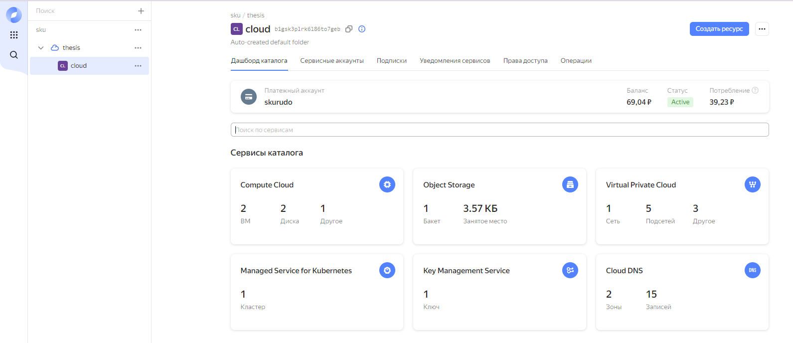

  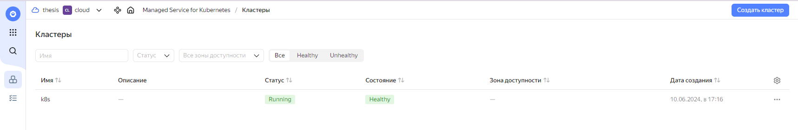

  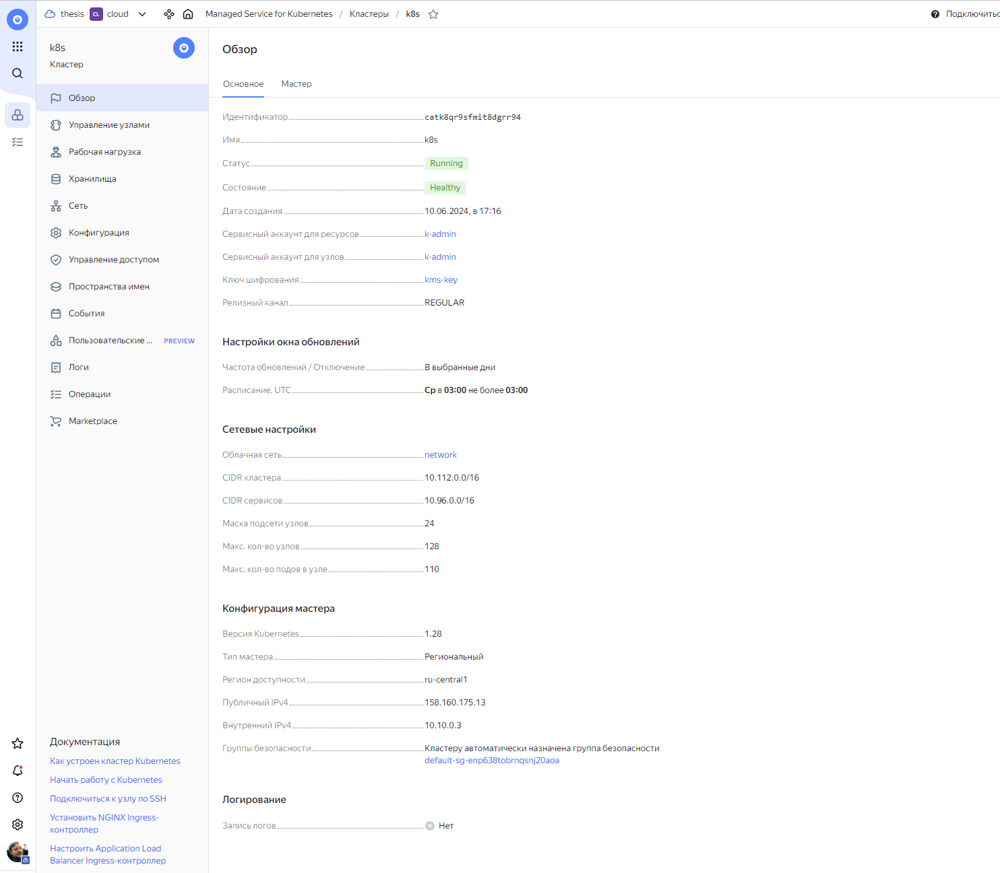

  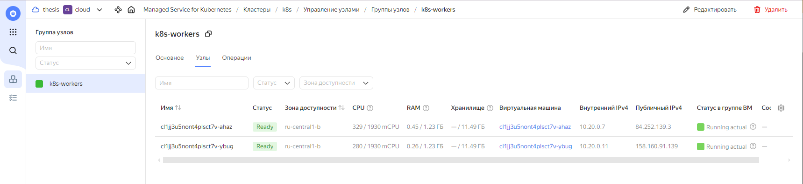

  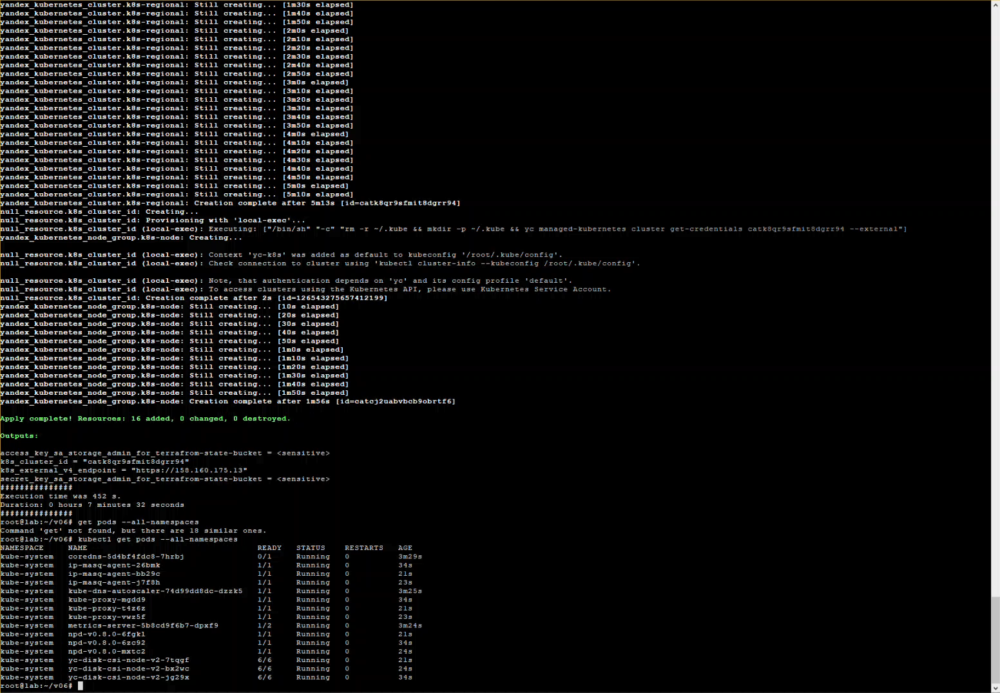

  [Видео-ролик](https://youtu.be/VZC2BRsoJ10)

</details>

<details>
  <summary>Summary</summary>

  ```
  # kubectl get pods --all-namespaces
NAMESPACE     NAME                                   READY   STATUS    RESTARTS   AGE
kube-system   coredns-5d4bf4fdc8-7hrbj               0/1     Running   0          3m29s
kube-system   ip-masq-agent-26bmk                    1/1     Running   0          34s
kube-system   ip-masq-agent-bb29c                    1/1     Running   0          21s
kube-system   ip-masq-agent-j7f8h                    1/1     Running   0          23s
kube-system   kube-dns-autoscaler-74d99dd8dc-dzzk5   1/1     Running   0          3m25s
kube-system   kube-proxy-mgdd9                       1/1     Running   0          34s
kube-system   kube-proxy-t4z6z                       1/1     Running   0          21s
kube-system   kube-proxy-vwz5f                       1/1     Running   0          23s
kube-system   metrics-server-5b8cd9f6b7-dpxf9        1/2     Running   0          3m24s
kube-system   npd-v0.8.0-6fgkl                       1/1     Running   0          21s
kube-system   npd-v0.8.0-6zc92                       1/1     Running   0          34s
kube-system   npd-v0.8.0-mxtc2                       1/1     Running   0          24s
kube-system   yc-disk-csi-node-v2-7tqgf              6/6     Running   0          21s
kube-system   yc-disk-csi-node-v2-bx2wc              6/6     Running   0          24s
kube-system   yc-disk-csi-node-v2-jg29x              6/6     Running   0          34s
  ```


</details>

<details>
  <summary>Материалы по теме</summary>

  * [HashiCorp - yandex_kubernetes_cluster](https://registry.terraform.io/providers/yandex-cloud/yandex/latest/docs/resources/kubernetes_cluster)
  * [HashiCorp - yandex_kubernetes_node_group](https://registry.terraform.io/providers/yandex-cloud/yandex/latest/docs/resources/kubernetes_node_group)
  * [TF Yandex - yandex_kubernetes_cluster](https://terraform-provider.yandexcloud.net/Resources/kubernetes_cluster)
  * [TF Yandex - yandex_kubernetes_node_group](https://terraform-provider.yandexcloud.net/Resources/kubernetes_node_group)
  * [Обзор способов подключения](https://yandex.cloud/ru/docs/managed-kubernetes/operations/connect/)
  * [Kubernetes Terraform Module for Yandex.Cloud](https://github.com/terraform-yc-modules/terraform-yc-kubernetes)
  * [Extracting the KUBE_CONFIG for a DigitalOcean Kubernetes cluster from a Terraform .tfstate](https://dev.to/sshine/extracting-the-kubeconfig-for-a-digitalocean-kubernetes-cluster-from-a-terraform-tfstate-1o59)
  * [Understanding local-exec provisioner in terraform](https://www.devopsschool.com/blog/understanding-local-exec-provisioner-in-terraform/)
  * [How to Safely Pass Variables to Terraform local-exec Scripts](https://w3bward.hashnode.dev/how-to-safely-pass-variables-to-terraform-local-exec-scripts)
  * [Автоматизация установки Kubernetes кластера с помощью Kubespray и Terraform в Yandex Cloud](https://habr.com/ru/articles/574514/)
</details>

### Создание тестового приложения

<details>
  <summary>Подготовка тестового приложения</summary>

[Dockerfile](src/pro-one-app/Dockerfile) - докерфайл
[index.html](src/pro-one-app/index.html) - статическая страничка
[netology.jpg](src/pro-one-app/netology.jpg) - статическая картинка
[nginx.conf](src/pro-one-app/nginx.conf) - файл конфигурации nginx
</details>


<details>
  <summary>Тестирование и запуск</summary>

Собираем:

```
root@lab:~/testapp# docker build -t protestapp --no-cache .
[+] Building 2.2s (10/10) FINISHED                                                                                                                                                           docker:default
 => [internal] load build definition from Dockerfile                                                                                                                                                   0.1s
 => => transferring dockerfile: 210B                                                                                                                                                                   0.0s
 => [internal] load metadata for docker.io/library/nginx:mainline-alpine                                                                                                                               0.5s
 => [internal] load .dockerignore                                                                                                                                                                      0.1s
 => => transferring context: 2B                                                                                                                                                                        0.0s
 => CACHED [1/5] FROM docker.io/library/nginx:mainline-alpine@sha256:69f8c2c72671490607f52122be2af27d4fc09657ff57e42045801aa93d2090f7                                                                  0.0s
 => [internal] load build context                                                                                                                                                                      0.1s
 => => transferring context: 30.71kB                                                                                                                                                                   0.0s
 => [2/5] RUN rm /etc/nginx/conf.d/*                                                                                                                                                                   0.4s
 => [3/5] ADD nginx.conf /etc/nginx/conf.d/                                                                                                                                                            0.3s
 => [4/5] ADD index.html /usr/share/nginx/html/                                                                                                                                                        0.1s
 => [5/5] ADD netology.jpg /usr/share/nginx/html/                                                                                                                                                      0.2s
 => exporting to image                                                                                                                                                                                 0.3s
 => => exporting layers                                                                                                                                                                                0.3s
 => => writing image sha256:55f45583125ea230e0f9e1745ed42eeae8a7a69054795d3a2f72c97e2ef56f6e                                                                                                           0.0s
 => => naming to docker.io/library/protestapp                                                                                                                                                          0.0s
```

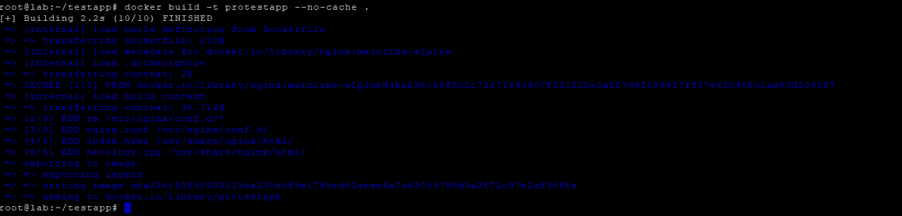

Запускаем для проверки

```
root@lab:~/testapp# docker run -p 3000:80 protestapp
/docker-entrypoint.sh: /docker-entrypoint.d/ is not empty, will attempt to perform configuration
/docker-entrypoint.sh: Looking for shell scripts in /docker-entrypoint.d/
/docker-entrypoint.sh: Launching /docker-entrypoint.d/10-listen-on-ipv6-by-default.sh
10-listen-on-ipv6-by-default.sh: info: /etc/nginx/conf.d/default.conf is not a file or does not exist
/docker-entrypoint.sh: Sourcing /docker-entrypoint.d/15-local-resolvers.envsh
/docker-entrypoint.sh: Launching /docker-entrypoint.d/20-envsubst-on-templates.sh
/docker-entrypoint.sh: Launching /docker-entrypoint.d/30-tune-worker-processes.sh
/docker-entrypoint.sh: Configuration complete; ready for start up
2024/06/10 16:01:24 [notice] 1#1: using the "epoll" event method
2024/06/10 16:01:24 [notice] 1#1: nginx/1.27.0
2024/06/10 16:01:24 [notice] 1#1: built by gcc 13.2.1 20231014 (Alpine 13.2.1_git20231014)
2024/06/10 16:01:24 [notice] 1#1: OS: Linux 5.15.0-102-generic
2024/06/10 16:01:24 [notice] 1#1: getrlimit(RLIMIT_NOFILE): 1048576:1048576
2024/06/10 16:01:24 [notice] 1#1: start worker processes
2024/06/10 16:01:24 [notice] 1#1: start worker process 20
2024/06/10 16:01:24 [notice] 1#1: start worker process 21
2024/06/10 16:01:24 [notice] 1#1: start worker process 22
2024/06/10 16:01:24 [notice] 1#1: start worker process 23
```


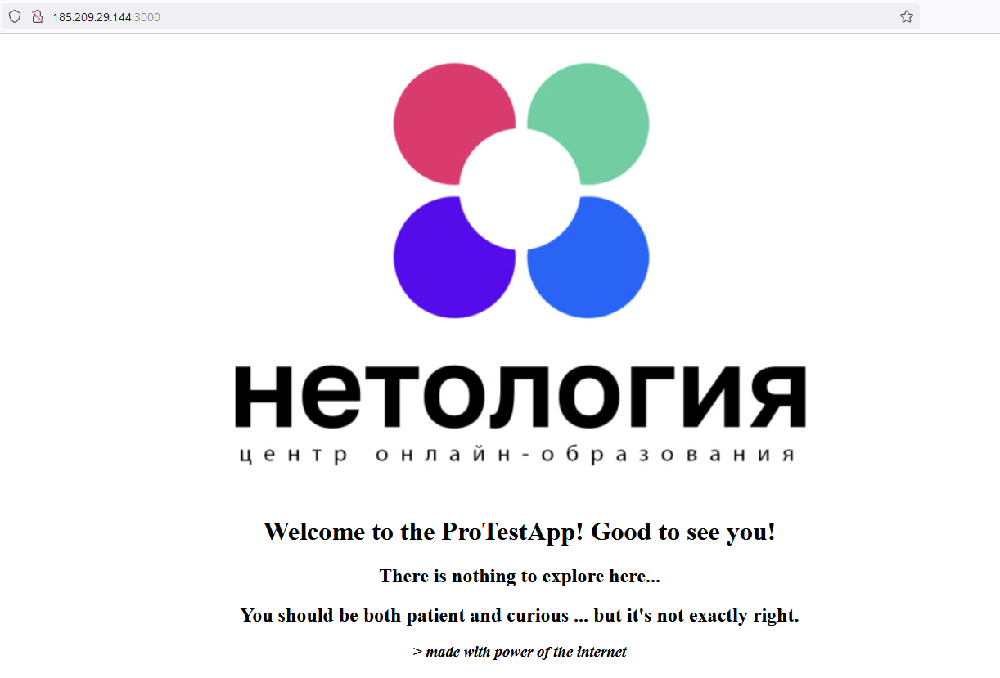
</details>


<details>
  <summary>Создание registry</summary>


Добавляем registry c помощью манифеста [registry.tf](src/pro-one-infra-k8s/registry.tf), листиннг ниже

```
resource "yandex_container_registry" "my-registry" {
  name = "pro-one-app"
}

resource "yandex_container_repository" "my-repository" {
  name = "${yandex_container_registry.my-registry.id}/pro-one-app"
}


# Output data
output "yandex_container_repository" {
  value = yandex_container_registry.my-registry.id
  description = "ID registry"
}


resource "null_resource" "yandex_container_repository" {
provisioner "local-exec" {
    command = "echo ${yandex_container_registry.my-registry.id} > registry-id"
 }
}
```

Данные о registry, а именно id получаем также с помощью output и local-exec

[Видео создания](https://youtu.be/uMMFicdFmTM)


</details>

<details>
  <summary>Сохранение в регистри</summary>

Сначала нужно залогиниться... сделаем это с помощью нехитрого скрипта - [yc-registry-login.sh](src/yandex-registry/yc-registry-login.sh), который будет брать значение OAtoken'a и передавать докеру для логина. Данные про токен у нас есть в private.auto.tfvars

```
#!/bin/bash

s="$(head -1 private.auto.tfvars)"
s=${s#*'"'}; s=${s%'"'*}

echo "Token for login:"
echo "$s"


echo "Login to Yandex Docker Registry"
echo "$s" | docker login --username oauth --password-stdin cr.yandex
```

```
6# ./yc-registry-login.sh
Token for login:
CENSORED
Login to Yandex Docker Registry
WARNING! Your password will be stored unencrypted in /root/.docker/config.json.
Configure a credential helper to remove this warning. See
https://docs.docker.com/engine/reference/commandline/login/#credentials-store

Login Succeeded
```

Теперь нужно запилить собрать и залить образ в регистри. id регистри мы получили с помощью терраформ (опентофу).

Переименуем [yc-registry-login.sh](src/yandex-registry/yc-registry-login.sh) в [yc-registry-docker.sh](src/yandex-registry/yc-registry-docker.sh) и добавим туда чтение id регистри и билд-пуш туда.
```
echo "Registry ID"
rid="$(head -1 registry-id)"
echo "$rid"


echo "-------"
echo "Build and push app"
cd ~/pro-one-app
docker build . -t cr.yandex/$rid/pro-one-app:latest -f ~/pro-one-app/Dockerfile
docker push cr.yandex/${rid}/pro-one-app:latest

```

В итоге получаем такой листинг в первом проходе:

```
# ./yc-registry-docker.sh
Token for login:
CENSORED
Login to Yandex Docker Registry
WARNING! Your password will be stored unencrypted in /root/.docker/config.json.
Configure a credential helper to remove this warning. See
https://docs.docker.com/engine/reference/commandline/login/#credentials-store

Login Succeeded
Registry ID
[+] Building 1.4s (10/10) FINISHED                                                                                                                                                           docker:default
 => [internal] load build definition from Dockerfile                                                                                                                                                   0.0s
 => => transferring dockerfile: 210B                                                                                                                                                                   0.0s
 => [internal] load metadata for docker.io/library/nginx:mainline-alpine                                                                                                                               1.2s
 => [internal] load .dockerignore                                                                                                                                                                      0.0s
 => => transferring context: 2B                                                                                                                                                                        0.0s
 => [1/5] FROM docker.io/library/nginx:mainline-alpine@sha256:69f8c2c72671490607f52122be2af27d4fc09657ff57e42045801aa93d2090f7                                                                         0.0s
 => [internal] load build context                                                                                                                                                                      0.1s
 => => transferring context: 30.71kB                                                                                                                                                                   0.0s
 => CACHED [2/5] RUN rm /etc/nginx/conf.d/*                                                                                                                                                            0.0s
 => CACHED [3/5] ADD nginx.conf /etc/nginx/conf.d/                                                                                                                                                     0.0s
 => CACHED [4/5] ADD index.html /usr/share/nginx/html/                                                                                                                                                 0.0s
 => CACHED [5/5] ADD netology.jpg /usr/share/nginx/html/                                                                                                                                               0.0s
 => exporting to image                                                                                                                                                                                 0.0s
 => => exporting layers                                                                                                                                                                                0.0s
 => => writing image sha256:55f45583125ea230e0f9e1745ed42eeae8a7a69054795d3a2f72c97e2ef56f6e                                                                                                           0.0s
 => => naming to cr.yandex/crp8jfk6aqukdh9003lb/pro-one-app:latest                                                                                                                                     0.0s
The push refers to repository [cr.yandex/crp8jfk6aqukdh9003lb/pro-one-app]
72b5fc078a9e: Pushed
b54438062662: Pushed
b280efc1ae41: Pushed
16f15a5caaa8: Pushed
9cba8117003a: Pushed
b6d04dc5ecf7: Pushed
d38ed9b519d2: Pushed
3b4115e2edd1: Pushed
8d720e2faad3: Pushed
7b87df18a0ed: Pushed
a05d3326ce5a: Pushed
d4fc045c9e3a: Pushed
latest: digest: sha256:eae5670009c17b8dd1c3cb997899528bacb8cb399b00430dd9cadb0ae5ba3afa size: 2819
```

Повторяем и видим, что все на месте:

```
# ./yc-registry-docker.sh
Token for login:
CENSORED
Login to Yandex Docker Registry
WARNING! Your password will be stored unencrypted in /root/.docker/config.json.
Configure a credential helper to remove this warning. See
https://docs.docker.com/engine/reference/commandline/login/#credentials-store

Login Succeeded
Registry ID
crp8jfk6aqukdh9003lb
-------
Build and push app
[+] Building 0.7s (10/10) FINISHED                                                                                                                                                           docker:default
 => [internal] load build definition from Dockerfile                                                                                                                                                   0.0s
 => => transferring dockerfile: 210B                                                                                                                                                                   0.0s
 => [internal] load metadata for docker.io/library/nginx:mainline-alpine                                                                                                                               0.5s
 => [internal] load .dockerignore                                                                                                                                                                      0.0s
 => => transferring context: 2B                                                                                                                                                                        0.0s
 => [1/5] FROM docker.io/library/nginx:mainline-alpine@sha256:69f8c2c72671490607f52122be2af27d4fc09657ff57e42045801aa93d2090f7                                                                         0.0s
 => [internal] load build context                                                                                                                                                                      0.0s
 => => transferring context: 95B                                                                                                                                                                       0.0s
 => CACHED [2/5] RUN rm /etc/nginx/conf.d/*                                                                                                                                                            0.0s
 => CACHED [3/5] ADD nginx.conf /etc/nginx/conf.d/                                                                                                                                                     0.0s
 => CACHED [4/5] ADD index.html /usr/share/nginx/html/                                                                                                                                                 0.0s
 => CACHED [5/5] ADD netology.jpg /usr/share/nginx/html/                                                                                                                                               0.0s
 => exporting to image                                                                                                                                                                                 0.0s
 => => exporting layers                                                                                                                                                                                0.0s
 => => writing image sha256:55f45583125ea230e0f9e1745ed42eeae8a7a69054795d3a2f72c97e2ef56f6e                                                                                                           0.0s
 => => naming to cr.yandex/crp8jfk6aqukdh9003lb/pro-one-app:latest                                                                                                                                     0.0s
The push refers to repository [cr.yandex/crp8jfk6aqukdh9003lb/pro-one-app]
72b5fc078a9e: Layer already exists
b54438062662: Layer already exists
b280efc1ae41: Layer already exists
16f15a5caaa8: Layer already exists
9cba8117003a: Layer already exists
b6d04dc5ecf7: Layer already exists
d38ed9b519d2: Layer already exists
3b4115e2edd1: Layer already exists
8d720e2faad3: Layer already exists
7b87df18a0ed: Layer already exists
a05d3326ce5a: Layer already exists
d4fc045c9e3a: Layer already exists
latest: digest: sha256:eae5670009c17b8dd1c3cb997899528bacb8cb399b00430dd9cadb0ae5ba3afa size: 2819

```

Успешно создалось:
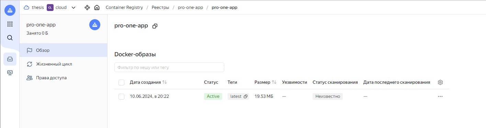

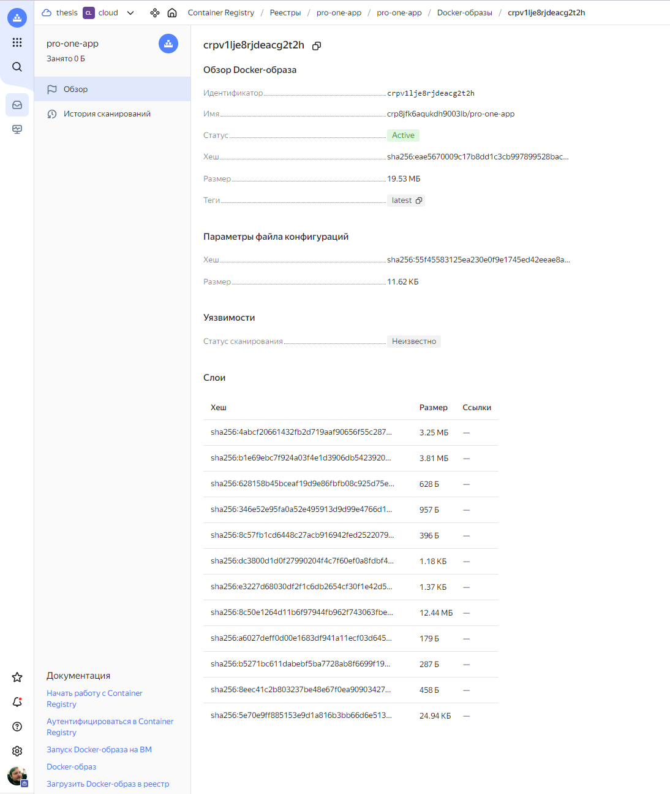

Реестры, container registry, точно также, как и s3, не удаляются, если там что-то есть внутри. Т.е. для полного удаления нужно сначала зачистить содержимое и только потом удалять.

</details>

<details>
  <summary>Материалы по теме</summary>

  * [Запуск Docker-образа на виртуальной машине](https://yandex.cloud/ru/docs/container-registry/tutorials/run-docker-on-vm#oauth-token_1)
  * [Справочник Terraform для Yandex Container Registry](https://yandex.cloud/ru/docs/container-registry/tf-ref)
  * [TF Yandex - yandex_container_repository](https://terraform-provider.yandexcloud.net/Resources/container_repository)
  * [Repository in Container Registry](https://yandex.cloud/en/docs/container-registry/concepts/repository)
</details>