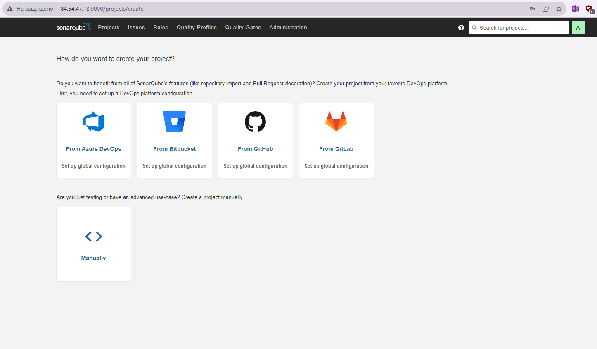

# Домашнее задание к занятию 9 «Процессы CI/CD»

## Подготовка к выполнению

1. Создайте два VM в Yandex Cloud с параметрами: 2CPU 4RAM Centos7 (остальное по минимальным требованиям).
2. Пропишите в [inventory](./infrastructure/inventory/cicd/hosts.yml) [playbook](./infrastructure/site.yml) созданные хосты.
3. Добавьте в [files](./infrastructure/files/) файл со своим публичным ключом (id_rsa.pub). Если ключ называется иначе — найдите таску в плейбуке, которая использует id_rsa.pub имя, и исправьте на своё.
4. Запустите playbook, ожидайте успешного завершения.
5. Проверьте готовность SonarQube через [браузер](http://localhost:9000).
6. Зайдите под admin\admin, поменяйте пароль на свой.
7.  Проверьте готовность Nexus через [бразуер](http://localhost:8081).
8. Подключитесь под admin\admin123, поменяйте пароль, сохраните анонимный доступ.

### Первые шаги 

Сразу же нарываемся на проблему... (здесь была масса проблем, половину из которых удалось решить)... но решается еще проще - ВСЕГДА проверяйте ВЕРСИЮ ansible. Наступил на грабли, было больно. В итоге проверил версию, обновил, все завелось отлично. Мастерская работа продела преподавателем.

А также стоит сразу учесть на вражеской ОС, которую вы поставили:
1) может отработать ipv6 
2) быть включен firewall

## Знакомоство с SonarQube

### Основная часть

1. Создайте новый проект, название произвольное.
2. Скачайте пакет sonar-scanner, который вам предлагает скачать SonarQube.
3. Сделайте так, чтобы binary был доступен через вызов в shell (или поменяйте переменную PATH, или любой другой, удобный вам способ).
4. Проверьте `sonar-scanner --version`.
5. Запустите анализатор против кода из директории [example](./example) с дополнительным ключом `-Dsonar.coverage.exclusions=fail.py`.
6. Посмотрите результат в интерфейсе.
7. Исправьте ошибки, которые он выявил, включая warnings.
8. Запустите анализатор повторно — проверьте, что QG пройдены успешно.
9. Сделайте скриншот успешного прохождения анализа, приложите к решению ДЗ.


### Ответ к заданию 1

Установка и тестирование прошли успешно. 
Совсем все баги победить не удалось, но удалось снизить их количество.




Установка sonar-scanner
- просто скачивается бинарник, кладется в папочку и делается PATH к нему

```
# sonar-scanner -v
INFO: Scanner configuration file: /opt/sonar-scanner/conf/sonar-scanner.properties
INFO: Project root configuration file: NONE
INFO: SonarScanner 5.0.1.3006
INFO: Java 17.0.7 Eclipse Adoptium (64-bit)
INFO: Linux 3.10.0-1160.99.1.el7.x86_64 amd64
```

Запуск sonar-scanner
```
sonar-scanner   -Dsonar.projectKey=Test   -Dsonar.sources=.   -Dsonar.host.url=http://84.54.47.18:9000   -Dsonar.login=15b96289c57e65a9bcfbc7d741fffc557e956d61 -Dsonar.coverage.exclusions=fail.py
```

## Знакомство с Nexus

### Основная часть

1. В репозиторий `maven-public` загрузите артефакт с GAV-параметрами:

 *    groupId: netology;
 *    artifactId: java;
 *    version: 8_282;
 *    classifier: distrib;
 *    type: tar.gz.
   
2. В него же загрузите такой же артефакт, но с version: 8_102.
3. Проверьте, что все файлы загрузились успешно.
4. В ответе пришлите файл `maven-metadata.xml` для этого артефекта.


### Ответ к заданию 2


[maven-metadata.xml](maven-metadata.xml)

### Знакомство с Maven

### Подготовка к выполнению

1. Скачайте дистрибутив с [maven](https://maven.apache.org/download.cgi).
2. Разархивируйте, сделайте так, чтобы binary был доступен через вызов в shell (или поменяйте переменную PATH, или любой другой, удобный вам способ).
3. Удалите из `apache-maven-<version>/conf/settings.xml` упоминание о правиле, отвергающем HTTP- соединение — раздел mirrors —> id: my-repository-http-unblocker.
4. Проверьте `mvn --version`.
5. Заберите директорию [mvn](./mvn) с pom.

### Основная часть

1. Поменяйте в `pom.xml` блок с зависимостями под ваш артефакт из первого пункта задания для Nexus (java с версией 8_282).
2. Запустите команду `mvn package` в директории с `pom.xml`, ожидайте успешного окончания.
3. Проверьте директорию `~/.m2/repository/`, найдите ваш артефакт.
4. В ответе пришлите исправленный файл `pom.xml`.

### Ответ к заданию 3

```
# mvn package
[INFO] Scanning for projects...
[INFO]
[INFO] ---------------------------< netology:java >----------------------------
[INFO] Building java 8_282
[INFO]   from pom.xml
[INFO] --------------------------------[ jar ]---------------------------------
Downloading from central: https://repo.maven.apache.org/maven2/org/apache/maven/plugins/maven-resources-plugin/3.3.1/maven-resources-plugin-3.3.1.pom
Downloaded from central: https://repo.maven.apache.org/maven2/org/apache/maven/plugins/maven-resources-plugin/3.3.1/maven-resources-plugin-3.3.1.pom (8.2 kB at 20 kB/s)
Downloading from central: https://repo.maven.apache.org/maven2/org/apache/maven/plugins/maven-plugins/39/maven-plugins-39.pom
Downloaded from central: https://repo.maven.apache.org/maven2/org/apache/maven/plugins/maven-plugins/39/maven-plugins-39.pom (8.1 kB at
169 kB/s)
Downloading from central: https://repo.maven.apache.org/maven2/org/apache/maven/maven-parent/39/maven-parent-39.pom
Downloaded from central: https://repo.maven.apache.org/maven2/org/apache/maven/maven-parent/39/maven-parent-39.pom (48 kB at 578 kB/s)
Downloading from central: https://repo.maven.apache.org/maven2/org/apache/apache/29/apache-29.pom
Downloaded from central: https://repo.maven.apache.org/maven2/org/apache/apache/29/apache-29.pom (21 kB at 450 kB/s)
...
SKIP
...
Downloaded from central: https://repo.maven.apache.org/maven2/org/codehaus/plexus/plexus-utils/3.4.2/plexus-utils-3.4.2.jar (267 kB at 2.8 MB/s)
Downloaded from central: https://repo.maven.apache.org/maven2/org/apache/commons/commons-compress/1.21/commons-compress-1.21.jar (1.0 MB at 9.3 MB/s)
[WARNING] JAR will be empty - no content was marked for inclusion!
[INFO] Building jar: /root/target/java-8_282.jar
[INFO] ------------------------------------------------------------------------
[INFO] BUILD SUCCESS
[INFO] ------------------------------------------------------------------------
[INFO] Total time:  8.475 s
[INFO] Finished at: 2023-10-18T13:32:53+03:00
[INFO] ------------------------------------------------------------------------
```

```
# mvn --version
Apache Maven 3.9.5 (57804ffe001d7215b5e7bcb531cf83df38f93546)
Maven home: /opt/maven
Java version: 11, vendor: Oracle Corporation, runtime: /opt/jdk/openjdk-11+28_linux
Default locale: en_US, platform encoding: UTF-8
OS name: "linux", version: "3.10.0-1160.99.1.el7.x86_64", arch: "amd64", family: "unix"
```

[pom.xml](pom.xml)

---
