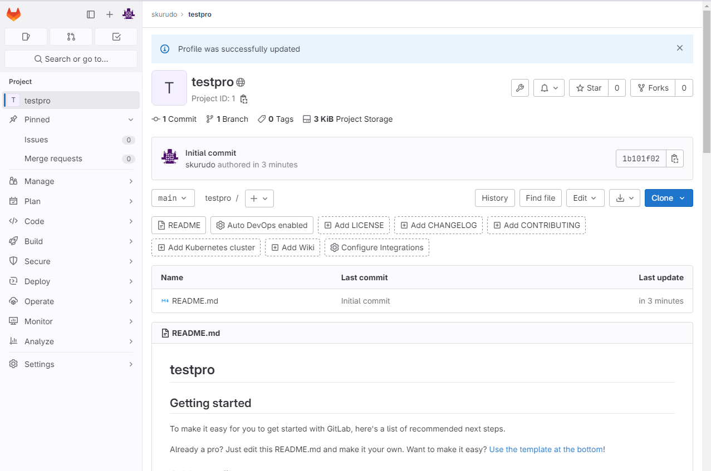
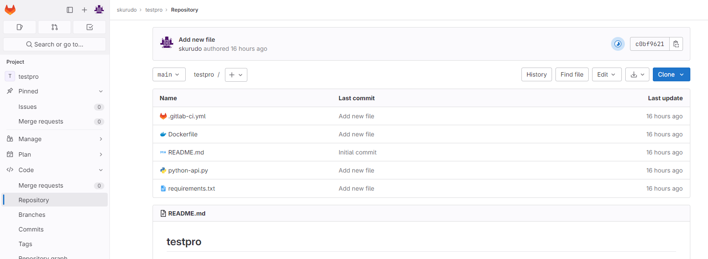
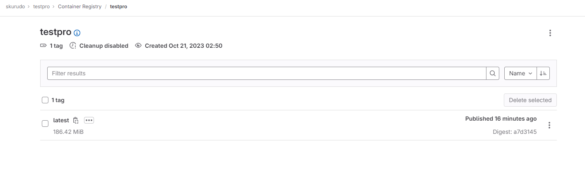

# Домашнее задание к занятию 12 «GitLab»

## Подготовка к выполнению

1. Или подготовьте к работе Managed GitLab от yandex cloud [по инструкции](https://cloud.yandex.ru/docs/managed-gitlab/operations/instance/instance-create) .
Или создайте виртуальную машину из публичного образа [по инструкции](https://cloud.yandex.ru/marketplace/products/yc/gitlab ) .
2. Создайте виртуальную машину и установите на нее gitlab runner, подключите к вашему серверу gitlab  [по инструкции](https://docs.gitlab.com/runner/install/linux-repository.html) .
3. (* Необязательное задание повышенной сложности. )  Если вы уже знакомы с k8s попробуйте выполнить задание, запустив gitlab server и gitlab runner в k8s  [по инструкции](https://cloud.yandex.ru/docs/tutorials/infrastructure-management/gitlab-containers). 
4. Создайте свой новый проект.
5. Создайте новый репозиторий в GitLab, наполните его [файлами](./repository).
6. Проект должен быть публичным, остальные настройки по желанию.

### Скриншоты подготовительной части





## Основная часть

### DevOps

В репозитории содержится код проекта на Python. Проект — RESTful API сервис. Ваша задача — автоматизировать сборку образа с выполнением python-скрипта:

1. Образ собирается на основе [centos:7](https://hub.docker.com/_/centos?tab=tags&page=1&ordering=last_updated).
2. Python версии не ниже 3.7.
3. Установлены зависимости: `flask` `flask-jsonpify` `flask-restful`.
4. Создана директория `/python_api`.
5. Скрипт из репозитория размещён в /python_api.
6. Точка вызова: запуск скрипта.
7. При комите в любую ветку должен собираться docker image с форматом имени hello:gitlab-$CI_COMMIT_SHORT_SHA . Образ должен быть выложен в Gitlab registry или yandex registry.   





### Скриншоты основной части - DevOps

### Product Owner

Вашему проекту нужна бизнесовая доработка: нужно поменять JSON ответа на вызов метода GET `/rest/api/get_info`, необходимо создать Issue в котором указать:

1. Какой метод необходимо исправить.
2. Текст с `{ "message": "Already started" }` на `{ "message": "Running"}`.
3. Issue поставить label: feature.

### Скриншоты основной части - Product Owner


### Developer

Пришёл новый Issue на доработку, вам нужно:

1. Создать отдельную ветку, связанную с этим Issue.
2. Внести изменения по тексту из задания.
3. Подготовить Merge Request, влить необходимые изменения в `master`, проверить, что сборка прошла успешно.

### Скриншоты основной части - Developer





### Tester

Разработчики выполнили новый Issue, необходимо проверить валидность изменений:

1. Поднять докер-контейнер с образом `python-api:latest` и проверить возврат метода на корректность.
2. Закрыть Issue с комментарием об успешности прохождения, указав желаемый результат и фактически достигнутый.

### Ответ основной части - Tester


```
# docker run --rm -d -p "5290:5290" skurudo.gitlab.yandexcloud.net:5050/skurudo/testpro
80158b24f8e6a6251065bc61b11b1d252dcc7e02e63728f9807762bd027b6e2f
```
```
# docker ps
CONTAINER ID   IMAGE                                                 COMMAND                  CREATED         STATUS         PORTS                                       NAMES
80158b24f8e6   skurudo.gitlab.yandexcloud.net:5050/skurudo/testpro   "python3 /python_api…"   8 seconds ago   Up 7 seconds   0.0.0.0:5290->5290/tcp, :::5290->5290/tcp   cranky_banach
```

```
# curl http://127.0.0.1:5290/get_info
{"version": 3, "method": "GET", "message": "Running"}
```

## Итог

В качестве ответа пришлите подробные скриншоты по каждому пункту задания:

- файл gitlab-ci.yml;

[.gitlab-ci.yml](.gitlab-ci.yml)

- Dockerfile; 

[Dockerfile](Dockerfile)

- лог успешного выполнения пайплайна;
- решённый Issue.


