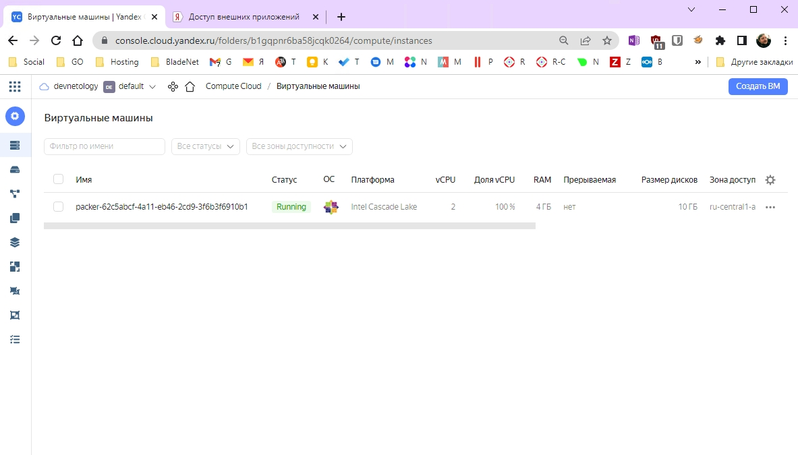
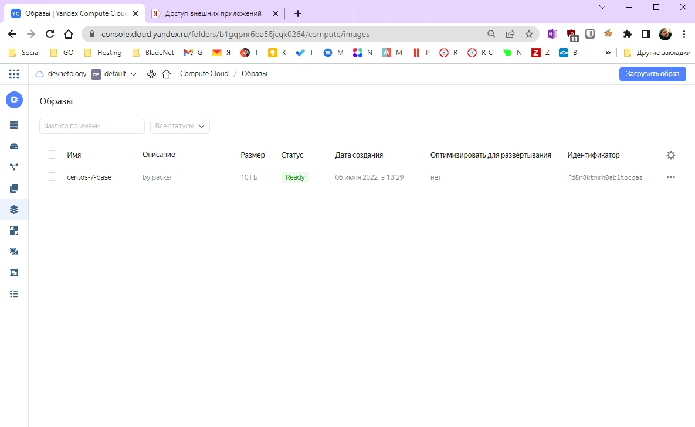
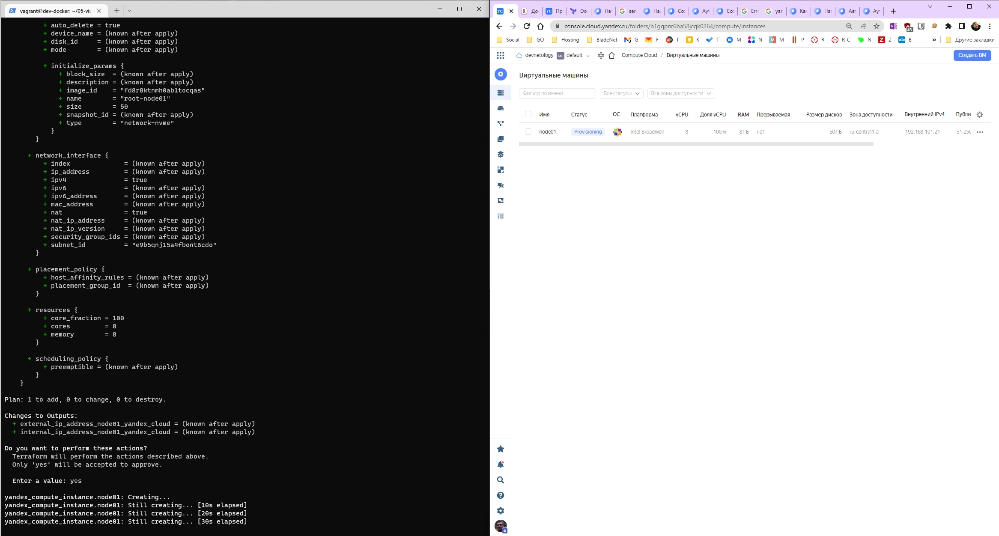
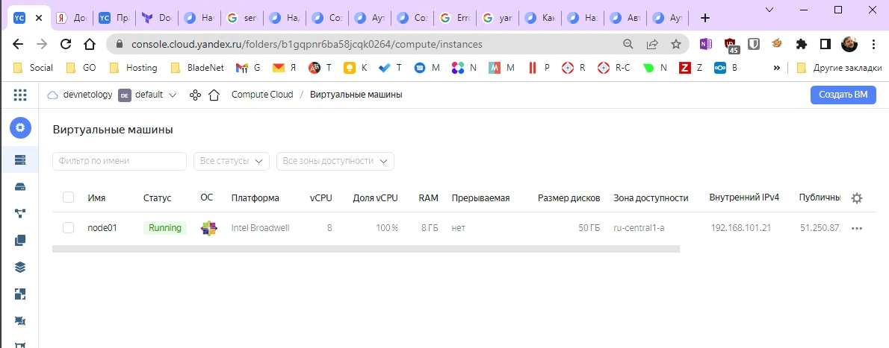
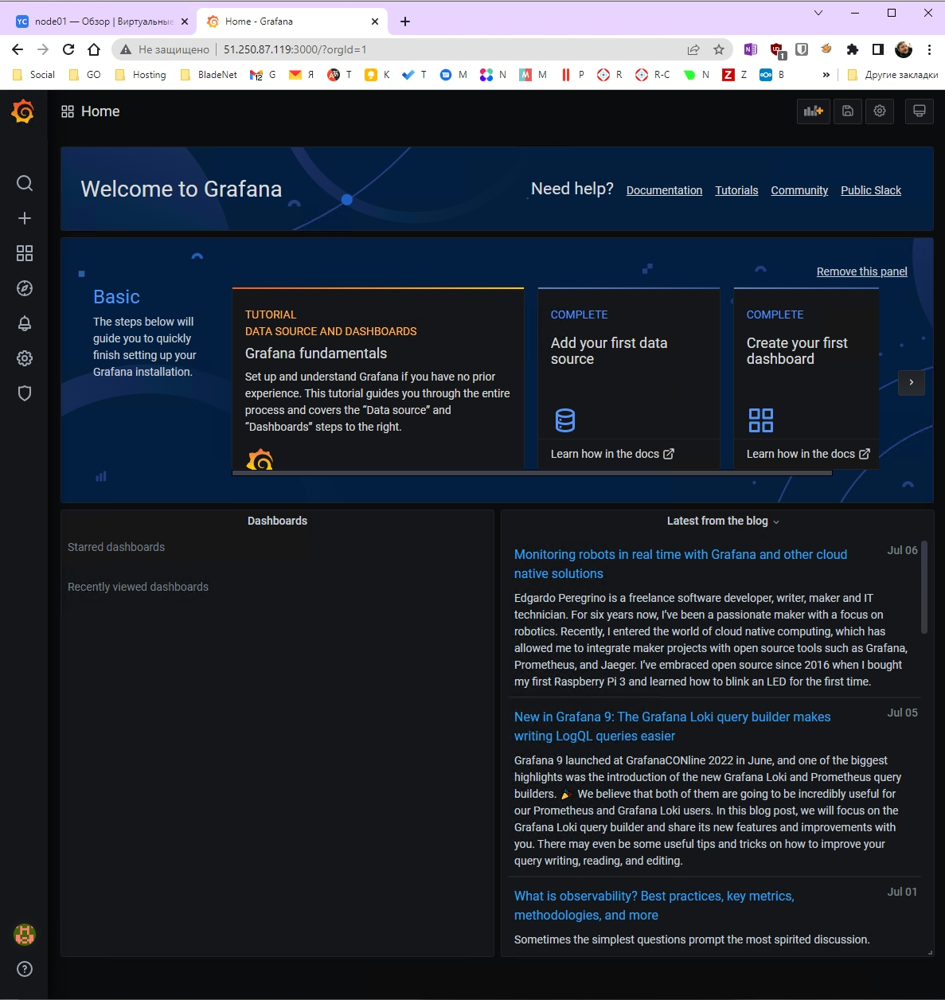
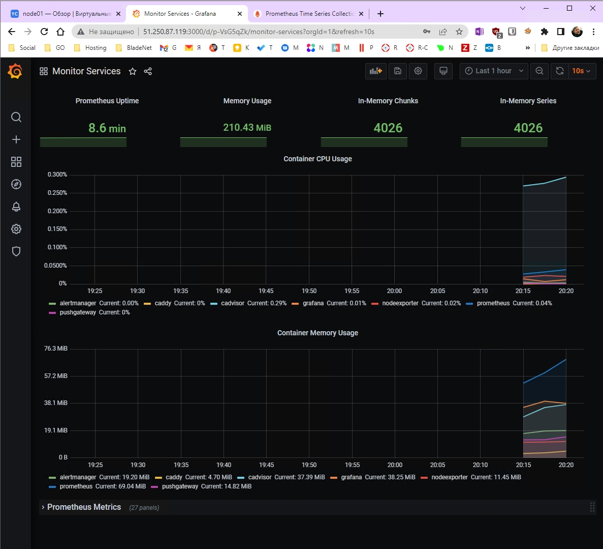

# Домашнее задание к занятию "5.4. Оркестрация группой Docker контейнеров на примере Docker Compose"

---

## Задача 1

Создать собственный образ операционной системы с помощью Packer.

Для получения зачета, вам необходимо предоставить:
- Скриншот страницы, как на слайде из презентации (слайд 37).

### Ответ на задачу 1
* подготовили отдельную вагрант-машину

* установили yc - настроили
```
curl -sSL https://storage.yandexcloud.net/yandexcloud-yc/install.sh | bash

relogin (shell restart)

yc init
```
```
Please enter OAuth token: xxxxxxxxxxxxx
Please select cloud to use:
 [1] cloud-skurudo (id = ...)
 [2] devnetology (id = ...)
Please enter your numeric choice: 2
Your current cloud has been set to 'devnetology' (id = ...).
Please choose folder to use:
 [1] default (id = ...)
 [2] Create a new folder
Please enter your numeric choice: 1
Your current folder has been set to 'default' (id = ...).
Do you want to configure a default Compute zone? [Y/n] y
Which zone do you want to use as a profile default?
 [1] ru-central1-a
 [2] ru-central1-b
 [3] ru-central1-c
 [4] Don't set default zone
Please enter your numeric choice: 1
Your profile default Compute zone has been set to 'ru-central1-a'.
```

```
vagrant@dev-docker:~$ yc config list
token: xxxxxxxxxxxxx
cloud-id: ...
folder-id: ...
compute-default-zone: ru-central1-a
```

```
vagrant@dev-docker:~$ yc compute image list
+----+------+--------+-------------+--------+
| ID | NAME | FAMILY | PRODUCT IDS | STATUS |
+----+------+--------+-------------+--------+
+----+------+--------+-------------+--------+
```

Добавляем packer

```
curl -fsSL https://apt.releases.hashicorp.com/gpg | sudo apt-key add -
sudo apt-add-repository "deb [arch=amd64] https://apt.releases.hashicorp.com $(lsb_release -cs) main"
sudo apt-get update && sudo apt-get install packer

vagrant@dev-docker:~$ packer -v
1.8.2
```

Добавляем terraform

```
sudo apt-get update && sudo apt-get install -y gnupg software-properties-common curl
curl -fsSL https://apt.releases.hashicorp.com/gpg | sudo apt-key add -
sudo apt-add-repository "deb [arch=amd64] https://apt.releases.hashicorp.com $(lsb_release -cs) main"
sudo apt-get update && sudo apt-get install terraform

vagrant@dev-docker:~$ terraform -v
Terraform v1.2.4
on linux_amd64
```

И не забудем про ansible

```
$ sudo apt-get install ansible
```

Переходим к созданию сети и подсети

```
$ yc vpc network create --name net --labels my-label=netology --description "my network"
id: enpm8cb5bb76t9lp4sgm
folder_id: b1gqpnr6ba58jcqk0264
created_at: "2022-07-06T14:06:40Z"
name: net
description: my network
labels:
  my-label: netology
  
  
$ yc vpc subnet create --name my-subnet-a --zone ru-central1-a --range 10.1.2.0/24 --network-name net --description "my subnet of network"
id: e9bqndgmlfp6mickm6j3
folder_id: b1gqpnr6ba58jcqk0264
created_at: "2022-07-06T14:10:12Z"
name: my-subnet-a
description: my subnet of network
network_id: enpm8cb5bb76t9lp4sgm
zone_id: ru-central1-a
v4_cidr_blocks:
  - 10.1.2.0/24  
```

Настало время packer,
но сначала отредактируем centos-7-base.json - вставим наши значения "folder_id", "subnet_id", "subnet_id"

```
vagrant@dev-docker:~/05-virt-04-docker-compose/src/packer$ packer validate centos-7-base.json
The configuration is valid.

vagrant@dev-docker:~/05-virt-04-docker-compose/src/packer$ packer build centos-7-base.json
yandex: output will be in this color.

==> yandex: Creating temporary RSA SSH key for instance...
```

Ждали-ждали и получили ошибку:
```
==> yandex: Error waiting for image: operation (id=fhm0fi7ioueuho5da4qe) wait context done: context deadline exceeded
==> yandex: Provisioning step had errors: Running the cleanup provisioner, if present...
==> yandex: Destroying boot disk...
    yandex: Disk has been deleted!
Build 'yandex' errored after 9 minutes 47 seconds: Error waiting for image: operation (id=fhm0fi7ioueuho5da4qe) wait context done: context deadline exceeded
```

Запустили packer повторно... но получили ошибку - с таким именем уже есть, образ все-таки доделался.

```
vagrant@dev-docker:~/05-virt-04-docker-compose/src/packer$ yc compute image list
+----------------------+---------------+--------+----------------------+--------+
|          ID          |     NAME      | FAMILY |     PRODUCT IDS      | STATUS |
+----------------------+---------------+--------+----------------------+--------+
| fd8r8ktnmh0ab1tocqas | centos-7-base | centos | f2euv1kekdgvc0jrpaet | READY  |
+----------------------+---------------+--------+----------------------+--------+
```




## Задача 2

Создать вашу первую виртуальную машину в Яндекс.Облаке.

Для получения зачета, вам необходимо предоставить:
- Скриншот страницы свойств созданной ВМ, как на примере ниже:

### Ответ на задачу 2

Инициализируем терраформ в директории с сырцами

```
vagrant@dev-docker:~/05-virt-04-docker-compose/src/terraform$ terraform init

Initializing the backend...

Initializing provider plugins...
- Finding latest version of yandex-cloud/yandex...
- Installing yandex-cloud/yandex v0.76.0...
- Installed yandex-cloud/yandex v0.76.0 (unauthenticated)

Terraform has created a lock file .terraform.lock.hcl to record the provider
selections it made above. Include this file in your version control repository
so that Terraform can guarantee to make the same selections by default when
you run "terraform init" in the future.

Terraform has been successfully initialized!
```

Редактируем variables.tf и идем в terraform.. и получаем ошибку

```
vagrant@dev-docker:~/05-virt-04-docker-compose/src/terraform$ terraform plan
╷
│ Error: JSON in "key.json" are not valid: invalid character 'k' looking for beginning of value
│
│   with provider["registry.terraform.io/yandex-cloud/yandex"],
│   on provider.tf line 11, in provider "yandex":
│   11:   service_account_key_file = "key.json"
│
```

При попытке сделать ключ для аккаунта, будет посланы делать сервисные аккаунт
```
yc iam key create --user-account --output key.json

│ Error: key validation failed: key should de issued for service account, but subject is &iamkey.Key_UserAccountId{UserAccountId:"ajekrl114vnclc10k730"}
```


```
yc iam service-account create --name default-sa  \
  --description "this is my favorite service account"

* добавим роли и права

* проверяем 
yc iam service-account --folder-id ... list
yc iam key create --service-account-name default-sa --output key.json
yc config profile create sa-profile
yc iam key create --service-account-id ... --output key.json

yc config set cloud-id ...
yc config set folder-id ...
yc config list

https://cloud.yandex.ru/docs/iam/operations/sa/create
https://cloud.yandex.ru/docs/iam/operations/sa/assign-role-for-sa
https://cloud.yandex.ru/docs/cli/operations/authentication/service-account

```

И снова в terraform:
```
$ terraform plan
$ terraform apply
```

Теперь получилося:
```Apply complete! Resources: 1 added, 0 changed, 0 destroyed.

Outputs:

external_ip_address_node01_yandex_cloud = "51.250.87.119"
internal_ip_address_node01_yandex_cloud = "192.168.101.21"
```




## Задача 3

Создать ваш первый готовый к боевой эксплуатации компонент мониторинга, состоящий из стека микросервисов.

Для получения зачета, вам необходимо предоставить:
- Скриншот работающего веб-интерфейса Grafana с текущими метриками, как на примере ниже

### Ответ на задачу 3

* поправим inventory и в путь

```
$ ansible-playbook provision.yml
```

```
PLAY RECAP ****************************************************************************************************************
node01.netology.cloud      : ok=12   changed=10   unreachable=0    failed=0    skipped=0    rescued=0    ignored=0
```



