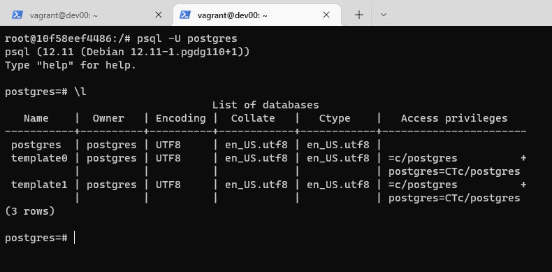
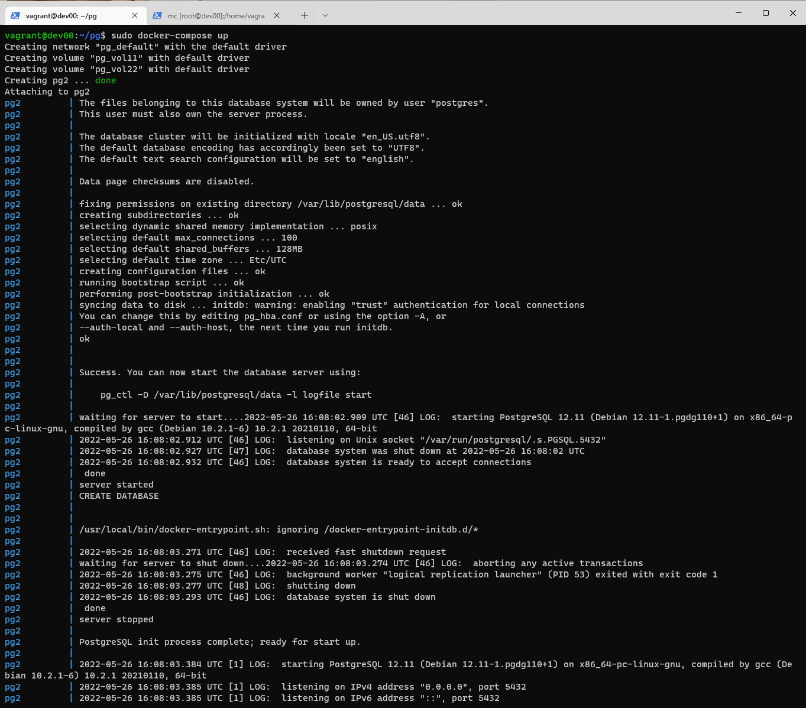
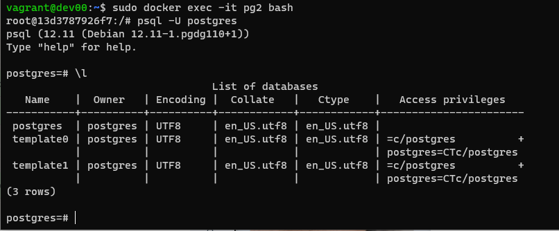

# Домашнее задание к занятию "6.2. SQL"

## Задача 1
> Используя docker поднимите инстанс PostgreSQL (версию 12) c 2 volume, 
> в который будут складываться данные БД и бэкапы.
> Приведите получившуюся команду или docker-compose манифест.

### Ответ на задачу 1
- sudo apt update

- sudo apt install apt-transport-https ca-certificates curl software-properties-common

- curl -fsSL https://download.docker.com/linux/ubuntu/gpg | sudo apt-key add -

- sudo add-apt-repository "deb [arch=amd64] https://download.docker.com/linux/ubuntu focal stable"

- sudo apt update

- apt-cache policy docker-ce

- sudo apt install docker-ce

- sudo systemctl status docker

```
$ sudo systemctl status docker
● docker.service - Docker Application Container Engine
     Loaded: loaded (/lib/systemd/system/docker.service; enabled; vendor preset: enabled)
     Active: active (running) since Thu 2022-05-26 14:58:49 UTC; 1min 42s ago
```
- sudo docker pull postgres:12

- sudo docker images

```
$ sudo docker images
REPOSITORY   TAG       IMAGE ID       CREATED      SIZE
postgres     12        94046d1cabc3   8 days ago   373MB
```

- sudo docker volume create vol2

```
vagrant@dev00:~$ sudo docker volume create vol2
vol2
```

- sudo docker volume create vol1

```
vagrant@dev00:~$ sudo docker volume create vol1
vol1
```

- sudo docker run --name pg -e POSTGRES_PASSWORD=postgres -d -p 5432:5432 postgres:12

```
vagrant@dev00:~$ sudo docker run --name pg -e POSTGRES_PASSWORD=postgres -d -p 5432:5432 postgres:12
09b31a50b7f64d86299b04a362fd696397a6406a6bcb471907c952d1bf365226
```

- sudo docker run --rm --name pg -e POSTGRES_PASSWORD=postgres -ti -p 5432:5432 -v vo1:/home/vagrant/data1 -v vol2:/home/vagrant/data2 postgres:12

```
vagrant@dev00:~$ sudo docker ps
CONTAINER ID   IMAGE         COMMAND                  CREATED          STATUS          PORTS                                       NAMES
10f58eef4486   postgres:12   "docker-entrypoint.s…"   50 seconds ago   Up 49 seconds   0.0.0.0:5432->5432/tcp, :::5432->5432/tcp   pg
```

- sudo docker exec -it pg bash

- смотрим:


---

- по-быстрому накидаем вариант с docker-compose... но сначала скачаем

- sudo curl -L "https://github.com/docker/compose/releases/download/1.29.2/docker-compose-$(uname -s)-$(uname -m)" -o /usr/local/bin/docker-compose

- sudo chmod +x /usr/local/bin/docker-compose

- небольшие изменения для проверки: sudo docker run --rm --name pg2 -e POSTGRES_PASSWORD=postgres -ti -p 5432:5432 -v vol11:/home/vagrant/data11 -v vol22:/home/vagrant/data22 postgres:12

- делаем /home/vagrant/pg/docker-compose.yml

```
version: '3'

volumes:
  vol11: {}
  vol22: {}

services:

  postgres:
    image: postgres:12
    container_name: pg2
    ports:
      - "0.0.0.0:5532:5432"
    volumes:
      - vol11:/home/vagrant/data11
      - vol22:/home/vagrant/data12
    environment:
      POSTGRES_PASSWORD: "postgres"
    restart: always
```

- в случае проблем и пересборке файла не забывает отрубать волюмы: sudo docker-compose down --volumes

- sudo docker-compose up

- sudo docker exec -it pg2 bash

- смотрим:




## Задача 2
> В БД из задачи 1: 
> - создайте пользователя test-admin-user и БД test_db
> - в БД test_db создайте таблицу orders и clients (спeцификация таблиц ниже)
> - предоставьте привилегии на все операции пользователю test-admin-user на таблицы БД test_db
> - создайте пользователя test-simple-user  
> - предоставьте пользователю test-simple-user права на SELECT/INSERT/UPDATE/DELETE данных таблиц БД test_db

> Таблица orders:
> - id (serial primary key)
> - наименование (string)
> - цена (integer)

> Таблица clients:
> - id (serial primary key)
> - фамилия (string)
> - страна проживания (string, index)
> - заказ (foreign key orders)

> Приведите:
> - итоговый список БД после выполнения пунктов выше,
> - описание таблиц (describe)
> - SQL-запрос для выдачи списка пользователей с правами над таблицами test_db
> - список пользователей с правами над таблицами test_db

### Ответ на задачу 2
- psql -U postgres

- CREATE DATABASE test_db;
```
postgres=# CREATE DATABASE test_db;
CREATE DATABASE
```

- psql -d test_db -U postgres

- CREATE TABLE orders (id INT PRIMARY KEY, name text, price INT);

```
CREATE TABLE
test_db=# \dt
         List of relations
 Schema |  Name  | Type  |  Owner
--------+--------+-------+----------
 public | orders | table | postgres
(1 row)
```

- CREATE TABLE clients (id INT PRIMARY KEY, family char(30), land char(30), zakaz INT, FOREIGN KEY (zakaz) REFERENCES orders (id));

```
CREATE TABLE
test_db=# \dt
          List of relations
 Schema |  Name   | Type  |  Owner
--------+---------+-------+----------
 public | clients | table | postgres
 public | orders  | table | postgres
(2 rows)
```

- CREATE ROLE "test-admin-user" SUPERUSER NOCREATEDB NOCREATEROLE NOINHERIT LOGIN;

```
CREATE ROLE
test_db=# \du
                                      List of roles
    Role name    |                         Attributes                         | Member of
-----------------+------------------------------------------------------------+-----------
 postgres        | Superuser, Create role, Create DB, Replication, Bypass RLS | {}
 test-admin-user | Superuser, No inheritance                                  | {}
```

- CREATE ROLE "test-simple-user" NOSUPERUSER NOCREATEDB NOCREATEROLE NOINHERIT LOGIN;

```
CREATE ROLE
test_db=# \du
                                       List of roles
    Role name     |                         Attributes                         | Member of
------------------+------------------------------------------------------------+-----------
 postgres         | Superuser, Create role, Create DB, Replication, Bypass RLS | {}
 test-admin-user  | Superuser, No inheritance                                  | {}
 test-simple-user | No inheritance                                             | {}
```

- делаем GRANT и проверяем

```
GRANT SELECT ON TABLE public.clients TO "test-simple-user";
GRANT INSERT ON TABLE public.clients TO "test-simple-user";
GRANT UPDATE ON TABLE public.clients TO "test-simple-user";
GRANT DELETE ON TABLE public.clients TO "test-simple-user";
GRANT SELECT ON TABLE public.orders TO "test-simple-user";
GRANT INSERT ON TABLE public.orders TO "test-simple-user";
GRANT UPDATE ON TABLE public.orders TO "test-simple-user";
GRANT DELETE ON TABLE public.orders TO "test-simple-user";
```

```
test_db=# \z
                                     Access privileges
 Schema |  Name   | Type  |        Access privileges         | Column privileges | Policies
--------+---------+-------+----------------------------------+-------------------+----------
 public | clients | table | postgres=arwdDxt/postgres       +|                   |
        |         |       | "test-simple-user"=arwd/postgres |                   |
 public | orders  | table | postgres=arwdDxt/postgres       +|                   |
        |         |       | "test-simple-user"=arwd/postgres |                   |
(2 rows)
```


## Задача 3
> Используя SQL синтаксис - наполните таблицы следующими тестовыми данными:

> Таблица orders

> |Наименование|цена|
> |------------|----|
> |Шоколад| 10 |
> |Принтер| 3000 |
> |Книга| 500 |
> |Монитор| 7000|
> |Гитара| 4000|

> Таблица clients

> |ФИО|Страна проживания|
> |------------|----|
> |Иванов Иван Иванович| USA |
> |Петров Петр Петрович| Canada |
> |Иоганн Себастьян Бах| Japan |
> |Ронни Джеймс Дио| Russia|
> |Ritchie Blackmore| Russia|

> Используя SQL синтаксис:
> - вычислите количество записей для каждой таблицы 
> - приведите в ответе:
>     - запросы 
>     - результаты их выполнения.

### Ответ на задачу 3
- insert into orders VALUES (1, 'Шоколад', 10), (2, 'Принтер', 3000), (3, 'Книга', 500), (4, 'Монитор', 7000), (5, 'Гитара', 4000);

```
test_db=# select * from orders;
 id |  name   | price
----+---------+-------
  1 | Шоколад |    10
  2 | Принтер |  3000
  3 | Книга   |   500
  4 | Монитор |  7000
  5 | Гитара  |  4000
(5 rows)
```

- insert into clients VALUES (1, 'Иванов Иван Иванович', 'USA'), (2, 'Петров Петр Петрович', 'Canada'), (3, 'Иоганн Себастьян Бах', 'Japan'), (4, 'Ронни Джеймс Дио', 'Russia'), (5, 'Ritchie Blackmore', 'Russia');

```
test_db=# select * from clients;
 id |             family             |              land              | zakaz
----+--------------------------------+--------------------------------+-------
  1 | Иванов Иван Иванович           | USA                            |
  2 | Петров Петр Петрович           | Canada                         |
  3 | Иоганн Себастьян Бах           | Japan                          |
  4 | Ронни Джеймс Дио               | Russia                         |
  5 | Ritchie Blackmore              | Russia                         |
(5 rows)
```

- количество записей:

```
test_db=# select count(*) from orders;
 count
-------
     5
(1 row)

test_db=# select count(*) from clients;
 count
-------
     5
(1 row)
```

## Задача 4
> Часть пользователей из таблицы clients решили оформить заказы из таблицы orders.
> Используя foreign keys свяжите записи из таблиц, согласно таблице:
> |ФИО|Заказ|
> |------------|----|
> |Иванов Иван Иванович| Книга |
> |Петров Петр Петрович| Монитор |
> |Иоганн Себастьян Бах| Гитара |
> Приведите SQL-запросы для выполнения данных операций.
> Приведите SQL-запрос для выдачи всех пользователей, которые совершили заказ, а также вывод данного запроса.
> Подсказк - используйте директиву `UPDATE`.

### Ответ на задачу 4

```
test_db=# update  clients set zakaz = 3 where id = 1;
UPDATE 1
test_db=#  update  clients set zakaz = 4 where id = 2;
UPDATE 1
test_db=# update  clients set zakaz = 5 where id = 3;
UPDATE 1
```

```
test_db=#  select c.family, o.name from clients c, orders o where c.zakaz = o.id;
             family             |  name
--------------------------------+---------
 Иванов Иван Иванович           | Книга
 Петров Петр Петрович           | Монитор
 Иоганн Себастьян Бах           | Гитара
(3 rows)
```

## Задача 5
> Получите полную информацию по выполнению запроса выдачи всех пользователей из задачи 4 
> (используя директиву EXPLAIN).
> Приведите получившийся результат и объясните что значат полученные значения.

### Ответ на задачу 5

```
test_db=# explain select c.family, o.name from clients c, orders o where c.zakaz = o.id;
                               QUERY PLAN
-------------------------------------------------------------------------
 Hash Join  (cost=37.00..50.53 rows=280 width=156)
   Hash Cond: (c.zakaz = o.id)
   ->  Seq Scan on clients c  (cost=0.00..12.80 rows=280 width=128)
   ->  Hash  (cost=22.00..22.00 rows=1200 width=36)
         ->  Seq Scan on orders o  (cost=0.00..22.00 rows=1200 width=36)
(5 rows)
```

- выполняем explain, команду, которая дает нам понимание, что происходит при каждом конкретном запросе;
- в данном случае выполняется запрос, который показывает как отрабатывает запрос из задания 4, который показал нам пользователей пользователей, которые совершили заказ;
- Hash Join - используется для объединения двух наборов записей (тоже имеет затраты - cost, а также rows/with);
- cost - это некое сферическое, насколько понимаю, понятие, которое позволяет нам оценить затратность запроса; 
- rows - приблизительное количество возвращаемых строк возвращаемых запросом;
- width - средний объем строки в байтах;
- Hash Cond - условие;
- Seq Scan - проводит последовательное, блок за блоком, чтение данных таблицы;


## Задача 6
> Создайте бэкап БД test_db и поместите его в volume, предназначенный для бэкапов (см. Задачу 1).
> Остановите контейнер с PostgreSQL (но не удаляйте volumes).
> Поднимите новый пустой контейнер с PostgreSQL.
> Восстановите БД test_db в новом контейнере.
> Приведите список операций, который вы применяли для бэкапа данных и восстановления. 

### Ответ на задачу 6

- pg_dumpall -h localhost -U test-admin-user > /home/vagrant/data12/test_db.sql
- или можно использовать команду: pg_dump -U postgres -Fc test_db > /home/vagrant/data12/test_db2.sql

- ls -la /home/vagrant/data12/

```
total 16
drwxr-xr-x 2 root root 4096 May 26 16:53 .
drwxr-xr-x 4 root root 4096 May 26 16:24 ..
-rw-r--r-- 1 root root 3505 May 26 17:24 test_db2.sql
-rw-r--r-- 1 root root 5243 May 26 17:21 test_db.sql
```

- docker stop pg2

- sudo docker run --rm --name pg -e POSTGRES_PASSWORD=postgres -ti -p 5632:5432 -v pg_vol11:/home/vagrant/data11 -v pg_vol22:/home/vagrant/data12 postgres:12 (здесь нужно внимательно с volume!)

- sudo docker exec -it pg bash

- psql -U postgres

```
postgres@f791c76df4d1:~$ psql -U postgres
psql (12.11 (Debian 12.11-1.pgdg110+1))
Type "help" for help.

postgres=# \db
       List of tablespaces
    Name    |  Owner   | Location
------------+----------+----------
 pg_default | postgres |
 pg_global  | postgres |
(2 rows)
```

- root@f531b4c86da0:/# ls /home/vagrant/data12

```
test_db.sql
```

- cd /home/vagrant/data12

- psql -U postgres -f test_db.sql

- или, если не в текстовом формате pg_restore -U postgres -v -C -d test_db test_db2.sql

```
SET
SET
SET
psql:test_db.sql:14: ERROR:  role "postgres" already exists
ALTER ROLE
CREATE ROLE
ALTER ROLE
CREATE ROLE
ALTER ROLE
You are now connected to database "template1" as user "postgres".
SET
SET
SET
SET
SET
 set_config
------------

(1 row)

SET
SET
SET
SET
You are now connected to database "postgres" as user "postgres".
SET
SET
SET
SET
SET
 set_config
------------

(1 row)

SET
SET
SET
SET
SET
SET
SET
SET
SET
 set_config
------------

(1 row)

SET
SET
SET
SET
CREATE DATABASE
ALTER DATABASE
You are now connected to database "test_db" as user "postgres".
SET
SET
SET
SET
SET
 set_config
------------

(1 row)

SET
SET
SET
SET
SET
SET
CREATE TABLE
ALTER TABLE
CREATE TABLE
ALTER TABLE
COPY 5
COPY 5
ALTER TABLE
ALTER TABLE
ALTER TABLE
GRANT
GRANT
``` 

```
root@f531b4c86da0:/home/vagrant/data12# psql -U postgres
psql (12.11 (Debian 12.11-1.pgdg110+1))
Type "help" for help.

postgres=# \l
                                 List of databases
   Name    |  Owner   | Encoding |  Collate   |   Ctype    |   Access privileges
-----------+----------+----------+------------+------------+-----------------------
 postgres  | postgres | UTF8     | en_US.utf8 | en_US.utf8 |
 template0 | postgres | UTF8     | en_US.utf8 | en_US.utf8 | =c/postgres          +
           |          |          |            |            | postgres=CTc/postgres
 template1 | postgres | UTF8     | en_US.utf8 | en_US.utf8 | =c/postgres          +
           |          |          |            |            | postgres=CTc/postgres
 test_db   | postgres | UTF8     | en_US.utf8 | en_US.utf8 |
(4 rows)
```